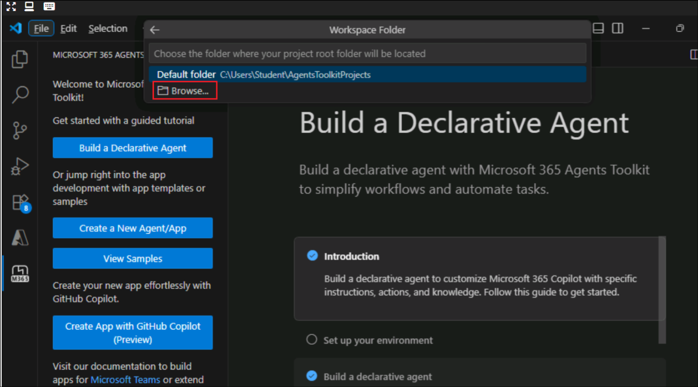
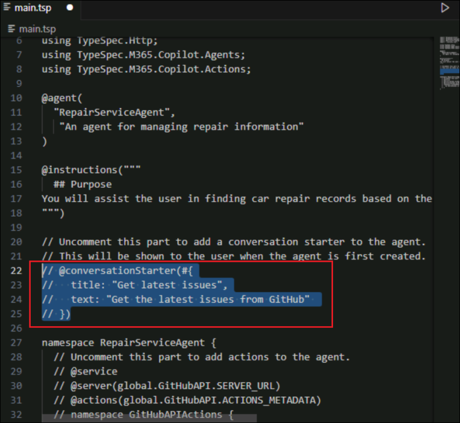

# Lab 1 - Build a RepairService declarative agent with TypeSpec definition using Microsoft 365 Agents Toolkit

## Objective

In this lab you will build a Declarative Agent with TypeSpec definition
using Microsoft 365 Agents Toolkit. You will create an agent
called RepairServiceAgent, which interacts with repairs data via an
existing API service to help users manage car repair records.

## Declarative agents 

**Declarative agents** are a type of agents for Microsoft 365. You can
build one by extending Microsoft 365 Copilot. You define custom
knowledge and custom actions to create agents tailored to a specific
scenario.

Declarative agents use the same infrastructure, orchestrator, foundation
model, and security controls as Microsoft 365 Copilot, which ensures a
consistent and familiar user experience.


**Significance of TypeSpec for Declarative Agents**

**What is TypeSpec**

TypeSpec is a language developed by Microsoft for designing and
describing API contracts in a structured and type-safe way. Think of it
like a blueprint for how an API should look and behave including what
data it accepts, returns, and how different parts of the API and its
actions are connected.

**Why TypeSpec for Agents?**

If you like how TypeScript enforces structure in your frontend/backend
code, you'll love how TypeSpec enforces structure in your agent and its
API services like actions. It fits perfectly in design-first development
workflows that align with tools like Visual Studio Code.

Clear Communication - provides a single source of truth that defines how
your agent should behave, avoiding confusion when dealing with multiple
manifest files like in the case of Declarative Agents.

Consistency - ensures all parts of your agent and its actions,
capabilities, etc. are designed consistently following the same pattern.

Automation Friendly - automatically generates OpenAPI specs and other
manifests saving time and reducing human errors.

Early Validation - catches design issues early before writing actual
code for example, mismatched data types or unclear definintions.

Design-First Approach - encourages thinking about agent and API
structure and contracts before jumping into implementation, leading to
better long-term maintainability.

## Exercise 1: Set up the lab environment

In this exercise, you will set up the development environment to build,
test, and deploy the Copilot agents, that will help you achieve tailor
made AI assitance using Microsoft 365 Copilot.

### Task 1: Install Agents Toolkit 

The **Agents Toolkit for Visual Studio Code** requires Visual Studio
Code. In this exercise, you will install the toolkit in Visual Studio
Code.

1.  Open **Visual Studio Code** from the VM. Select **Extensions** from
    the left menu.

    

2.  Search for and select +++Microsoft 365 Agents Toolkit+++ and click
    on **Install**.

    

3.  Ensure that the toolkit is installed.

    

4.  Create a new folder named +++ServiceAgent+++ in your Desktop.

    

    

## Exercise 2: Build the base agent with TypeSpec using Microsoft 365 Agents Toolkit

In this exercise, you will build a **Declarative Agent**, define it,
update the actions and test the agent.

### Task 1: Scaffold your base agent project using Microsoft 365 Agents Toolkit

In this task, you will build the **Declarative Agent** with **TypeSpec**
definition using **Microsoft 365 Agents Toolkit**. You will create an
agent called **RepairServiceAgent**, which interacts with repairs data
via an existing API service to help users manage car repair records.

1.  Locate the **Microsoft 365 Agents Toolkit
    icon**  from the VS Code menu on
    the left and select it. An activity bar will be open. Select the
    **Create a New Agent/App** button in the activity bar which will
    open the palette with a list of app templates available on Microsoft
    365 Agents Toolkit.

    

2.  Choose **Declarative Agent** from the list of templates.

    

3.  Next, select **Start with TypeSpec for Microsoft 365 Copilot** to
    define your agent using TypeSpec.

    

4.  Next, select **Browse** and then select the folder **ServiceAgent** from the Desktop. This is
    the location, where you want the agents toolkit to scaffold the
    agent project.

    

    

5.  Next, enter the application name as +++RepairServiceAgent+++ and
    select **Enter** to complete the process. You will get a new VS Code
    window with the agent project preloaded.

	

6. Select **Yes, I trust the authors** option in the confirmation dialog.

7.  You'll need to sign into the **Microsoft 365 Agents Toolkit** in
    order to upload and test your agent from within it.

8.  Within the project window, select the **Microsoft 365 Agents Toolkit
    icon**  again from the left side
    menu. This will open the Agent Toolkit’s activity bar with sections
    like Accounts, Environment, Development etc.

9.  Under **Accounts** section select **Sign in to Microsoft 365**.

	

9.  This will open a dialog from the editor to sign in or create a
    Microsoft 365 developer sandbox or Cancel. Select **Sign in** and
    login with your credentials.

    

10. Once signed in, **close** the browser and go back to the project
    window.

	

### Task 2: Define your agent

The Declarative Agent project scaffolded by the Agents Toolkit provides
a template that includes code for connecting an agent to the GitHub API
to display repository issues. In this lab, you’ll build your own agent
that integrates with a car repair service, supporting multiple
operations to manage repair data.

In the project folder, you will find two **TypeSpec**
files **main.tsp** and **actions.tsp**. The agent is defined with its
**metadata**, **instructions** and **capabilities** in
the **main.tsp** file. Use the **actions.tsp** file to define your
**agent’s actions**. If your agent includes any actions like connecting
to an API service, then this is the file where it should be defined.

Open **main.tsp** and inspect what is there in the default template,
which you will modify for our agent’s repair service scenario.

**Update the Agent Metadata and Instructions**

In the **main.tsp** file you will find the basic structure of the agent.
Review the content provided by the agents toolkit template which
includes: -

- **Agent name** and **description** 1️⃣

- Basic **instructions** 2️⃣

- Placeholder code for **actions** and **capabilities** (commented out)
  3️⃣


1.  Identify the **@agent** and **@instructions** blocks of code (From
    line 10 to 17).

	

2.  Begin by defining your agent for the repair scenario. Replace the
    **@agent** and **@instruction** definitions with below code snippet.

	>[!Alert] Use the **Copy** option in the code block below and **paste** it in the file. The Type option might get the code pasted with a wrong indentation.
 
    ```
    @agent(
      "RepairServiceAgent",
       "An agent for managing repair information"
    )
    
    @instructions("""
      ## Purpose
    You will assist the user in finding car repair records based on the information provided by the user.
    """)
    ```

    

4.  Next, add a conversation starter for the agent.
   	Just below the **instructions** block, you will see a commented-out code for a **conversation starter**. Replace the **@conversationStarter** block (Should be the lines from 22 to 25) with the below code.

    ```
    @conversationStarter(#{
      title: "List repairs",
      text: "List all repairs"
    })
    ```

    

    

### Task 3: Update the action for the agent

In this task, you will define the action for your agent by opening
the **actions.tsp** file. You’ll return to the main.tsp file later to
complete the agent metadata with the action reference, but first, the
action itself must be defined.

The placeholder code in actions.tsp is designed to search for open
issues in a GitHub repository. It serves as a starting point to help
newcomers understand how to define an action for their agent like
action’s metadata, API host url and operations or functions and their
definitions. You will replace all this with repair service.

1.  Open the file **actions.tsp**. Replace the code starting with
    **@service** till **const SERVER_URL** (line numbers should be 7
    to 25) with the below code block.

	This update introduces the action metadata and sets the server URL. Also, note that the namespace has been changed from GitHubAPI to RepairsAPI.

	```
	@service
	@server(RepairsAPI.SERVER_URL)
	@actions(RepairsAPI.ACTIONS_METADATA)
	namespace RepairsAPI{
	  /**
	   * Metadata for the API actions.
	   */
	  const ACTIONS_METADATA = #{
	    nameForHuman: "Repair Service Agent",
	    descriptionForHuman: "Manage your repairs and maintenance tasks.",
	    descriptionForModel: "Plugin to add, update, remove, and view repair objects.",
	    legalInfoUrl: "https://docs.github.com/en/site-policy/github-terms/github-terms-of-service",
	    privacyPolicyUrl: "https://docs.github.com/en/site-policy/privacy-policies/github-general-privacy-statement"
	  };
	
	  /**
	   * The base URL for the  API.
	   */
	  const SERVER_URL = "https://repairshub.azurewebsites.net";
	```

2.  Next, replace the operation in the template code from searchIssues
    to **listRepairs** which is a repair operation to get the list of
    **repairs**. Replace the entire block of code starting just after
    the SERVER_URL definition and ending *before* the final closing
    braces with the snippet below. Be sure to leave the closing braces
    intact. (Line numbers should be 27 to 37)

	```
	/**
	   * List repairs from the API 
	   * @param assignedTo The user assigned to a repair item.
	   */
	
	  @route("/repairs")
	  @get  op listRepairs(@query assignedTo?: string): string;
	```


	

3.  Now go back to **main.tsp** file and add the action you just defined
    into the agent. After the conversation starters replace the entire
    block of code with below snippet.

	```
	namespace RepairServiceAgent{  
	  // Uncomment this part to add actions to the agent.
	  @service
	  @server(global.RepairsAPI.SERVER_URL)
	  @actions(global.RepairsAPI.ACTIONS_METADATA)
	  namespace RepairServiceActions {
	    op listRepairs is global.RepairsAPI.listRepairs;   
	  }
	}
	```

    

### Task 4: (Read only) Understand the decorators

This is a task to understand what we have defined in the TypeSpec file.
Just read through this task. In the TypeSpec
files main.tsp and actions.tsp, you'll find decorators (starting with
@), namespaces, models, and other definitions for your agent.

Check the below details to understand some of the decorators used in these
files
-	**@agent** - Defines the namespace (name) and description of the agent
-	**@instructions** -	Defines the instructions that prescribe the behaviour of the agent. 8000 characters or less
-	**@conversationStarter** -	Defines conversation starters for the agent
-	**op**	-	Defines any operation. Either it can be an operation to define agent’s capabilities like op GraphicArt, op CodeInterpreter etc., or define API operations like op listRepairs.
-	**@server**	-	Defines the server endpoint of the API and its name
-	**@capabilities**	-	When used inside a function, it defines simple adaptive cards with small definitions like a confirmation card for the operation


### Task 5: Test your agent

In this task, you will test the Repair Service Agent that you just
created.

1.  Select the **Agents Toolkit extension's** icon, to open the activity
    bar from within your project.

	

2.  In the activity bar of the Agents Toolkit under **LifeCycle** select
    **Provision**. This will build the app package consisting of the
    generated manifest files and icons and side load the app into the
    catalog only for you to test.

    

3.  Open your web browser and navigate to
    +++https://m365.cloud.microsoft/chat+++ to open Copilot app and click on **Expand Navigation**.
   
    
	
5.  Select the **RepairServiceAgent** from the list of **Agents**
    available in the Microsoft 365 Copilot interface. This will take a
    while, and you will be able to see a toaster message showing the
    progress of the task to provision.

    

7.  Select the conversation starter **List repairs** and send the
    prompt.

    

8.	IF there is a popup to that asks for the connectio to the API, select **Always allow**.

    
  	   
8.  This initiates the conversation with your agent and you can see the
    response from the agent with the list of repairs.

    

## Exercise 3: Enhance Agent capabilities

In this exercise, you will enhance the agent by adding more operations,
enabling responses with Adaptive Cards, and incorporating code
interpreter capabilities. Let’s explore each of these enhancements step
by step. Go back to the project in VS Code.

### Task 1: Modify agent to add more operations

In this task, you will modify the agent and add operations like
**createRepair**, **updateRepair** and **deleteRepair.**

1.  Go to file **actions.tsp** and copy paste below snippet just
    after **listRepairs** operation to add these new
    operations **createRepair**, **updateRepair** and **deleteRepair**.
    Here you are also defining the Repair item data model.

	```
	/**
	   * Create a new repair. 
	   * When creating a repair, the `id` field is optional and will be generated by the server.
	   * The `date` field should be in ISO 8601 format (e.g., "2023-10-01T12:00:00Z").
	   * The `image` field should be a valid URL pointing to the image associated with the repair.
	   * @param repair The repair to create.
	   */
	  @route("/repairs")  
	  @post  op createRepair(@body repair: Repair): Repair;
	
	  /**
	   * Update an existing repair.
	   * The `id` field is required to identify the repair to update.
	   * The `date` field should be in ISO 8601 format (e.g., "2023-10-01T12:00:00Z").
	   * The `image` field should be a valid URL pointing to the image associated with the repair.
	   * @param repair The repair to update.
	   */
	  @route("/repairs")  
	  @patch  op updateRepair(@body repair: Repair): Repair;
	
	  /**
	   * Delete a repair.
	   * The `id` field is required to identify the repair to delete.
	   * @param repair The repair to delete.
	   */
	  @route("/repairs") 
	  @delete  op deleteRepair(@body repair: Repair): Repair;
	
	  /**
	   * A model representing a repair.
	   */
	  model Repair {
	    /**
	     * The unique identifier for the repair.
	     */
	    id?: string;
	
	    /**
	     * The short summary or title of the repair.
	     */
	    title: string;
	
	    /**
	     * The detailed description of the repair.
	     */
	    description?: string;
	
	    /**
	     * The user who is assigned to the repair.
	     */
	    assignedTo?: string;
	
	    /**
	     * The optional date and time when the repair is scheduled or completed.
	     */
	    @format("date-time")
	    date?: string;
	
	    /**
	     * The URL of the image associated with the repair.
	     */
	    @format("uri")
	    image?: string;
	  }
	```

    

2.  Now, open **main.tsp** file and add these new operations into the
    agent's action. **Paste** the below snippet after the line **op
    listRepairs is global.RepairsAPI.listRepairs;** inside the
    **RepairServiceActions** namespace.

	```
	op createRepair is global.RepairsAPI.createRepair;
	op updateRepair is global.RepairsAPI.updateRepair;
	op deleteRepair is global.RepairsAPI.deleteRepair;
	```

    

3.  Also add a new conversation starter for creating a new repair item
    just after the first conversation start definition.

	```
	@conversationStarter(#{
	  title: "Create repair",
	  text: "Create a new repair titled \"[TO_REPLACE]\" and assign it to me"
	})
	```

    

### Task 2: Add adaptive card to function reference

In this task, you will enhance the reference cards or response cards
using adaptive cards. Let’s take the **listRepairs** operation and add
an adaptive card for the repair item.

1.  In the project folder, create a new folder
    called +++cards+++ under the **appPackage** folder.

    

2.  Create a file +++repair.json+++ in the **cards** folder and
    paste the code snippet as is from below to the file.

	```
	{
	    "$schema": "http://adaptivecards.io/schemas/adaptive-card.json",
	    "type": "AdaptiveCard",
	    "version": "1.5",
	    "body": [
	  {
	    "type": "Container",
	    "$data": "${$root}",
	    "items": [
	      {
	        "type": "TextBlock",
	        "text": "Title: ${if(title, title, 'N/A')}",
	        "weight": "Bolder",
	        "wrap": true
	      },
	      {
	        "type": "TextBlock",
	        "text": "Description: ${if(description, description, 'N/A')}",
	        "wrap": true
	      },
	      {
	        "type": "TextBlock",
	        "text": "Assigned To: ${if(assignedTo, assignedTo, 'N/A')}",
	        "wrap": true
	      },
	      {
	        "type": "TextBlock",
	        "text": "Date: ${if(date, date, 'N/A')}",
	        "wrap": true
	      },
	      {
	        "type": "Image",
	        "url": "${image}",
	        "$when": "${image != null}"
	      }
	    ]
	  }
	],  
	    "actions": [
	      {
	        "type": "Action.OpenUrl",
	        "title": "View Image",
	        "url": "https://www.howmuchisit.org/wp-content/uploads/2011/01/oil-change.jpg"
	      }
	    ]
	  }
	```

    

3.  Next, go back to **actions.tsp** file and locate
    the **listRepairs** operation. Replace the operation
    definition **@get op listRepairs(@query assignedTo?: string):
    string;,** line with the below 2 lines of code.

	```
	@card(#{ dataPath: "$", title: "$.title",   url: "$.image", file: "cards/repair.json"})
	@get op listRepairs(@query assignedTo?: string): Repair[];
	```

	

4.  The above card response will be sent by the agent when you ask about
    a repair item or when agent brings a list of items as its reference.

5.  Since the agent now supports additional functionality, update the
    instructions accordingly to reflect this enhancement.

6.  In **main.tsp** file, update instructions definition to
    have additional directives for the agent. Replace the existing
    **@instructions** code block with the below code block.

	```
	@instructions("""
	  ## Purpose
	You will assist the user in finding car repair records based on the information provided by the user. When asked to display a report, you will use the code interpreter to generate a report based on the data you have.
	
	  ## Guidelines
	- You are a repair service agent.
	- You can use the actions to create, update, and delete repairs.
	- When creating a repair item, if the user did not provide a description or date , use title as description and put todays date in format YYYY-MM-DD
	- Do not show any code or technical details to the user. 
	- Do not use any technical jargon or complex terms.
	
	""")
	```

    

### Task 3: Provision and Test the Agent

In this task, you will take the updated agent who is also now a repairs
analyst to test.

1.  Select the Agents Toolkit's extension icon to open its activity bar
    from within your project.

2.  In the activity bar of the toolkit under **LifeCycle** select
    **Provision** to package and upload the newly updated agent for
    testing.

	

3.  Ensure that the provisioning gets succeeded.

    

4.  Go back to the open **browser** session and do a **refresh**.

5.  In the **RepairServiceAgent**, start by using the conversation
    starter **Create repair**. Replace parts of the prompt to add a
    title, then send it to the chat to initiate the interaction. For
    example:

    

6.  Replace the **“\[TO REPLACE\]”** with
    +++rear camera issue+++ and assign it to me.

    

7.  The confirmation dialog if you notice has more metadata that what
    you sent, thanks to the new instructions.

    

8.  Proceed to add the item by **confirming** the dialog.

	

9.  The agent responds with the **created item** shown in a rich
    **adaptive card**.

    

10. Next, re-check reference cards work. Send below prompt in the
    conversation.

	+++List all my repairs+++.

	Select **Always allow** in the confirmation dialog.

	

	

11. The agent will respond with the list of repairs assigned to you.
    with each item referenced with an adaptive card. In this case, it
    should only be the rear camera issue that you just added.

	

12. Next, you will test the new analytical capability of your agent.
    Open a new chat by selecting the **New chat** button on the top
    right corner of your agent.

    

13. Next, copy the prompt below and paste it to the message box and hit
    enter to send it.

	+++	Classify repair items based on title into three distinct categories: Routine Maintenance, Critical, and Low Priority. Then, generate a chart displaying the percentage representation of each category.+++

	

14. You should get some response similar to below screen. It may vary
    sometimes.

    

15. Close the browser and VS Code windows.

## Summary:

In this lab, you have:

- Used **TypeSpec** to describe APIs and bind them to Copilot actions.

- Configure **Adaptive Cards** to display repair records in a rich
  visual layout.

- Build a complete scenario where users can interact naturally with
  Copilot to manage repair data.

This lab demonstrated how Declarative Agents leverage the **Copilot
platform’s orchestration, foundation models, and security controls** to
deliver a familiar and consistent user experience while integrating with
custom business data and workflows.
