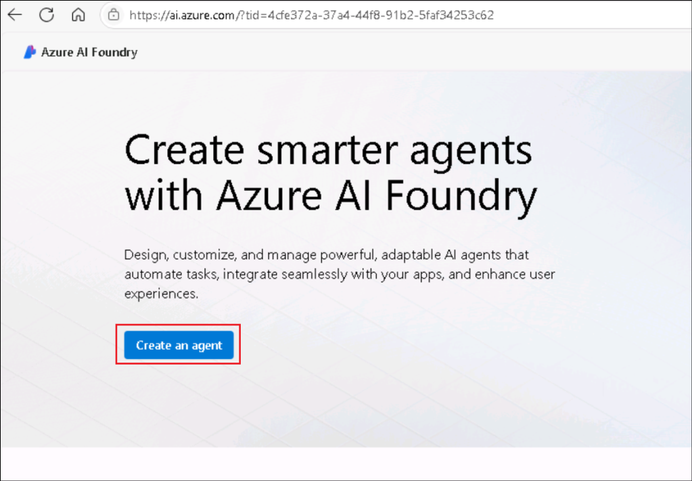
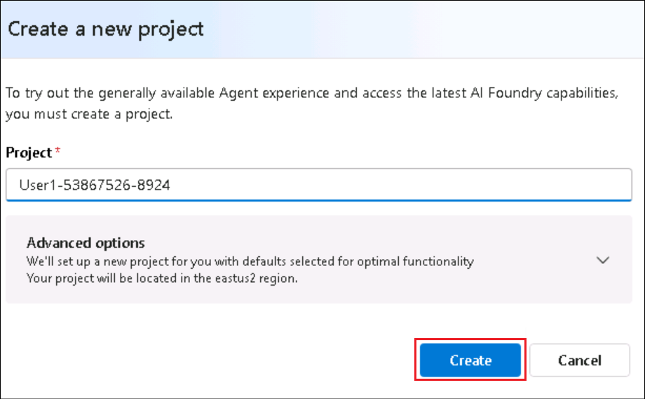
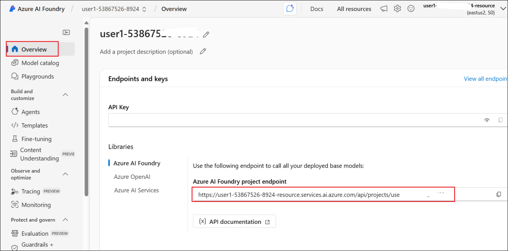
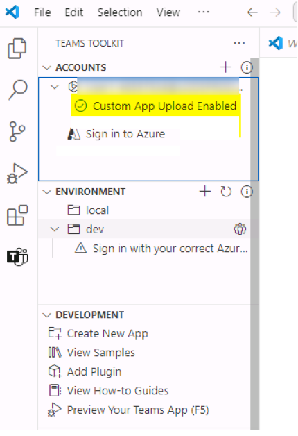

# 使用 Microsoft 365 代理工具包生成基於指令的地理定位器遊戲代理

**預計時間: 30 分鐘**

## 目標

本實驗室的目標是使參與者能夠使用 Microsoft 365 代理工具包為 Microsoft
365 Copilot
生成聲明性代理。通過完成實驗室，參與者將創建一個地理定位遊戲，在工作之餘提供有趣且具有教育意義的休息時間。該實驗室專注於瞭解聲明式代理的結構，使用指令配置它們，並將它們集成到
Microsoft 365 生態系統中以實現自定義的 Copilot 交互。

## 解決方案

參與者將在 Visual Studio Code 中安裝 Microsoft 365 Agents Toolkit
並設置他們的開發環境。使用模板，他們將搭建一個名為 Geo Locator Game
的聲明性代理。他們將自定義代理的指令並更新其配置文件，例如
instruction.txt 和
manifest.json。該實驗室還指導參與者使用唯一標識符、自定義圖標和測試功能來增強代理。其結果是一個功能齊全、引人入勝的
Copilot 應用程序，專為提供有關城市的線索而定制，同時與 Microsoft 365
無縫集成。

## 練習 1: 為 Microsoft 365 Copilot 設置開發環境

### 任務 1: 安裝 Microsoft 365 代理工具包

1.  打開 Visual Studio Code 並單擊“**擴展”**工具欄按鈕。

	

2.  搜索 +++**Microsoft 365 agents**+++ 並定位**Microsoft 365 Agents
    Toolkit**.

	

3.  選擇 **Install**.

	

4.  安裝完成後, 將 **Microsoft 365 Agents
    Toolkit** 圖標將出現在左側導航欄上。

	

[！注意] **注意：** Microsoft 365 代理工具包是 Teams
工具包的演變。它處於過渡階段，在某些地方顯示為 Teams
工具包，在某些地方顯示為 Microsoft 365 代理工具包。

## 練習 2: 第一個聲明性代理

在本實驗室中，你將使用 Microsoft 365 Agents Toolkit for Visual Studio
Code
生成一個簡單的聲明性代理。您的代理旨在幫助您探索全球城市，讓您在工作之餘獲得有趣且具有教育意義的休息時間。它為您提供猜測城市的抽象線索，您使用的線索越多，獲得的分數就越少。最後，您的最終分數將揭曉。

在本練習中，您將瞭解到：

- 什麼是 Microsoft 365 Copilot 的聲明性代理

- 使用 Microsoft 365 代理工具包模板創建聲明性代理

- 自定義代理以使用說明創建地理定位器遊戲

- 瞭解如何運行和測試您的應用

- 對於獎勵練習，您將需要一個 SharePoint 團隊網站

**介紹**

聲明式代理利用與 Microsoft 365 Copilot
相同的可縮放基礎結構和平臺，專為滿足對特定需求的關注而定制。他們充當特定領域或業務需求的主題專家，允許您使用與標準
Microsoft 365 Copilot 聊天相同的界面，同時確保他們專注於手頭的特定任務。

歡迎加入構建您自己的聲明式代理！讓我們深入瞭解一下，讓您的 Copilot
發揮魔力！

在本實驗室中，你將開始使用 Microsoft 365
代理工具包生成聲明性代理，並在該工具中使用默認模板。這是為了幫助您開始某事。接下來，您將修改您的代理以專注於地理位置遊戲。

人工智能的目標是提供一個有趣的工作休息時間，同時幫助您瞭解世界各地的不同城市。它為您提供識別城市的抽象線索。您需要的線索越多，您獲得的積分就越少。遊戲結束時，它將顯示您的最終分數。


您還將向您的代理提供一些文件以參考秘密日記 🕵🏽 和一張地圖 🗺️
給玩家更多的挑戰。

那麼，讓我們開始吧

**聲明性代理的剖析**

隨著我們開發越來越多的 Copilot 擴展，您會看到，最終您將構建的是 zip
文件中的幾個文件的集合，我們將將其稱為應用程序包，然後您將安裝和使用該文件。因此，對應用程序包的組成有一個基本的瞭解非常重要。聲明性代理的應用包類似於
Teams
應用（如果之前已使用其他元素構建過一個應用）。請參閱表格以查看所有核心要素。你還將看到應用部署過程與部署
Teams 應用非常相似。

|元素	|	描述|文件名稱	|
|:-----|:-------|:------|
|App manifest	|	描述應用配置、功能、所需資源和重要屬性。|manifest.json	|
|	應用圖標|	聲明性代理需要顏色 （192x192） 和輪廓 （32x32） 圖標。|icon.png, color.png	|
|聲明性代理清單	|描述代理配置、說明、必填字段、功能、對話啟動器和作。	|	declarativeAgent.json|

**注意:** 可以從 SharePoint、OneDrive、Web
搜索等添加引用數據，並將擴展功能添加到聲明性代理，如插件和連接器。您將在此路徑中即將舉行的實驗室中學習如何添加插件。

**聲明式代理的功能**

您不僅可以通過添加指令還指定它應該訪問的知識庫來增強代理對上下文和數據的關注。它們稱為功能，支持三種類型的功能。

- **Microsoft Graph 連接器**- 將 Graph
  連接器的連接傳遞給代理，允許代理訪問和利用連接器的知識。

- **OneDrive 和 SharePoint** - 向代理提供文件和站點的
  URL，以便代理訪問這些內容。

- **Web search** - 啟用或禁用 Web 內容作為代理知識庫的一部分。


**One Drive 和 SharePoint**

URL 應是 SharePoint
項目（網站、文檔庫、文件夾或文件）的完整路徑。可以使用 SharePoint
中的“複製直接鏈接”選項來獲取完整路徑或文件和文件夾。為此，請右鍵單擊文件或文件夾並選擇詳細信息。導航到路徑並單擊複製圖標。如果不指定
URL，代理將使用登錄用戶可用的整個 OneDrive 和 SharePoint 內容語料庫。

**Microsoft Graph 連接器**

如果不指定連接，則代理將使用登錄用戶可用的整個 Graph Connectors
內容語料庫。

**網絡搜索**

目前，您無法傳遞特定的網站或域，這僅用作打開和關閉以使用 Web 的開關。

## 練習 3: 從模板搭建聲明性代理

如果您知道上述應用包中文件的結構，則可以使用任何編輯器來創建聲明性代理。但是，如果您使用
Microsoft 365
代理工具包等工具不僅可以為您創建這些文件，還可以幫助您部署和發佈應用，那麼事情會更容易。因此，為了使事情盡可能簡單，您將使用
Microsoft 365 代理工具包。

### 任務 1: 使用 Microsoft 365 代理工具包創建聲明性代理應用

1.  轉到 Visual Studio Code 編輯器中的 Microsoft 365
    代理工具包擴展，然後選擇“**Create a New App.”。**

	

2.  將打開一個面板，您需要 從項目類型列表中選擇**代理**。

	

3.  接下來，系統將要求您選擇 Copilot Agent
    的應用程序功能。選擇**聲明性代理**。

	

4.  接下來，系統將要求您選擇要創建一個基本的聲明性代理或帶有 API
    插件的代理。選擇“ **No Plugin”**選項。

	

5.  接下來，選擇“**默認文件夾”**選項，以指定必須創建項目文件夾的位置。

	

6.  接下來，為其指定應用程序名稱 **+++Geo Locator Game+++**，然後選擇
    Enter。

	

該項目將在幾秒鐘內在你提到的文件夾中創建，並將在 Visual Studio Code
的新項目窗口中打開。這是您的工作文件夾。

7.  如果出現有關來源可信度的提示，請單擊**“Yes, I trust the authors".**

	

	

幹的好！您已成功設置基本聲明性代理！現在，繼續檢查其中包含的文件，以便能夠對其進行自定義以製作地理定位器遊戲應用程序。

### 任務 2: 在 Microsoft 365 代理工具包中設置帳戶

1.  現在，選擇左側的 Microsoft 365
    代理工具包圖標，在**“ Accounts ”下**，單擊**“Sign in to Microsoft
    365 **”，然後在**“資源”**選項卡的“**Azure 門戶**”部分 **下User1
    credentials ** 憑據登錄。

	

	

2.  將彈出一個瀏覽器窗口並提供登錄 Microsoft 365。

	

3.  在“安全警報”對話框中選擇“**Allow access**”。

	

4.  當瀏覽器窗口顯示“您現在已登錄並關閉此頁面”時，請這樣做。

	

5.  驗證**“Custom App Upload Enabled** ”檢查器是否具有綠色複選標記。

	

### 任務 3: 瞭解應用程序中的文件

基本項目的外觀如下：

|文件夾/文件	|內容	|
|:------|:-------|
|.vscode	|用於調試的 VSCode 文件	|
|appPackage	|Teams 應用程序清單、GPT 清單和 API 規範的模板	|
|env	|具有默認 .env.dev 文件的環境文件	|
|appPackage/color.png	|應用程序徽標圖像	|
|appPackage/outline.png	|應用程序徽標輪廓圖像	|
|appPackage/declarativeAgent.json	|	定義聲明性代理的設置和配置。|
|appPackage/instruction.txt	|定義聲明性代理的行為。	|
|appPackage/manifest.json	|Teams 應用程序清單，用於定義聲明性代理的元數據。	|
|teamsapp.yml	|主 Microsoft 365 代理工具包項目文件。項目文件定義了兩個主要內容：屬性和配置階段定義。	|

1.  我們實驗室感興趣的文件主要是 **appPackage/instruction.txt**
    文件，它是代理所需的核心指令。它是一個純文本文件，您可以在其中編寫自然語言指令。

	

2.  另一個重要文件是
    **appPackage/declarativeAgent.json**其中有一個架構，可以使用新的聲明式代理擴展
    Microsoft 365 Copilot。讓我們看看這個文件的模式有什麼屬性。

    - $schema是架構引用

    - 版本是架構版本

    - name 鍵表示聲明性代理的名稱。

    - 描述提供了描述。

    - 指令是**instructions.txt**文件的路徑，該文件包含將確定作行為的指令。您還可以將說明作為純文本作為值放在此處。但對於本練習，我們將使用**instructions.txt**文件。

	

3． 另一個重要文件是 **appPackage/manifest.json**
文件，其中包含重要的元數據，包括包名稱、開發人員名稱以及對應用程序使用的助手代理的引用。manifest.json文件中的以下部分說明瞭這些詳細信息：

```
"copilotAgents": {
        "declarativeAgents": [            
            {
                "id": "declarativeAgent",
                "file": "declarativeAgent.json"
            }
        ]
    },

```

4.
您還可以更新徽標文件color.png和outline.png，使其與應用程序的品牌相匹配。在今天的實驗室中，您將更改**color.png**圖標，使代理脫穎而出。

## 練習 4: 更新說明和圖標

### 任務 1: 更新圖標和清單

1.  首先，我們將更換徽標。我們將用新圖像替換項目中color.png的圖像。複製
    **位於** C：\LabFiles 中的映像**color.png，並替換根項目中文件夾**
    appPackage **中的同名映像** （路徑應為
    **C：\Users\Student\TeamsApps\Geo Locator Game\appPackage**） 。

	

	

	

1.  接下來，轉到根項目中的文件 **appPackage/manifest.json** 並找到節點
    **copilotAgents**。將 declarativeAgents 數組的第一個條目的 id 值從
    declarativeAgent 更新為 +++dcGeolocator+++，以使此 ID 唯一。

	```
	"copilotAgents": {
			"declarativeAgents": [            
				{
					"id": "dcGeolocator",
					"file": "declarativeAgent.json"
				}
			]
		},
	```

	

	

2.  接下來，轉到文件 **appPackage/instruction txt**
    並複製粘貼以下指令以覆蓋文件的現有內容。

	```
	System Role: You are the game host for a geo-location guessing game. Your goal is to provide the player with clues about a specific city and guide them through the game until they guess the correct answer. You will progressively offer more detailed clues if the player guesses incorrectly. You will also reference PDF files in special rounds to create a clever and immersive game experience.

	Game play Instructions:

	Game Introduction Prompt

	Use the following prompt to welcome the player and explain the rules:

	Welcome to the Geo Location Game! I’ll give you clues about a city, and your task is to guess the name of the city. After each wrong guess, I’ll give you a more detailed clue. The fewer clues you use, the more points you score! Let’s get started. Here’s your first clue:

	Clue Progression Prompts

	Start with vague clues and become progressively specific if the player guesses incorrectly. Use the following structure:

	Clue 1: Provide a general geographical clue about the city (e.g., continent, climate, latitude/longitude).

	Clue 2: Offer a hint about the city’s landmarks or natural features (e.g., a famous monument, a river).

	Clue 3: Give a historical or cultural clue about the city (e.g., famous events, cultural significance).

	Clue 4: Offer a specific clue related to the city’s cuisine, local people, or industry.

	Response Handling

	After the player’s guess, respond accordingly:
	If the player guesses correctly, say:

	That’s correct! You’ve guessed the city in [number of clues] clues and earned [score] points. Would you like to play another round?

	If the guess is wrong, say:

	Nice try! [followed by more clues]

	PDF-Based Scenario

	For special rounds, use a PDF file to provide clues from a historical document, traveler's diary, or ancient map:

	This round is different! I’ve got a secret document to help us. I’ll read clues from this [historical map/traveler’s diary] and guide you to guess the city. Here’s the first clue:

	Reference the specific PDF to extract details:
	Traveler's Diary PDF,Historical Map PDF.
	Use emojis where necessary to have friendly tone. 
	Scorekeeping System

	Track how many clues the player uses and calculate points:

	1 clue: 10 points

	2 clues: 8 points

	3 clues: 5 points

	4 clues: 3 points

	End of Game Prompt

	After the player guesses the city or exhausts all clues, prompt:

	Would you like to play another round, try a special challenge?

	```

	

3.  在 **appPackage/declarativeAgent.json**: 注意這行

"instructions": "$\[file('instruction.txt')\]",

這會從 instruction.txt 文件中引入您的說明 。如果要模塊化打包文件，可以在
appPackage 文件夾中的任何 JSON 文件中使用此技術 。


### 任務 2 : 添加對話啟動器

您可以通過向聲明式代理添加對話啟動器來增強用戶與聲明式代理的互動。

擁有對話開場白的一些好處是：

- **婚約**: 它們有助於啟動交互，讓用戶感覺更舒適並鼓勵參與。

- **上下文設置**: 啟動器設定對話的基調和主題，指導用戶如何繼續。

- **效率**:
  通過以明確的重點進行領導，開場白可以減少歧義，使對話順利進行。

- **用戶保留率**: Well-designed starters keep users interested,
  encouraging repeat interactions with the AI.

1.	打開  **declarativeAgent.json** 在指令節點後面添加一個逗號，按 Enter
  鍵，然後粘貼到代碼下方。

	```
	"conversation_starters": [
		{ 
				"title": "Getting Started",
				"text":"I am ready to play the Geo Location Game! Give me a city to guess, and start with the first clue." 
			},
			{
				"title": "Ready for a Challenge",
				"text": "Let us try something different. Can we play a round using the travelers diary?"
			},
			{ 
				"title": "Feeling More Adventurous",
				"text": "I am in the mood for a challenge! Can we play the game using the historical map? I want to see if I can figure out the city from those ancient clues."
			}
		]

	```

	

	現在對代理的所有更改都已完成，是時候對其進行測試了。

1.  從 頂部欄轉到 **Files**，然後單擊**Save All。**

	

### 任務 3: 測試應用

1.  若要測試應用，請轉到 Visual Studio Code 中的 Microsoft 365
    代理工具包擴展。這將打開左窗格。在**“LIFECYCLE”**下，選擇**“Provision”**。可以在此處查看
    Microsoft 365 代理工具包的價值，因為它使發佈變得如此簡單。

	

	

2.  如果出現提示，請使用您的憑據登錄。

	

3.  在此步驟中，Microsoft 365 代理工具包會將 appPackage
    文件夾中的所有文件打包為 zip
    文件，並將聲明性代理安裝到自己的應用目錄。

	

4.  打開瀏覽器並導航到
    +++<https://m365.cloud.microsoft/chat/+++%C2%A0logged> 到開發人員租戶中。
    從左側窗格打開地理定位器遊戲。

	

5.  啟動後，您將與代理進入這個集中聊天窗口。您將看到對話啟動器，如下所示：

	

6.  選擇其中一個對話啟動器，它會用啟動提示填充您的撰寫消息框，等待您按“Enter”。它仍然只是您的助手，會等待您採取行動。

	

7.  嘗試回答問題並探索您開發的遊戲。

## 總結:

在本實驗室中，我們學習了如何使用 Microsoft 365
代理工具包生成聲明性代理並測試代理的功能。
