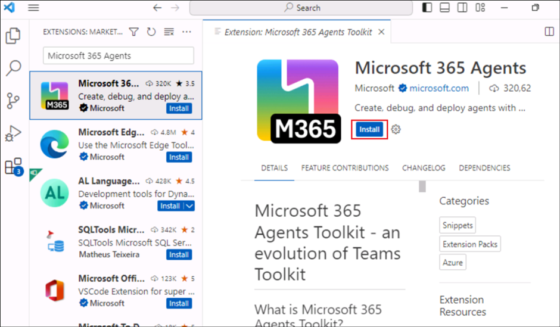
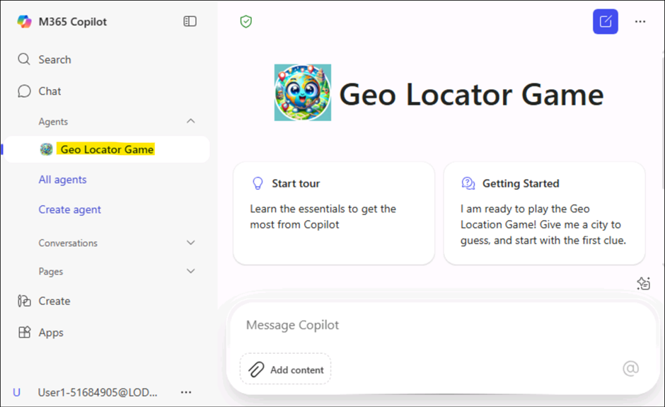

# 使用 Microsoft 365 代理工具包生成基于指令的地理定位器游戏代理

**预计时间: 30 分钟**

## 目标

本实验室的目标是使参与者能够使用 Microsoft 365 代理工具包为 Microsoft
365 Copilot
生成声明性代理。通过完成实验室，参与者将创建一个地理定位游戏，在工作之余提供有趣且具有教育意义的休息时间。该实验室专注于了解声明式代理的结构，使用指令配置它们，并将它们集成到
Microsoft 365 生态系统中以实现自定义的 Copilot 交互。

## 解决方案

参与者将在 Visual Studio Code 中安装 Microsoft 365 Agents Toolkit
并设置他们的开发环境。使用模板，他们将搭建一个名为 Geo Locator Game
的声明性代理。他们将自定义代理的指令并更新其配置文件，例如
instruction.txt 和
manifest.json。该实验室还指导参与者使用唯一标识符、自定义图标和测试功能来增强代理。其结果是一个功能齐全、引人入胜的
Copilot 应用程序，专为提供有关城市的线索而定制，同时与 Microsoft 365
无缝集成。

## 练习 1: 为 Microsoft 365 Copilot 设置开发环境

### 任务 1: 安装 Microsoft 365 代理工具包

1.  打开 Visual Studio Code 并单击“**扩展”**工具栏按钮。

    

2.  搜索 +++**Microsoft 365 agents**+++ 并定位**Microsoft 365 Agents
    Toolkit**.

    

3.  选择 **Install**.

    

4.  安装完成后, 将 **Microsoft 365 Agents
    Toolkit** 图标将出现在左侧导航栏上。

    

    [！注意] **注意：** Microsoft 365 代理工具包是 Teams
工具包的演变。它处于过渡阶段，在某些地方显示为 Teams
工具包，在某些地方显示为 Microsoft 365 代理工具包。

## 练习 2: 第一个声明性代理

在本实验室中，你将使用 Microsoft 365 Agents Toolkit for Visual Studio
Code
生成一个简单的声明性代理。您的代理旨在帮助您探索全球城市，让您在工作之余获得有趣且具有教育意义的休息时间。它为您提供猜测城市的抽象线索，您使用的线索越多，获得的分数就越少。最后，您的最终分数将揭晓。

在本练习中，您将了解到：

- 什么是 Microsoft 365 Copilot 的声明性代理

- 使用 Microsoft 365 代理工具包模板创建声明性代理

- 自定义代理以使用说明创建地理定位器游戏

- 了解如何运行和测试您的应用

- 对于奖励练习，您将需要一个 SharePoint 团队网站

**介绍**

声明式代理利用与 Microsoft 365 Copilot
相同的可缩放基础结构和平台，专为满足对特定需求的关注而定制。他们充当特定领域或业务需求的主题专家，允许您使用与标准
Microsoft 365 Copilot 聊天相同的界面，同时确保他们专注于手头的特定任务。

欢迎加入构建您自己的声明式代理！让我们深入了解一下，让您的 Copilot
发挥魔力！

在本实验室中，你将开始使用 Microsoft 365
代理工具包生成声明性代理，并在该工具中使用默认模板。这是为了帮助您开始某事。接下来，您将修改您的代理以专注于地理位置游戏。

人工智能的目标是提供一个有趣的工作休息时间，同时帮助您了解世界各地的不同城市。它为您提供识别城市的抽象线索。您需要的线索越多，您获得的积分就越少。游戏结束时，它将显示您的最终分数。


您还将向您的代理提供一些文件以参考秘密日记 🕵🏽 和一张地图 🗺️
给玩家更多的挑战。

那么，让我们开始吧

**声明性代理的剖析**

随着我们开发越来越多的 Copilot 扩展，您会看到，最终您将构建的是 zip
文件中的几个文件的集合，我们将将其称为应用程序包，然后您将安装和使用该文件。因此，对应用程序包的组成有一个基本的了解非常重要。声明性代理的应用包类似于
Teams
应用（如果之前已使用其他元素构建过一个应用）。请参阅表格以查看所有核心要素。你还将看到应用部署过程与部署
Teams 应用非常相似。

| 元素  |  描述 | 文件名称  |
|:------|:------|:-------|
| App manifest  | 描述应用配置、功能、所需资源和重要属性。  |  manifest.json |
| 应用图标  | 声明性代理需要颜色 （192x192） 和轮廓 （32x32） 图标。  | icon.png, color.png  |
| 声明性代理清单 | 描述代理配置、说明、必填字段、功能、对话启动器和作。  |  declarativeAgent.json |


**注意:** 可以从 SharePoint、OneDrive、Web
搜索等添加引用数据，并将扩展功能添加到声明性代理，如插件和连接器。您将在此路径中即将举行的实验室中学习如何添加插件。

**声明式代理的功能**

您不仅可以通过添加指令还指定它应该访问的知识库来增强代理对上下文和数据的关注。它们称为功能，支持三种类型的功能。

- **Microsoft Graph 连接器**- 将 Graph
  连接器的连接传递给代理，允许代理访问和利用连接器的知识。

- **OneDrive 和 SharePoint** - 向代理提供文件和站点的
  URL，以便代理访问这些内容。

- **Web search** - 启用或禁用 Web 内容作为代理知识库的一部分。


**One Drive 和 SharePoint**

URL 应是 SharePoint
项目（网站、文档库、文件夹或文件）的完整路径。可以使用 SharePoint
中的“复制直接链接”选项来获取完整路径或文件和文件夹。为此，请右键单击文件或文件夹并选择详细信息。导航到路径并单击复制图标。如果不指定
URL，代理将使用登录用户可用的整个 OneDrive 和 SharePoint 内容语料库。

**Microsoft Graph 连接器**

如果不指定连接，则代理将使用登录用户可用的整个 Graph Connectors
内容语料库。

**网络搜索**

目前，您无法传递特定的网站或域，这仅用作打开和关闭以使用 Web 的开关。

## 练习 3: 从模板搭建声明性代理

如果您知道上述应用包中文件的结构，则可以使用任何编辑器来创建声明性代理。但是，如果您使用
Microsoft 365
代理工具包等工具不仅可以为您创建这些文件，还可以帮助您部署和发布应用，那么事情会更容易。因此，为了使事情尽可能简单，您将使用
Microsoft 365 代理工具包。

### 任务 1: 使用 Microsoft 365 代理工具包创建声明性代理应用

1.  转到 Visual Studio Code 编辑器中的 Microsoft 365
    代理工具包扩展，然后选择“**Create a New App.”。**

    

2.  将打开一个面板，您需要 从项目类型列表中选择**代理**。

    

3.  接下来，系统将要求您选择 Copilot Agent
    的应用程序功能。选择**声明性代理**。

    

4.  接下来，系统将要求您选择要创建一个基本的声明性代理或带有 API
    插件的代理。选择“ **No Plugin”**选项。

    

5.  接下来，选择“**默认文件夹”**选项，以指定必须创建项目文件夹的位置。

    

6.  接下来，为其指定应用程序名称 **+++Geo Locator Game+++**，然后选择
    Enter。

    

该项目将在几秒钟内在你提到的文件夹中创建，并将在 Visual Studio Code
的新项目窗口中打开。这是您的工作文件夹。

7.  如果出现有关来源可信度的提示，请单击 **“Yes, I trust the authors."**

    

    

干的好！您已成功设置基本声明性代理！现在，继续检查其中包含的文件，以便能够对其进行自定义以制作地理定位器游戏应用程序。

### 任务 2: 在 Microsoft 365 代理工具包中设置帐户

1.  现在，选择左侧的 Microsoft 365
    代理工具包图标，在**“ Accounts ”下**，单击**“Sign in to Microsoft
    365 **”，然后在**“资源”**选项卡的“**Azure 门户**”部分 **下User1
    credentials ** 凭据登录。

    

    

2.  将弹出一个浏览器窗口并提供登录 Microsoft 365。

    

3.  在“安全警报”对话框中选择“**Allow access**”。

    

4.  当浏览器窗口显示“您现在已登录并关闭此页面”时，请这样做。

    

5.  验证**“Custom App Upload Enabled** ”检查器是否具有绿色复选标记。

    

### 任务 3: 了解应用程序中的文件

基本项目的外观如下：

| 文件夹/文件  |  内容 |
|:-----|:-------|
| .vscode  |  用于调试的 VSCode 文件 |
| appPackage  |  Teams 应用程序清单、GPT 清单和 API 规范的模板 |
| env | 具有默认 .env.dev 文件的环境文件  |
| appPackage/color.png  | 应用程序徽标图像  |
| appPackage/outline.png  | 应用程序徽标轮廓图像  |
| appPackage/declarativeAgent.json | 定义声明性代理的设置和配置。  |
| appPackage/instruction.txt |  定义声明性代理的行为。 |
| appPackage/manifest.json  | Teams 应用程序清单，用于定义声明性代理的元数据。  |
| teamsapp.yml | 主 Microsoft 365 代理工具包项目文件。项目文件定义了两个主要内容：属性和配置阶段定义。  |

1.  我们实验室感兴趣的文件主要是 **appPackage/instruction.txt**
    文件，它是代理所需的核心指令。它是一个纯文本文件，您可以在其中编写自然语言指令。

    

2.  另一个重要文件是
    **appPackage/declarativeAgent.json**其中有一个架构，可以使用新的声明式代理扩展
    Microsoft 365 Copilot。让我们看看这个文件的模式有什么属性。

    - $schema是架构引用

    - 版本是架构版本

    - name 键表示声明性代理的名称。

    - 描述提供了描述。

    - 指令是**instructions.txt**文件的路径，该文件包含将确定作行为的指令。您还可以将说明作为纯文本作为值放在此处。但对于本练习，我们将使用**instructions.txt**文件。

    

3． 另一个重要文件是 **appPackage/manifest.json**
文件，其中包含重要的元数据，包括包名称、开发人员名称以及对应用程序使用的助手代理的引用。manifest.json文件中的以下部分说明了这些详细信息：

    ```
    "copilotAgents": {
            "declarativeAgents": [            
                {
                    "id": "declarativeAgent",
                    "file": "declarativeAgent.json"
                }
            ]
        },
    ```

    4.
您还可以更新徽标文件color.png和outline.png，使其与应用程序的品牌相匹配。在今天的实验室中，您将更改**color.png**图标，使代理脱颖而出。

## 练习 4: 更新说明和图标

### 任务 1: 更新图标和清单

1.  首先，我们将更换徽标。我们将用新图像替换项目中color.png的图像。复制
    **位于** C：\LabFiles 中的映像**color.png，并替换根项目中文件夹**
    appPackage **中的同名映像** （路径应为
    **C：\Users\Student\TeamsApps\Geo Locator Game\appPackage**） 。

    

    

    

1.  接下来，转到根项目中的文件 **appPackage/manifest.json** 并找到节点
    **copilotAgents**。将 declarativeAgents 数组的第一个条目的 id 值从
    declarativeAgent 更新为 +++dcGeolocator+++，以使此 ID 唯一。

    ```
    "copilotAgents": {
            "declarativeAgents": [            
                {
                    "id": "dcGeolocator",
                    "file": "declarativeAgent.json"
                }
            ]
        },
    ```

    

    

2.  接下来，转到文件 **appPackage/instruction txt**
    并复制粘贴以下指令以覆盖文件的现有内容。

    ```
    System Role: You are the game host for a geo-location guessing game. Your goal is to provide the player with clues about a specific city and guide them through the game until they guess the correct answer. You will progressively offer more detailed clues if the player guesses incorrectly. You will also reference PDF files in special rounds to create a clever and immersive game experience.

    Game play Instructions:

    Game Introduction Prompt

    Use the following prompt to welcome the player and explain the rules:

    Welcome to the Geo Location Game! I’ll give you clues about a city, and your task is to guess the name of the city. After each wrong guess, I’ll give you a more detailed clue. The fewer clues you use, the more points you score! Let’s get started. Here’s your first clue:

    Clue Progression Prompts

    Start with vague clues and become progressively specific if the player guesses incorrectly. Use the following structure:

    Clue 1: Provide a general geographical clue about the city (e.g., continent, climate, latitude/longitude).

    Clue 2: Offer a hint about the city’s landmarks or natural features (e.g., a famous monument, a river).

    Clue 3: Give a historical or cultural clue about the city (e.g., famous events, cultural significance).

    Clue 4: Offer a specific clue related to the city’s cuisine, local people, or industry.

    Response Handling

    After the player’s guess, respond accordingly:
    If the player guesses correctly, say:

    That’s correct! You’ve guessed the city in [number of clues] clues and earned [score] points. Would you like to play another round?

    If the guess is wrong, say:

    Nice try! [followed by more clues]

    PDF-Based Scenario

    For special rounds, use a PDF file to provide clues from a historical document, traveler's diary, or ancient map:

    This round is different! I’ve got a secret document to help us. I’ll read clues from this [historical map/traveler’s diary] and guide you to guess the city. Here’s the first clue:

    Reference the specific PDF to extract details:
    Traveler's Diary PDF,Historical Map PDF.
    Use emojis where necessary to have friendly tone. 
    Scorekeeping System

    Track how many clues the player uses and calculate points:

    1 clue: 10 points

    2 clues: 8 points

    3 clues: 5 points

    4 clues: 3 points

    End of Game Prompt

    After the player guesses the city or exhausts all clues, prompt:

    Would you like to play another round, try a special challenge?

    ```

    

3.  在 **appPackage/declarativeAgent.json**: 注意这行

    "instructions": "$\[file('instruction.txt')\]",

    这会从 instruction.txt 文件中引入您的说明 。如果要模块化打包文件，可以在
appPackage 文件夹中的任何 JSON 文件中使用此技术 。

    [A screenshot of a computer AI-generated content may be
incorrect.](./media/image30.png)

### 任务 2 : 添加对话启动器

您可以通过向声明式代理添加对话启动器来增强用户与声明式代理的互动。

拥有对话开场白的一些好处是：

- **婚约**: 它们有助于启动交互，让用户感觉更舒适并鼓励参与。

- **上下文设置**: 启动器设定对话的基调和主题，指导用户如何继续。

- **效率**:
  通过以明确的重点进行领导，开场白可以减少歧义，使对话顺利进行。

- **用户保留率**: Well-designed starters keep users interested,
  encouraging repeat interactions with the AI.

- 打开  **declarativeAgent.json** 在指令节点后面添加一个逗号，按 Enter
  键，然后粘贴到代码下方。

    ```
    "conversation_starters": [
        { 
                "title": "Getting Started",
                "text":"I am ready to play the Geo Location Game! Give me a city to guess, and start with the first clue." 
            },
            {
                "title": "Ready for a Challenge",
                "text": "Let us try something different. Can we play a round using the travelers diary?"
            },
            { 
                "title": "Feeling More Adventurous",
                "text": "I am in the mood for a challenge! Can we play the game using the historical map? I want to see if I can figure out the city from those ancient clues."
            }
        ]
    ```

    

现在对代理的所有更改都已完成，是时候对其进行测试了。

1.  从 顶部栏转到 **Files**，然后单击**Save All。**

    

### 任务 3: 测试应用

1.  若要测试应用，请转到 Visual Studio Code 中的 Microsoft 365
    代理工具包扩展。这将打开左窗格。在**“LIFECYCLE”**下，选择**“Provision”**。可以在此处查看
    Microsoft 365 代理工具包的价值，因为它使发布变得如此简单。

    

    

2.  如果出现提示，请使用您的凭据登录。

    

3.  在此步骤中，Microsoft 365 代理工具包会将 appPackage
    文件夹中的所有文件打包为 zip
    文件，并将声明性代理安装到自己的应用目录。

    

4.  打开浏览器并导航到
    +++<https://m365.cloud.microsoft/chat/+++%C2%A0logged> 到开发人员租户中。
    从左侧窗格打开地理定位器游戏。

    

5.  启动后，您将与代理进入这个集中聊天窗口。您将看到对话启动器，如下所示：

    

6.  选择其中一个对话启动器，它会用启动提示填充您的撰写消息框，等待您按“Enter”。它仍然只是您的助手，会等待您采取行动。

    

7.  尝试回答问题并探索您开发的游戏。

## 总结:

在本实验室中，我们学习了如何使用 Microsoft 365
代理工具包生成声明性代理并测试代理的功能。
