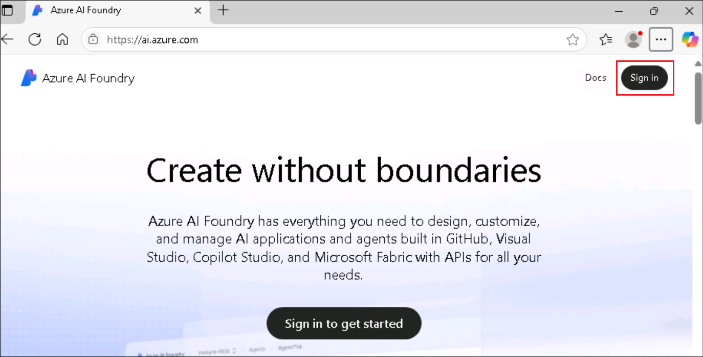
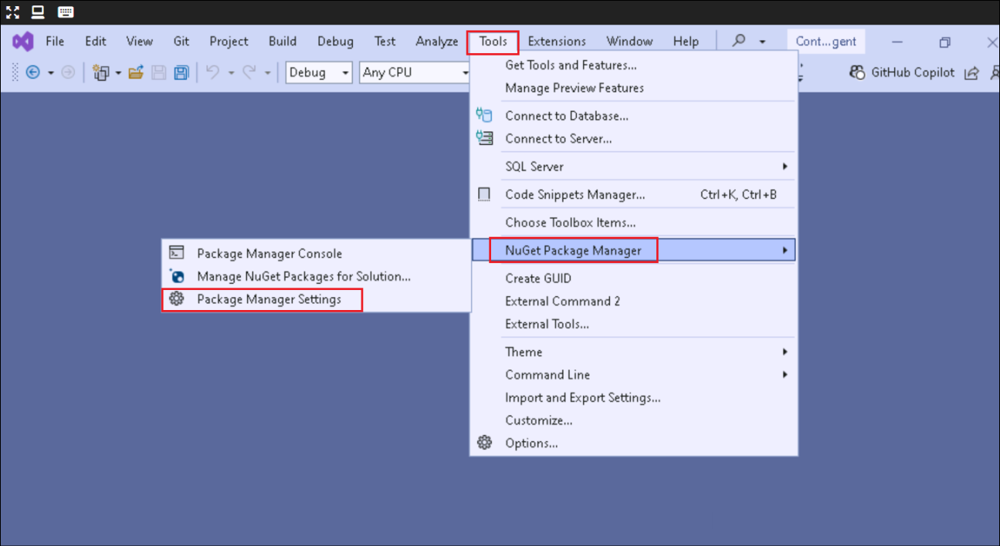
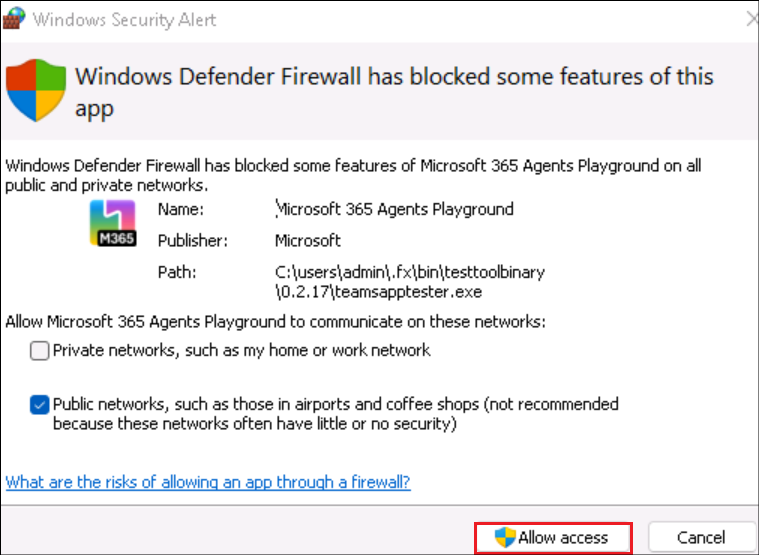

# ラボ 3 - M365 Agents SDK とセマンティック カーネルを使用して独自のエージェントを構築する

ラボの所要時間 – 80分

## 客観的

このラボでは、Microsoft 365 Agents SDK と Semantic Kernel
を使用して、Microsoft Teams、Microsoft 365 Copilot
Chat、さらには外部チャネルで実行されるカスタム エンジン
エージェントを開発します。

Azure AI
Foundryでは、エージェントのコアとなる指示、ツール、そしてパーソナリティを定義します。そこから、Microsoft
365 Agents SDKとVisual
Studioを使用してエージェントを実装し、動作をカスタマイズし、オーケストレーションのためにSemantic
Kernelと統合します。その後、Microsoft
Teamsでエージェントをテストし、Copilot Chatにインポートして、Microsoft
365アプリケーション全体でエージェントが動作する様子を確認します。

このラボでは、次のことを学びます。

- Azure AI Foundry でエージェントを準備する

- M365 Agents SDK を使用して最初のエージェントを構築する

- SDKを使用してエージェントのプロパティを構成する

- Azure AI Foundry を使用してエージェントを Teams と統合する

- エージェントを Microsoft 365 Copilot Chat に招待する

## 演習 1: Azure AI Foundry でエージェントを準備する

この演習では、AIエージェントの作成、構成、スケーリングのためのMicrosoftプラットフォームであるAzure
AI
Foundryを使用して、カスタムエンジンエージェントを準備することから始めます。**Agents**
**Playground**を探索し、エージェントの役割を定義し、指示をカスタマイズし、関連する社内ドキュメントに接続して、検索拡張生成（RAG）をサポートします。

**Microsoft 365 Agents SDK**と**Semantic Kernel
を**使用して、残りのビルドパスの基礎を構築します。従業員ハンドブック、ロールライブラリ、福利厚生プランなどのアップロードされたドキュメントに基づいて質問に答えることができる、Contoso
Electronics の実際の人事エージェントをシミュレートします。

Azure AI
Foundryは、開発者がAIエージェントを容易に構築、デプロイ、スケールできるプラットフォームです。エージェントの設定方法と、
Agents
Playgroundを使用した機能テストについて学習します。このハンズオン体験を通して、Azure
AI Agent
Serviceの機能と、様々なAIモデルやツールとの統合方法について理解を深めることができます。

Azure AI Foundry は、AI
エージェントを構築するための出発点です。このタスクでは、ログイン資格情報を使用して
Azure AI Foundry にログインします。

1.  ブラウザを開き、 +++ <https://ai.azure.com> +++ に移動して、Azure
    アカウントにサインインします。

    

2.  Azure AI Foundry ホームページから、**Create an agent**を選択します。

    

3.  プロジェクト名は推奨どおりのままにして、
    **\[Create\]を選択します**。

    

4.  これにより、Azure AI Foundry
    で新しいプロジェクトがスキャフォールディングされます。これには通常 3
    ～ 5 分かかります。

5.  プロジェクトが作成されると、プロジェクトにリダイレクトされます。左側のサイドバーを展開し、
    **「Agents」**を選択します。これで Agents Playground が開きます。

    

6.  **「Agents」**を選択します。新しいエージェントが作成されていることがわかります。

    

7.  エージェント**を選択し**、下にスクロールして「**Try in
    playground」を選択します**。

    

Agents Playground に移動したら、実際のシナリオ (Contoso 社内の HR
エージェント) に合わせてエージェントの ID と動作をカスタマイズします。

8.  エージェントのセットアップ パネルで、エージェントの名前を +++Contoso
    HR Agent+++ に設定し、手順を次のように更新します。

    ```
    You are Contoso HR Agent, an internal assistant for Contoso Electronics. Your role is to help employees find accurate, policy-aligned answers to questions related to:
    - Job role descriptions and responsibilities
    - Performance review process
    - Health and wellness benefits (PerksPlus, Northwind Standard, Northwind Plus)
    - Employee rights and workplace safety
    - Company values and conduct
    Always base your responses on the content provided in the official documents such as the Employee Handbook, Role Library, and Benefit Plans. If you are unsure or the information is not covered, suggest the employee contact HR.
    Respond in a professional but approachable tone. Keep answers factual and to the point.
    Example scenarios you should support:
    - What is the deductible for Northwind Standard?
    - Can I use PerksPlus for spa treatments?
    - What does the CTO at Contoso do?
    - What happens during a performance review?

    ```

9.  Knowledgeセクションで、 **+ Add を選択し**、**Files
    を選択して**、**local filesを選択します**。

    

    

    

10. **C:\Labfiles\M365 Agents
    SDK**に移動し、その中のすべてのファイルを選択して、
    **「Open」をクリックします**。

    

11. **「Upload and
    save」を**選択して、アップロードします。これにより、エージェント用のベクターストアが作成されます。

    

12. ドキュメントをアップロードすると、Foundry
    はそれをベクター形式に自動的に変換します。ベクター形式により、エージェントは関連情報を効率的に検索して取得できるようになります。

    

13. **Agent
    ID**をメモ帳に保存してください。次の演習で必要になります。エージェントIDはエージェントの詳細ページで確認できます。

    

14. また、 **\[Overview\]**ページに移動し、 **Azure AI Foundry project
    endpoint**の値をメモ帳に保存します。

    

指示をカスタマイズし、関連文書をアップロードすることで、エージェントに動作方法と依存する知識を教えることになります。これは、検索拡張生成（RAG）の簡略化された形式です。

## 練習問題2： M365 Agents SDK を使用して最初のエージェントを構築する

Azure AI Foundry を使ったエージェントの構築方法を解説しましたので、次は
Microsoft 365 Agents SDK
を使ってローカルで独自のエージェントを構築する方法を見ていきましょう。この
SDK を使えば、Microsoft Teams、Microsoft 365
Copilot、その他の推奨チャネルで実行できる、マルチチャネル対応で本番環境対応可能なエージェントを構築できます。

1.  Windowsのスタートから「Visual」を検索し、 **Visual Studio
    2022を開きます**。 **「Skip and add accounts later」を選択します**。

    

2.  **Start Visual Studioを**選択します。

    

3.  **Create a new projectを**選択します。

    

4.  +++ **Microsoft** +++を検索し、 **Microsoft 365
    Agents**テンプレートを選択します。 **「Next」をクリックします**。

    

5.  エージェントの名前を +++ **ContosoHRAgent** +++ として入力し、
    **\[Create\]を選択します**。

    

6.  テンプレートのリストから**Echo
    Botを選択し**、**Createを選択します**。

    

7.  ポップアップで**「Allow access」**を選択します。

    

8.  プロジェクトテンプレートがスキャフォールディングされたら、右側のパネルのソリューションエクスプローラーに移動し、エージェントテンプレートを確認します。ContosoHRAgentプロジェクトを展開します。

    - **Program.cs**を開いてください。このコードは、エージェントをホストするWebサーバーの設定と実行を行います。認証、ルーティング、ストレージなどの必要なサービスをセットアップし、
      **EchoBot**を登録して、メモリベースの状態処理を挿入します。

    

    - **Bot > EchoBot.cs**を開き、このサンプルが**Microsoft.Agents.Builder**を使用して基本的な AI エージェントをセットアップしていることを確認します。ユーザーがチャットに参加するとウェルカムメッセージを送信し、メッセージをリッスンして、実行中のメッセージ数とともにエコーバックします。

    

    **Echo Bot**は、ユーザーが送信したメッセージを繰り返し返信するシンプルなボットです。これは、設定を確認し、会話がバックグラウンドでどのように処理されるかを理解するのに役立ちます。

9.  Visual Studio から、 **\[Tool\] -\> \[NuGet Packet Manager\] -\>
    \[Package Manager Settings\]を選択して**、NuGet.org をパッケージ
    ソースに追加します。

    

10. **「Package Sources」**を選択し、
    **+**記号をクリックして新しいパッケージ ソースを追加します。

    

11. 以下の詳細を入力し、 **「OK」を選択します**。

    - Name - +++nuget.org+++

    - Source - +++https://api.nuget.org/v3/index.json

    

12. Echoエージェントをテストするには、
    **「Stsrt」**または**F5**キーを押してください。これにより、ローカルホストでテストツールが自動的に起動し、エージェントと対話できるようになります。Visual
    Studioから、アプリケーションをローカルでテストするために自己発行のSSL証明書を作成するように求められた場合は、**確認し**て**続行してください**。

    

    

13. セキュリティ警告で**「Allow access」**を選択します。

    

14. アプリケーションが起動します。

    

15. エージェントからの「Hello and
    Welcome!」というメッセージが流れるまで待ち、「Hi」「Hello」など何か入力してください。エージェントが全てエコーバックすることを確認してください。

    

    

16. Visual Studio から**\[Debug\]** -\> **\[Stop
    Debugging\]**を選択してデバッグを停止します。

    

    M365 Agents SDKを使用した最初のエージェントの構築演習を完了しました。このシンプルなエージェントは、より強力なエクスペリエンスの基盤となります。次のステップでは、これをAzure
AI
Foundryエージェントと組み合わせて、よりリッチでコンテキストに応じた回答を実現します。

## 演習3: エージェントのプロパティを構成してTeamsでテストする

基本的なボットを作成したら、次は生成AI機能を追加してAIエージェントにアップグレードしましょう。この演習では、Semantic
Kernelなどの主要ライブラリをインストールし、エージェントがよりインテリジェントに推論・応答できるように準備し、TeamsやCopilot
Chatで利用できるようにします。

1.  **Semantic Kernel
    NuGet**パッケージを追加します。このパッケージは、Azure AI
    統合のサポートを提供します。

2.  **ContosoHRAgentプロジェクト**を右クリックし、**Manage Nuget
    Packages for Solution**を選択します。

    

3.  **「Browse」**タブを選択し、「+++
    Microsoft.SemanticKernel.Agents.AzureAI +++」を検索します。
    **「Include prerelease」**チェックボックスをオンにします。

    

4.  **パッケージ**を選択し、プロジェクトの下の**Contoso
    を選択して**、**Install**を選択します。

    

    

5.  \[Preview Changes\] ダイアログで**\[Apply\]**を選択します。

    

6.  \[License Acceptance\] ダイアログで**\[I Accept\]**を選択します。

    

7.  パッケージがインストールされました。

    

8.  **Program.cs**を選択し、 +++ builder.Services.AddKernel ();+++
    の行の上に**var app = builder.Build ()** (行 31) を入力します。

    

    これにより、エージェントが生成 AI モデルと対話できるようにするコア
コンポーネントであるセマンティック カーネルが登録されます。

9.  **ContosoHRAgentプロジェクト**を右クリックし、 **\[Add\] \>
    \[Class\]を選択します**。

    

10. クラス名を +++ **FileReference.cs** +++ と入力し、
    **\[Create\]**を選択します。

    

11. このクラスは、応答内の特定のドキュメントを参照するときに使用する構造を定義します。これは、エージェントがアップロードされたファイルのコンテンツを引用する場合に便利です。

    既存のコードを次のコードに置き換えます。

    ```
    using Microsoft.Agents.Core.Models;

    namespace ContosoHRAgent
    {
        public class FileReference(string fileId, string fileName, string quote, Citation citation)
        {
            public string FileId { get; set; } = fileId;
            public string FileName { get; set; } = fileName;
            public string Quote { get; set; } = quote;
            public Citation Citation { get; set; } = citation;
        }
    }

    ```

    

12. **ContosoHRAgent**プロジェクトを右クリックし、
    **「Add」\>「Class」を選択し**、クラス名を「+++
    ConversationStateExtensions.cs
    +++」と定義します。既存のコードを以下のコードに置き換えます。

    ```
    using Microsoft.Agents.Builder.State;

    namespace ContosoHRAgent
    {
    public static class ConversationStateExtensions
    {
        public static int MessageCount(this ConversationState state) => state.GetValue<int>("countKey");

        public static void MessageCount(this ConversationState state, int value) => state.SetValue("countKey", value);

        public static int IncrementMessageCount(this ConversationState state)
        {
            int count = state.GetValue<int>("countKey");
            state.SetValue("countKey", ++count);
            return count;
        }

        public static string ThreadId(this ConversationState state) => state.GetValue<string>("threadId");

        public static void ThreadId(this ConversationState state, string value) => state.SetValue("threadId", value);
    }
    }

    ```

    

    このクラスは、ユーザー メッセージの数を管理および追跡するためのヘルパー
メソッドを追加し、進行中の会話中に状態がどのように保存および変更されるかを示します。

## 演習 4: Azure AI Foundry エージェントと M365 エージェント SDK を統合する

    M365 Agents SDKを使用してエージェントを構築し、生成AI機能を設定しました。次に、このローカルエージェントを、先ほど作成したAzure AI Foundryエージェントに接続します。これにより、エージェントはFoundryプロジェクトに保存されているエンタープライズデータと指示を使用して応答できるようになり、すべてが完了します。

### タスク 1: EchoBot.cs を Azure AI Foundry エージェントに接続できるように構成する

このタスクでは、EchoBot.cs 内で Foundry
でホストされているモデルを取得して呼び出すクライアントを追加して、Azure
AI Foundry エージェントに接続します。

1.  **ContosoHRAgent**プロジェクトで、 **Bot/EchoBot.**csを開き、EchoBot
    パブリック クラス内に次の行を追加します。

    ```
    private readonly PersistentAgentsClient _projectClient;
    private readonly string _agentId;

    ```


2.  既存の**EchoBot コンストラクターを**次のものに置き換えます。

    ```
    public EchoBot(AgentApplicationOptions options, IConfiguration configuration) : base(options)
    {

        OnConversationUpdate(ConversationUpdateEvents.MembersAdded, WelcomeMessageAsync);

        // Listen for ANY message to be received. MUST BE AFTER ANY OTHER MESSAGE HANDLERS 
        OnActivity(ActivityTypes.Message, OnMessageAsync);

        // Azure AI Foundry Project ConnectionString
        string projectEndpoint = configuration["AIServices:ProjectEndpoint"];
        if (string.IsNullOrEmpty(projectEndpoint))
        {
            throw new InvalidOperationException("ProjectEndpoint is not configured.");
        }
        _projectClient = new PersistentAgentsClient(projectEndpoint, new AzureCliCredential());

        // Azure AI Foundry Agent Id
        _agentId = configuration["AIServices:AgentID"];
        if (string.IsNullOrEmpty(_agentId))
        {
            throw new InvalidOperationException("AgentID is not configured.");
        }

    }

    ```

    

3.  **OnMessageAsync**メソッドを次のものに置き換えます。

    ```
    protected async Task OnMessageAsync(ITurnContext turnContext, ITurnState turnState, CancellationToken cancellationToken)
    {
        // send the initial message to the user
        await turnContext.StreamingResponse.QueueInformativeUpdateAsync("Working on it...", cancellationToken);

        // get the agent definition from the project
        var agentDefinition = await _projectClient.Administration.GetAgentAsync(_agentId, cancellationToken);

        // initialize a new agent instance from the agent definition
        var agent = new AzureAIAgent(agentDefinition, _projectClient);

        // retrieve the threadId from the conversation state
        // this is set if the agent has been invoked before in the same conversation
        var threadId = turnState.Conversation.ThreadId();

        // if the threadId is not set, we create a new thread
        // otherwise, we use the existing thread
        var thread = string.IsNullOrEmpty(threadId)
            ? new AzureAIAgentThread(_projectClient)
            : new AzureAIAgentThread(_projectClient, threadId);

        try
        {
            // increment the message count in state and queue the count to the user
            int count = turnState.Conversation.IncrementMessageCount();
            turnContext.StreamingResponse.QueueTextChunk($"({count}) ");

            // create the user message to send to the agent
            var message = new ChatMessageContent(AuthorRole.User, turnContext.Activity.Text);

            // invoke the agent and stream the responses to the user
            await foreach (AgentResponseItem<StreamingChatMessageContent> agentResponse in agent.InvokeStreamingAsync(message, thread, cancellationToken: cancellationToken))
            {
                // if the threadId is not set, we set it from the agent response
                // and store it in the conversation state for future use
                if (string.IsNullOrEmpty(threadId))
                {
                    threadId = agentResponse.Thread.Id;
                    turnState.Conversation.ThreadId(threadId);
                }

                turnContext.StreamingResponse.QueueTextChunk(agentResponse.Message.Content);
            }
        }
        finally
        {
            // ensure we end the streaming response
            await turnContext.StreamingResponse.EndStreamAsync(cancellationToken);
        }
    }

    ```

4.  上記のコード抜粋を貼り付けると、この機能はまだプレビュー段階であるため、警告（SKEXP0110）が表示される場合があります。AzureAIAgent
    を右クリックし、 **「Quick Actions and Refactorings \> Suppress or
    configure issues \> Configure SKEXP0110 Severity \>
    Silent**」を選択することで、現時点ではこの警告を安全に抑制できます。

    

5.  コードは次のようになります。

    

6.  ***OnMessageAsync***メソッドは***、***エージェントの応答ロジックの中核です。デフォルトのエコー動作を置き換えることで、エージェントはユーザーのメッセージを
    Azure AI Foundry
    エージェントに送信し、応答をリアルタイムでユーザーにストリーミング返信し、透明性を確保するために引用とファイル参照を追跡・添付し、セキュリティとトレーサビリティを確保するために機密性と
    AI 生成ラベルを追加できるようになります。

### タスク 2: Azure AI エージェント サービス キーを構成する

このタスクでは、Foundry
接続の詳細をappsettings.jsonに追加します。これらの値により、M365
エージェントが正しい Foundry プロジェクトとエージェントに接続されます。

1.  **ContosoHRAgent**プロジェクトで、
    **appsettings.json**を開き、appsettings リストの下部 (行 40)
    に次の行を追加します。

    ```
    ,
    "AIServices": {
    "AgentID": "<AzureAIFoundryAgentId>",
    "ProjectEndpoint": "<ProjectEndpoint>"
    }

    ```

    **AzureAIFoundryAgentId**のプレースホルダーを置き換え、 演習 1 の最後にメモ帳に保存した値を使用して、 **ProjectEndpoint** を変更します。

    

2.  **appsettings.json**の最終バージョンは次のようになります。

    ```
    {
    "AgentApplicationOptions": {
        "StartTypingTimer": false,
        "RemoveRecipientMention": false,
        "NormalizeMentions": false
    },

    "TokenValidation": {
        "Audiences": [
        "{{ClientId}}" // this is the Client ID used for the Azure Bot
        ]
    },

    "Logging": {
        "LogLevel": {
        "Default": "Information",
        "Microsoft.AspNetCore": "Warning",
        "Microsoft.Agents": "Warning",
        "Microsoft.Hosting.Lifetime": "Information"
        }
    },
    "AllowedHosts": "*",
    "Connections": {
        "BotServiceConnection": {
        "Settings": {
            "AuthType": "UserManagedIdentity", // this is the AuthType for the connection, valid values can be found in Microsoft.Agents.Authentication.Msal.Model.AuthTypes.
            "ClientId": "{{BOT_ID}}", // this is the Client ID used for the connection.
            "TenantId": "{{BOT_TENANT_ID}}",
            "Scopes": [
            "https://api.botframework.com/.default"
            ]
        }
        }
    },
    "ConnectionsMap": [
        {
        "ServiceUrl": "*",
        "Connection": "BotServiceConnection"
        }
    ],
    "AIServices": {
    "AgentID": "<AzureAIFoundryAgentId>",
    "ProjectEndpoint": "<ProjectEndpoint>"
    }
    }

    ```

### タスク3: Teamsでエージェントをテストする

このタスクでは、作成したエージェントを Teams でテストします。

1.  **Windowsコマンドプロンプト**を開き、「+++where
    az+++」と入力します。これは、Azure
    CLIがインストールされているパスを取得し、Path環境変数を更新するためです。

    出力としてリストされているパスをコピーして貼り付けます。

    

2.  **Start**ウィンドウで、 +++Environment+++ を検索し、**Edit the
    system environment variables**を選択します。

    

3.  **Environment variables**を選択します。

    

4.  **System variables**の下で、**パス**を選択し、**Edit**を選択します。

    

5.  コマンド**where az** (このタスクの最初のステップ)
    の出力として取得したパスを追加し、 **\[OK\]**をクリックします。

    

6.  **Environment
    Settings**の他の開いているウィンドウで**\[OK\]**を選択します。

7.  Visual Studio から、 **\[Tools \> Command Line \> Developer Command
    Prompt\]**を開きます。

    

8.  以下のコマンドを実行します。

    +++az login+++

    ブラウザにウィンドウがポップアップ表示されます。 **「Work or school account」**を選択し、ログイン資格情報でログインしてください。

    

    

9.  ログインしたら、 **1 を入力して**サブスクリプションを選択します。

    

10. **\[Start\]**を展開し、 **\[Dev Tunnels \> Create a
    Tunnel\]**を選択します。

    

11. 以下の詳細を入力し、 **「OK」**を選択します。

    - トンネルを作成するアカウント - **\[Sign in** -\> **Work or school
    account\]** を選択し、ログイン資格情報でログインします。

    - Name - +++DevTunnel+++。

    - Tunnel Type - **Temporary**

    - Access - **Public**

    

    

12. **M365Agent**プロジェクトを右クリックし、 **Microsoft 365 Agents
    Toolkit を選択し、Microsoft 365 Account**を選択します。

    

    

13. アカウントを選択し、 **「Continue」**をクリックします。

    

14. **\[Multiple startup projects\]**の横にあるドロップダウンを展開し、
    **\[Microsoft Teams (browser)\]**を選択します。

    

    これで、統合エージェントを実行し、Microsoft Teams
でライブテストする準備が整いました。

15. **「スタート」**または**F5キー**を押してください。Microsoft
    Teamsが自動的に起動し、エージェントアプリがウィンドウにポップアップ表示されます。
    **「Add」と「Open」**を選択して、エージェントとのチャットを開始してください。

    

    

16. エージェントと対話するには、次のいずれかの質問をすることができます。

    - +++What’s the difference between Northwind Standard and Health Plus
    when it comes to emergency and mental health coverage?+++

    - +++Can I use PerksPlus to pay for both a rock climbing class and a
    virtual fitness program?+++

    - +++What values guide behavior and decision-making at Contoso
    Electronics?+++

    Azure AI Foundry で作成したエージェントでも同様の応答が得られることがわかります。

    

    

## 演習5: エージェントをCopilot Chatに招待する

この演習では、カスタムエンジンエージェントのマニフェストを更新して、Copilot
Chat にエージェントを導入します。アプリのマニフェストで copilotAgents
を有効にすると、AI 搭載アシスタントを Copilot
エクスペリエンス内で直接利用できるようになります。

1.  **M365Agent/AppPackage/manifest.json**を開き、マニフェスト
    スキーマとバージョンを次のように更新します。

    ```
    "$schema": "https://developer.microsoft.com/en-us/json-schemas/teams/v1.22/MicrosoftTeams.schema.json",
    "manifestVersion": "1.22",

    ```

    

2.  **bots**セクションを次のものに置き換えます。これにより、マニフェストに
    copilotAgents も追加されます。

このブロックは、エージェントをM365
Copilotのカスタムエンジンエージェントとして宣言します。Microsoft
365にこのエージェントをCopilot
Chatで公開し、会話UIにコマンドリストと会話スターターを表示して、ユーザーがすぐに使い始められるように指示します。

    ```
    "bots": [ 
    { 
        "botId": "${{BOT_ID}}", 
        "scopes": [ 
        "personal", 
        "team", 
        "groupChat" 
        ], 
        "supportsFiles": false, 
        "isNotificationOnly": false, 
        "commandLists": [ 
        { 
            "scopes": [ "personal", "team", "groupChat" ], 
            "commands": [ 
            { 
                "title": "Emergency and Mental Health",
                "description": "What’s the difference between Northwind Standard and Health Plus when it comes to emergency and mental health coverage?" 
            }, 
            { 
                "title": "PerksPlus Details", 
                "description": "Can I use PerksPlus to pay for both a rock climbing class and a virtual fitness program?" 
            }, 
            { 
                "title": "Contoso Electronics Values", 
                "description": "What values guide behavior and decision making at Contoso Electronics?" 
            } 
            ] 
        } 
        ] 
    } 
    ], 
    "copilotAgents": { 
    "customEngineAgents": [ 
        { 
        "id": "${{BOT_ID}}", 
        "type": "bot" 
        } 
    ] 
    },

    ```

    

3.  **「Start」**または**F5 キー**を押します。Microsoft Teams
    が自動的に起動します。

4.  ブラウザーで Microsoft Teams
    が開いたら、アプリのポップアップを無視し、 **\[Apps \> Manage your
    apps \> Upload an app\] の**順に選択して、 **\[Upload a custom\]**
    を選択します。

    

5.  プロジェクトのセットアップ時にパスを変更していない場合、パスは**C:\Users\Admin\source\repos\ContosoHRAgent\ContosoHRAgent**になります。
    **\ContosoHRAgent\M365Agent\appPackage\build**
    に移動し、**appPackage.local.zip
    を選択して「Open」**をクリックします。

    

6.  アプリがTeamsに再度ポップアップ表示されるので、
    **「Add」**を選択します

    

7.  Copilot でエージェントをテストするには、 **「Open with
    Copilot」**を選択します。

    

8.  会話のきっかけとなる**「PerksPlus Details」**を選択し、
    **「Send」をクリックします**。

    

    

9.  Copilot Chat で AI Foundry
    エージェントからの応答を受け取っていることを確認します。

    

## まとめ

このラボでは、Microsoft 365 エージェント SDK と Azure AI Foundry
を使用してカスタム エンジン エージェントを構築しました。

あなたはどのように学びましたか

- エージェント プレイグラウンドを使用して Azure AI Foundry で AI
  エージェントを構成する

- エージェントの応答の根拠となる企業文書をアップロードします

- Visual Studio で M365 Agents SDK
  を使用してボットをスキャフォールディングする

- セマンティック カーネルを追加し、Azure AI エージェント
  サービスに接続する

- ボットを Azure AI Foundry
  エージェントと統合して、リアルタイムの根拠に基づいた推論を実現します。

- **Microsoft Teams**と**Copilot
  Chat**でエージェントを展開してテストする
