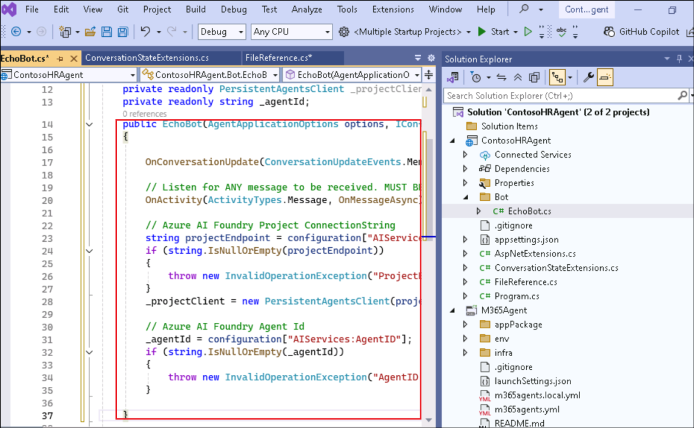

# 실습 3 - M365 Agents SDK 및 Semantic Kernel을 사용해 나만의 에이전트 구축하기

소요 시간 – 80분

## 목표

이 실습에서는 Microsoft 365 Agents SDK와 Semantic Kernel을 활용해
Microsoft Teams, Microsoft 365 Copilot Chat 및 외부 채널에서 실행되는
맞춤형 엔진 에이전트를 개발합니다.

Azure AI Foundry에서 에이전트의 핵심 지침, 도구 및 특성을 정의한 뒤,
Microsoft 365 Agents SDK와 Visual Studio를 사용해 에이전트를 구현하고,
Semantic Kernel과 통합하여 오케스트레이션 기능을 추가합니다. 이후
Microsoft Teams에서 에이전트를 테스트하고 Copilot Chat으로 가져와
Microsoft 365 애플리케이션 전반에서 작동하도록 구성하게 됩니다.

이 실습에서 학습할 내용은 다음과 같습니다:

- Azure AI Foundry에서 에이전트 준비하기

- M365 Agents SDK를 사용해 첫 번째 에이전트 빌드하기

- SDK를 통해 에이전트 속성 구성하기

- Azure AI Foundry를 사용해 Teams와 통합하기

- 에이전트를 Microsoft 365 Copilot Chat에 연결하기

## 연습 1: Azure AI Foundry에서 에이전트 준비

이 연습에서는 AI 에이전트를 생성, 구성 및 확장하기 위한 Microsoft의
플랫폼인 Azure AI Foundry를 사용해 맞춤형 엔진 에이전트를 준비하는
과정을 시작합니다. **Agents Playground**를 탐색하고, 에이전트의 역할을
정의하며, 지침을 개인화하고, RAG(Retrieval-Augmented Generation)를
지원하기 위해 관련 내부 문서에 연결합니다.

이 연습은 **Microsoft 365 Agents SDK** 및 **Semantic Kernel**을 사용하는
나머지 빌드 과정의 기초를 설정합니다. 직원 핸드북, 역할 라이브러리 및
복리후생 계획과 같은 업로드된 문서를 기반으로 질문에 답할 수 있는
Contoso Electronics의 실제 인사 에이전트를 시뮬레이션합니다.

Azure AI Foundry는 개발자가 AI 에이전트를 쉽게 빌드, 배포 및 확장할 수
있게 해주는 플랫폼입니다. 에이전트를 구성하고 Agents Playground를 사용해
기능을 테스트하는 방법을 배웁니다. 이 실습 경험을 통해 Azure AI Agent
Service의 기능과 다양한 AI 모델 및 도구와의 통합 방식을 직접 체험하게
됩니다.

Azure AI Foundry는 AI 에이전트를 구축하기 위한 시작점입니다. 이
작업에서는 로그인 자격 증명을 사용해 Azure AI Foundry에 로그인합니다.

1.  브라우저를 열고 +++<https://ai.azure.com>+++ 으로 이동해 Azure
    계정에 로그인하세요.
    
    

2.  Azure AI Foundry 홈페이지에서 **Create an agent**를 선택하세요.

    

3.  프로젝트 이름은 기본으로 제안된 값을 그대로 두고 **Create**를
    선택하세요.

    

4.  이렇게 하면 Azure AI Foundry에서 새 프로젝트가 생성되며, 일반적으로
    약 3~5분 정도 소요됩니다.

5.  프로젝트가 생성되면 자동으로 해당 프로젝트 페이지로 이동하게 됩니다.
    왼쪽 사이드바를 확장하고 **Agents**를 선택하면Agents Playground가
    열립니다.

    

6.  왼쪽 패널에서 **Agents**를 선택하세요. 새 에이전트가 자동으로 생성된
    것을 확인할 수 있습니다.

    

7.  **Agent**를 **선택한** 후 아래로 스크롤해 **Try in playground**를
    선택하세요.

    

    이제 Agents Playground에 들어왔으므로, 실제 시나리오에 맞게 에이전트의
정체성과 동작을 사용자 지정합니다. 이 실습에서는 Contoso의 내부 HR
에이전트를 구성합니다.

8.  에이전트의 설정(Setup) 패널에서 에이전트 이름(Name)을 +++Contoso HR
    Agent+++로 지정하고, 아래의 지침(Instructions)을 업데이트하세요:

    ```
    You are Contoso HR Agent, an internal assistant for Contoso Electronics. Your role is to help employees find accurate, policy-aligned answers to questions related to:
    - Job role descriptions and responsibilities
    - Performance review process
    - Health and wellness benefits (PerksPlus, Northwind Standard, Northwind Plus)
    - Employee rights and workplace safety
    - Company values and conduct
    Always base your responses on the content provided in the official documents such as the Employee Handbook, Role Library, and Benefit Plans. If you are unsure or the information is not covered, suggest the employee contact HR.
    Respond in a professional but approachable tone. Keep answers factual and to the point.
    Example scenarios you should support:
    - What is the deductible for Northwind Standard?
    - Can I use PerksPlus for spa treatments?
    - What does the CTO at Contoso do?
    - What happens during a performance review?

    ```

9.  Knowledge 섹션에서 **+ Add**를 선택한 다음, **Files**을 선택하고
    **local files**을 선택하세요.

    

    

    

10. **C:\Labfiles\M365 Agents SDK** 폴더로 이동해 내부의 모든 파일을
    선택한 뒤**Open**을 클릭하세요.

    

11. **Upload and save**을 선택하여 파일을 업로드하세요. 이 작업을 통해
    에이전트를 위한 벡터 저장소(vector store) 가 생성됩니다.

    

12. 문서를 업로드하면, Foundry가 이를 자동으로 벡터 형식으로 변환합니다.
    이 형식은 에이전트가 관련 정보를 효율적으로 검색하고 검색 결과를
    가져올 수 있도록 도와줍니다.

    

13. **Agent id** 는 다음 연습에서 필요하므로 메모장에 저장해 두세요.
    에이전트 ID는 에이전트 세부 정보에서 확인할 수 있습니다.

    

14. 또한 **Overview** 페이지로 이동해 **Azure AI Foundry project
    endpoint** 값을 메모장에 저장해 두세요.

    

지침을 사용자 지정하고 관련 문서를 업로드함으로써 에이전트에게 어떻게
동작해야 하는지와 어떤 지식을 활용해야 하는지를 학습시키는 것입니다.
이것은 RAG(Retrieval-Augmented Generation)의 단순화된 형태입니다.

## 연습 2: M365 Agents SDK를 사용해 첫 번째 에이전트 구축

이제 Azure AI Foundry를 사용해 에이전트를 구축하는 방법을
살펴보았으므로, 이번에는 Microsoft 365 Agents SDK를 사용해 로컬 환경에서
직접 에이전트를 구축하는 방법을 알아보겠습니다. 이 SDK를 사용하면
Microsoft Teams, Microsoft 365 Copilot 및 기타 선호하는 채널에서 실행할
수 있는 멀티채널 프로덕션급 에이전트를 개발할 수 있습니다.

1.  Windows 시작 메뉴에서 Visual을 검색하고 **Visual Studio 2022**를
    여세요. **Skip and add accounts later**를 선택하세요.

    

2.  **Start Visual Studio**를 선택하세요.

    

3.  **Create a new project**를 선택하세요.

    

4.  +++**Microsoft**+++를 입력한 뒤, **Microsoft 365 Agents** 템플릿을
    선택하세요. **Next**를 클릭하세요.

    

5.  에이전트 이름을 +++**ContosoHRAgent**+++로 입력하고 **Create**을
    선택하세요.

    

6.  템플릿 목록에서 **Echo Bot**을 선택한 뒤, **Create**을 클릭하세요.

    

7.  팝업 창이 표시되면 **Allow access**을 선택하세요.

    

8.  프로젝트 템플릿이 생성되면 오른쪽 패널의 Solution Explorer로 이동해
    에이전트 템플릿을 살펴보세요. **ContosoHRAgent** 프로젝트를
    확장하세요.

    - **Program.cs** 파일을 열면, 이 코드는 에이전트를 호스팅하는 웹
      서버를 구성하고 실행합니다. 인증, 라우팅, 스토리지와 같은 필수
      서비스를 설정하며, **EchoBot**을 등록하고 메모리 기반 상태 관리를
      주입합니다.

    

    - **Bot > EchoBot.cs** 를 열어보면 이 샘플이 **Microsoft.Agents.Builder**를 사용해 기본적인 AI 에이전트를 설정하는 것을 확인할 수 있습니다. 사용자가 채팅에 참여하면 환영 메시지를 보내고, 사용자가 보낸 모든 메시지를 수신하여 메시지 수를 포함한 응답을 되돌려줍니다.

    

    여러분은 사용자가 보낸 메시지를 그대로 되돌려주는 간단한 봇인 **Echo Bot**으로 시작했습니다. 이 봇은 설정이 올바르게 구성되었는지 확인하고, 대화가 백엔드에서 어떻게 처리되는지를 이해하는 데 유용한 예제입니다.

9.  Visual Studio에서 **Tools -\> NuGet Package Manager -\> Package
    Manager Settings**를 선택해 NuGet.org를 패키지 소스에 추가하세요.

    

10. **Package Sources**를 선택하고 **+** 기호를 클릭해서 새 패키지
    소스를 추가하세요.

    

11. 다음 정보를 입력한 뒤, **Ok**를 선택하세요.

    - Name - +++nuget.org+++

    - Source - +++https://api.nuget.org/v3/index.json+++

    

12. 에코 에이전트를 테스트하려면 **Start** 버튼을 클릭하거나 **F5** 키를
    누르세요. 이 작업을 수행하면 localhost에서 Test Tool이 자동으로
    실행되어 에이전트와 상호 작용할 수 있습니다. Visual Studio에서 로컬
    테스트를 위한 자체 서명 SSL 인증서 생성을 확인하라는 메시지가
    나타나면, **확인**(Yes) 을 선택하고 **계속 진행**하세요.

    

    

13. 보안 경고 창이 나타나면 **Allow access**을 선택하세요.

    

14. 애플리케이션이 이제 시작됩니다.

    

15. 에이전트의 메시지 “Hello and Welcome!”이 표시될 때까지 기다린 후,
    “Hi”, “Hello”와 같은 문장을 입력하세요. 에이전트가 입력한 모든
    내용을 그대로 따라 말하는 것을 확인할 수 있습니다.

    

16. Visual Studio에서 **Debug** -\> **Stop Debugging** 을 선택해
    디버깅을 중지하세요.

    

    이제 M365 Agents SDK를 사용해 첫 번째 에이전트를 구축하는 연습을
완료하셨습니다. 이 간단한 에이전트는 앞으로 더 강력한 기능을 구현하기
위한 기초 단계입니다. 다음 단계에서는 Azure AI Foundry 에이전트와 이 SDK
에이전트를 결합해, 더 풍부하고 상황에 맞게 응답할 수 있는 지능형
에이전트를 만들어 보겠습니다.

## 연습 3: 에이전트 속성 구성 및 Teams에서 테스트하기

이제 기본 봇을 만들었으니, 생성형 AI 기능을 추가해 AI 에이전트로
업그레이드해 보겠습니다.이번 실습에서는 Semantic Kernel 같은 핵심
라이브러리를 설치해, 에이전트가 더 지능적으로 사고하고 응답할 수 있도록
준비합니다. 이 에이전트는 나중에 Teams 또는 Copilot Chat에서 실행할 수
있습니다.

1.  **Semantic Kernel Nuget** 패키지를 추가하세요. 이 패키지는 Azure AI
    통합을 지원합니다.

2.  **ContosoHRAgent** 프로젝트를 마우스 오른쪽 버튼으로
    클릭하고 **Manage Nuget Packages for Solution**를 선택하세요.

    

3.  **Browse** 탭을 선택하고
    +++Microsoft.SemanticKernel.Agents.AzureAI+++를 검색하세요.
    **Include prerelease** 체크박스를 선택하세요.

    

4.  **Package**를 선택한 후, Project에서**Contoso**를
    선택하고 **Install** 버튼을 클릭하세요.

    

    

5.  Preview Changes 대화 상자에서**Apply** 버튼을 클릭하세요.

    

6.  License Acceptance 대화 상자에서**I Accept** 버튼을 선택하세요.

    

7.  이제 패키지가 설치되었습니다.

    

8.  **Program.cs** 파일을 열고, **var app = builder.Build()** (31번째
    줄) 위에 +++builder.Services.AddKernel();+++를 추가하세요.

    

    이는 Semantic Kernel을 등록하는 것으로, 에이전트가 생성형 AI 모델과
상호작용할 수 있게 해주는 핵심 구성 요소입니다.

9.  **ContosoHRAgent** 프로젝트를 마우스 오른쪽 버튼으로 클릭하고, **Add > Class**를 선택하세요.

    

10. Class 이름을 +++**FileReference.cs**+++로 입력하고 **Create**을
    선택하세요.

    

11. 이 클래스는 에이전트가 응답에서 특정 문서를 참조할 때 사용하는
    구조를 정의합니다. 이는 에이전트가 업로드된 파일의 내용을 인용할 때
    유용합니다. 

    기존 코드를 아래의 코드로 변경하세요.

    ```
    using Microsoft.Agents.Core.Models;

    namespace ContosoHRAgent
    {
        public class FileReference(string fileId, string fileName, string quote, Citation citation)
        {
            public string FileId { get; set; } = fileId;
            public string FileName { get; set; } = fileName;
            public string Quote { get; set; } = quote;
            public Citation Citation { get; set; } = citation;
        }
    }

    ```

    

12. **ContosoHRAgent** 프로젝트를 마우스 오른쪽 버튼으로 클릭하고 **Add > Class**를 선택한 후 클래스
    이름을 +++ConversationStateExtensions.cs+++로 정의하세요. 기존
    코드를 아래 코드로 변경하세요.

    ```
    using Microsoft.Agents.Builder.State;

    namespace ContosoHRAgent
    {
    public static class ConversationStateExtensions
    {
        public static int MessageCount(this ConversationState state) => state.GetValue<int>("countKey");

        public static void MessageCount(this ConversationState state, int value) => state.SetValue("countKey", value);

        public static int IncrementMessageCount(this ConversationState state)
        {
            int count = state.GetValue<int>("countKey");
            state.SetValue("countKey", ++count);
            return count;
        }

        public static string ThreadId(this ConversationState state) => state.GetValue<string>("threadId");

        public static void ThreadId(this ConversationState state, string value) => state.SetValue("threadId", value);
    }
    }

    ```

    

    이 클래스는 사용자 메시지 수를 관리하고 추적하는 헬퍼 메서드를 추가하며,
대화가 진행되는 동안 상태가 어떻게 저장되고 수정되는지를 보여줍니다.

## 연습 4: Azure AI Foundry 에이전트를 M365 Agents SDK와 통합하기

M365 Agents SDK를 사용해 에이전트를 구축하고 생성형 AI 기능을
구성했습니다. 이제 이전에 생성한 Azure AI Foundry 에이전트와 이 로컬
에이전트를 연결합니다. 이를 통해 에이전트가 Foundry 프로젝트에 저장된
엔터프라이즈 데이터와 지침을 활용해 응답할 수 있게 되어, 전체 흐름이
완성됩니다.

### 작업 1: Azure AI Foundry 에이전트에 연결하도록 EchoBot.cs 구성

이 작업에서는 EchoBot.cs 내에서 Foundry에 호스팅된 모델을 가져와 호출할
수 있도록 클라이언트를 추가하여 Azure AI Foundry 에이전트와 연결합니다.

1.  **ContosoHRAgent** 프로젝트에서 **Bot/EchoBot.cs** 파일을 열고
    EchoBot public class 내부에 다음 코드를 추가하세요.

    ```
    private readonly PersistentAgentsClient _projectClient;
    private readonly string _agentId;

    ```


2.  기존 **EchoBot constructor**을 다음을 변경하세요.

    ```
    public EchoBot(AgentApplicationOptions options, IConfiguration configuration) : base(options)
    {

        OnConversationUpdate(ConversationUpdateEvents.MembersAdded, WelcomeMessageAsync);

        // Listen for ANY message to be received. MUST BE AFTER ANY OTHER MESSAGE HANDLERS 
        OnActivity(ActivityTypes.Message, OnMessageAsync);

        // Azure AI Foundry Project ConnectionString
        string projectEndpoint = configuration["AIServices:ProjectEndpoint"];
        if (string.IsNullOrEmpty(projectEndpoint))
        {
            throw new InvalidOperationException("ProjectEndpoint is not configured.");
        }
        _projectClient = new PersistentAgentsClient(projectEndpoint, new AzureCliCredential());

        // Azure AI Foundry Agent Id
        _agentId = configuration["AIServices:AgentID"];
        if (string.IsNullOrEmpty(_agentId))
        {
            throw new InvalidOperationException("AgentID is not configured.");
        }

    }

    ```

    

3.  **OnMessageAsync** 메서드를 다음과 같이 변경하세요:

    ```
    protected async Task OnMessageAsync(ITurnContext turnContext, ITurnState turnState, CancellationToken cancellationToken)
    {
        // send the initial message to the user
        await turnContext.StreamingResponse.QueueInformativeUpdateAsync("Working on it...", cancellationToken);

        // get the agent definition from the project
        var agentDefinition = await _projectClient.Administration.GetAgentAsync(_agentId, cancellationToken);

        // initialize a new agent instance from the agent definition
        var agent = new AzureAIAgent(agentDefinition, _projectClient);

        // retrieve the threadId from the conversation state
        // this is set if the agent has been invoked before in the same conversation
        var threadId = turnState.Conversation.ThreadId();

        // if the threadId is not set, we create a new thread
        // otherwise, we use the existing thread
        var thread = string.IsNullOrEmpty(threadId)
            ? new AzureAIAgentThread(_projectClient)
            : new AzureAIAgentThread(_projectClient, threadId);

        try
        {
            // increment the message count in state and queue the count to the user
            int count = turnState.Conversation.IncrementMessageCount();
            turnContext.StreamingResponse.QueueTextChunk($"({count}) ");

            // create the user message to send to the agent
            var message = new ChatMessageContent(AuthorRole.User, turnContext.Activity.Text);

            // invoke the agent and stream the responses to the user
            await foreach (AgentResponseItem<StreamingChatMessageContent> agentResponse in agent.InvokeStreamingAsync(message, thread, cancellationToken: cancellationToken))
            {
                // if the threadId is not set, we set it from the agent response
                // and store it in the conversation state for future use
                if (string.IsNullOrEmpty(threadId))
                {
                    threadId = agentResponse.Thread.Id;
                    turnState.Conversation.ThreadId(threadId);
                }

                turnContext.StreamingResponse.QueueTextChunk(agentResponse.Message.Content);
            }
        }
        finally
        {
            // ensure we end the streaming response
            await turnContext.StreamingResponse.EndStreamAsync(cancellationToken);
        }
    }

    ```

4.  위 코드 조각을 붙여넣을 때, 이 기능이 아직 프리뷰 상태이므로
    SKEXP0110 경고가 표시될 수 있습니다. 이 경고는 안전하게 무시할 수
    있으며, 무시하려면 AzureAIAgent를 우클릭하고 **Quick Actions and
    Refactorings \> Suppress or configure issues \> Configure SKEXP0110
    Severity \> Silent**를 선택하세요.

    

5.  이제 코드가 다음과 같이 표시됩니다.

    

6.  ***OnMessageAsync*** 메서드는 에이전트 응답 로직의 핵심입니다. 기본
    에코 동작을 교체함으로써, 사용자의 메시지를 Azure AI Foundry
    에이전트로 전송하고, 응답을 실시간으로 스트리밍하며, 투명성을 위해
    인용 및 파일 참조를 추적하고 첨부하며, 보안과 추적성을 위해 민감도
    및 AI 생성 라벨을 추가할 수 있게 되었습니다.

### 작업 2: Azure AI Agent Service 키 구성

이 작업에서는 appsettings.json에 Foundry 연결 세부 정보를 추가합니다. 이
값들은 M365 에이전트를 올바른 Foundry 프로젝트 및 에이전트에 연결하는
역할을 합니다.

1.  **ContosoHRAgent** 프로젝트에서 **appsettings.json**을
    열고appsettings 목록의 맨 하단(40번째 줄) 에 다음 내용을 추가하세요.

    ```
    ,
    "AIServices": {
    "AgentID": "<AzureAIFoundryAgentId>",
    "ProjectEndpoint": "<ProjectEndpoint>"
    }

    ```

    **AzureAIFoundryAgentId** 와 기타 자리 표시자 값들을 Exercise 1에서 메모장에 저장한 실제 값으로 변경하세요.

    

2.  최종적으로 완성된 **appsettings.json** 파일은 아래와 같이
    표시됩니다:

    ```
    {
    "AgentApplicationOptions": {
        "StartTypingTimer": false,
        "RemoveRecipientMention": false,
        "NormalizeMentions": false
    },

    "TokenValidation": {
        "Audiences": [
        "{{ClientId}}" // this is the Client ID used for the Azure Bot
        ]
    },

    "Logging": {
        "LogLevel": {
        "Default": "Information",
        "Microsoft.AspNetCore": "Warning",
        "Microsoft.Agents": "Warning",
        "Microsoft.Hosting.Lifetime": "Information"
        }
    },
    "AllowedHosts": "*",
    "Connections": {
        "BotServiceConnection": {
        "Settings": {
            "AuthType": "UserManagedIdentity", // this is the AuthType for the connection, valid values can be found in Microsoft.Agents.Authentication.Msal.Model.AuthTypes.
            "ClientId": "{{BOT_ID}}", // this is the Client ID used for the connection.
            "TenantId": "{{BOT_TENANT_ID}}",
            "Scopes": [
            "https://api.botframework.com/.default"
            ]
        }
        }
    },
    "ConnectionsMap": [
        {
        "ServiceUrl": "*",
        "Connection": "BotServiceConnection"
        }
    ],
    "AIServices": {
    "AgentID": "<AzureAIFoundryAgentId>",
    "ProjectEndpoint": "<ProjectEndpoint>"
    }
    }

    ```

### 작업 3: Teams에서 에이전트 테스트

이번 작업에서는 생성한 에이전트를 Teams에서 테스트합니다.

1.  **Windows command prompt**를 열고 +++where az+++를 입력하세요. 이는
    Azure CLI가 설치된 경로를 확인하고 Path 환경 변수를 업데이트하기
    위한 것입니다.

    출력으로 표시되는 경로를 복사하여 붙여넣으세요.

    

2.  **Start** 창에서 +++Environment+++ 를 검색하고, **Edit the system
    environment variables**를 선택하세요.

    

3.  **Environment variables**를 선택하세요.

    

4.  **System variables**에서 **Path**을 선택한 뒤, **Edit**을
    선택하세요.

    

5.  첫 번째 단계에서 실행한 **where az** 명령어의 출력으로 얻은 경로를
    추가하고 **Ok** 버튼을 클릭하세요.

    

6.  **Environment Settings**의 다른 모든 열린 창에서도**Ok** 버튼을
    클릭하세요.

7.  Visual Studio에서 **Tools \> Command Line \> Developer Command
    Prompt**를 여세요.

    

8.  아래 명령어를 실행하세에ㅛ.

    +++az login+++

    브라우저 창이 열리면 **Work or school account**을 선택하고 로그인 정보를 입력해 로그인하세요.

    

    

9.  로그인이 완료되면, 구독을 선택하기 위해 **1**을 입력하세요.

    

10. **Start** 메뉴를 확장하고 **Dev Tunnels \> Create a Tunnel**을
    선택하세요.

    

11. 다음 정보를 입력하고 **Ok**를 선택하세요.

    - 터널을 생성할 계정: **Sign in** -\> **Work or school account**를
    선택하고 로그인하세요.

    - Name - +++DevTunnel+++.

    - Tunnel Type - **Temporary**

    - Access - **Public**

    

    

12. **M365Agent** 프로젝트를 마우스 오른쪽 클릭하고 **Microsoft 365
    Agents Toolkit \> Select Microsoft 365 Account**을 선택하세요.

    

    

13. 사용할 계정을 선택한 후 **Continue**를 클릭하세요.

    

14. **Multiple startup projects** 옆 **드롭다운**을 확장하고 **Microsoft
    Teams (browser)**를 선택하세요.

    

    이제 통합 에이전트를 실행할 준비가 완료되었으며, Microsoft Teams에서
실시간으로 테스트할 수 있습니다.

15. **Start** 또는 **F5** 를 눌러 디버깅을 시작합니다. Microsoft Teams가
    자동으로 실행되며, 에이전트 앱이 창에 나타납니다.
    **Add**와**Open**을 선택해 에이전트와 대화를 시작하세요.

    

    

16. 에이전트와 상호작용하기 위해 다음 질문 중 하나를 해볼 수 있습니다.

    - +++What’s the difference between Northwind Standard and Health Plus
    when it comes to emergency and mental health coverage?+++

    - +++Can I use PerksPlus to pay for both a rock climbing class and a
    virtual fitness program?+++

    - +++What values guide behavior and decision-making at Contoso
    Electronics?+++

    질문 후, Azure AI Foundry에서 생성한 에이전트와 유사한 응답을 받고 있는 것을 확인할 수 있습니다.

    

    

## 연습 5:  Copilot Chat에 에이전트 가져오기

이번 실습에서는 커스텀 엔진 에이전트를 Copilot Chat으로 가져오기 위해
에이전트의 매니페스트를 업데이트합니다. 앱
매니페스트에서 copilotAgents를 활성화하면, AI 기반 어시스턴트를 Copilot
환경 내에서 바로 사용할 수 있습니다.

1.  **M365Agent/AppPackage/manifest.json**를 열고, 매니페스트 스키마와
    버전을 다음과 같이 업데이트하세요.

    ```
    "$schema": "https://developer.microsoft.com/en-us/json-schemas/teams/v1.22/MicrosoftTeams.schema.json",
    "manifestVersion": "1.22",

    ```

    

2.  섹션을 아래 내용으로 변경해 매니페스트에 **copilotAgents**도
    추가하세요.

    이 블록은 에이전트를 M365 Copilot용 커스텀 엔진 에이전트로 선언합니다.
이를 통해 Microsoft 365는 해당 에이전트를 Copilot Chat에 노출하고, 대화
UI에서 명령 목록과 대화 시작 문구를 함께 표시하여 사용자가 빠르게 시작할
수 있도록 안내합니다.

    ```
    "bots": [ 
    { 
        "botId": "${{BOT_ID}}", 
        "scopes": [ 
        "personal", 
        "team", 
        "groupChat" 
        ], 
        "supportsFiles": false, 
        "isNotificationOnly": false, 
        "commandLists": [ 
        { 
            "scopes": [ "personal", "team", "groupChat" ], 
            "commands": [ 
            { 
                "title": "Emergency and Mental Health",
                "description": "What’s the difference between Northwind Standard and Health Plus when it comes to emergency and mental health coverage?" 
            }, 
            { 
                "title": "PerksPlus Details", 
                "description": "Can I use PerksPlus to pay for both a rock climbing class and a virtual fitness program?" 
            }, 
            { 
                "title": "Contoso Electronics Values", 
                "description": "What values guide behavior and decision making at Contoso Electronics?" 
            } 
            ] 
        } 
        ] 
    } 
    ], 
    "copilotAgents": { 
    "customEngineAgents": [ 
        { 
        "id": "${{BOT_ID}}", 
        "type": "bot" 
        } 
    ] 
    },

    ```

    

3.  **Start** 또는 **F5**를 눌러 디버깅을 시작하세요. Microsoft Teams가
    자동으로 실행됩니다.

4.  브라우저에서 Microsoft Teams가 열리면 앱 팝업은 무시하고 **Apps \>
    Manage your apps \> Upload an app**을 선택한 뒤, **Upload a custom
    app**을 선택하세요. 

    

5.  파일 탐색기에서 프로젝트 폴더로 이동하세요. 프로젝트 설정 중 경로를
    변경하지 않았다면 기본
    경로는**C:\Users\Admin\source\repos\ContosoHRAgent\ContosoHRAgent**입니다.
    **\ContosoHRAgent\M365Agent\appPackage\build select
    appPackage.local.zip** 폴더로 이동해 **Open**을 클릭하세요.

    

6.  앱이 Teams에서 다시 나타나면 **Add**를 선택하세요.

    

7.  **Open with Copilot**를 선택해 Copilot에서 에이전트를 테스트하세요.

    

8.  대화 시작 문구인 **PerksPlus Details**를 선택하고 **Send**를
    클릭하세요.

    

    

9.  Copilot Chat에서 이제 AI Foundry 에이전트로부터 응답을 받는 것을
    확인하세요.

    

## 요약

이번 실습에서는 Microsoft 365 Agents SDK와 Azure AI Foundry를 사용해
커스텀 엔진 에이전트를 구축했습니다.

학습한 내용:

- Agent Playground를 사용해 Azure AI Foundry에서 AI 에이전트 구성

- 기업 문서를 업로드하여 에이전트의 응답 기반 마련

- Visual Studio에서 M365 Agents SDK로 봇 스캐폴딩

- Semantic Kernel 추가 및 Azure AI Agent Service 연결

- Azure AI Foundry 에이전트와 통합해 실시간 기반 추론 지원

- **Microsoft Teams** 및 **Copilot Chat**에서 에이전트 배포 및 테스트
