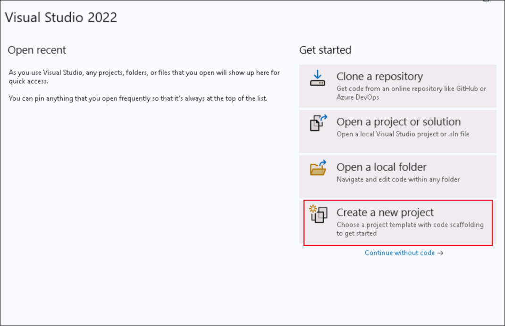

# Laboratorio 3 - Crear un agente propio con M365 Agents SDK y Semantic Kernel

**Duración del laboratorio: 80 minutos**

## Objetivo

 En este laboratorio, se desarrollará un agente personalizado que
funcionará en Microsoft Teams, Microsoft 365 Copilot Chat e incluso en
canales externos, utilizando Microsoft 365 Agents SDK y Semantic Kernel.

En Azure AI Foundry, se definirán las instrucciones principales, las
herramientas y la personalidad del agente. A partir de ello, se
utilizarán Microsoft 365 Agents SDK y Visual Studio para darle vida al
agente, personalizando sus comportamientos e integrándolo con Semantic
Kernel para la orquestación. Luego, se probará el agente en Microsoft
Teams, se incorporará en Copilot Chat y se observará su funcionamiento
en las aplicaciones de Microsoft 365.

En este laboratorio se aprenderá a:

• Preparar el agente en Azure AI Foundry.

• Crear el primer agente utilizando M365 Agents SDK.

• Configurar las propiedades del agente mediante el SDK.

• Integrar el agente con Teams utilizando Azure AI Foundry.

• Incorporar el agente en Microsoft 365 Copilot Chat.

## Ejercicio 1: Preparar el agente en Azure AI Foundry

En este ejercicio se iniciará el proceso de creación de un agente
personalizado utilizando **Azure AI Foundry**, la plataforma de
Microsoft para crear, configurar y escalar agentes de IA. Se explorará
el entorno **Agents Playground**, se definirá el rol del agente, se
personalizarán sus instrucciones y se conectará con documentos internos
relevantes para admitir la funcionalidad de **Retrieval-Augmented
Generation (RAG).**

Este ejercicio establece la base para el resto del recorrido de
desarrollo utilizando **Microsoft 365 Agents SDK** y **Semantic
Kernel**. Se simulará un agente de Recursos Humanos real de Contoso
Electronics, capaz de responder preguntas basadas en documentos
cargados, como el **Employee Handbook**, la **Role Library** y los
**Benefit Plans.**

**Azure AI Foundry** es una plataforma que permite a los desarrolladores
crear, implementar y escalar agentes de IA con facilidad. En este
ejercicio se aprenderá a configurar un agente y a probar su
funcionalidad utilizando el **Agents Playground**. Esta experiencia
práctica proporcionará una visión detallada de las capacidades del
**Azure AI Agent Service** y de cómo se integra con diversos modelos y
herramientas de IA.

Azure AI Foundry es el punto de partida para la creación de agentes de
IA. En esta tarea, se iniciará sesión en Azure AI Foundry utilizando las
credenciales correspondientes.

1.  Abra el navegador, navegue a +++<https://ai.azure.com>+++ e inicie
    sesión en su cuenta de Azure.

    

2.  Desde la página principal de Azure AI Foundry, seleccione **Create
    an agen**.

    

3.  Deje el nombre del proyecto según la recomendación y seleccione
    **Create**.

    

4.  Esto generará automáticamente un nuevo proyecto en Azure AI Foundry;
    el proceso suele tardar entre 3 y 5 minutos.

5.  Cuando el proyecto se haya creado, se redirigirá al entorno del
    mismo. Expanda la barra lateral izquierda y seleccione **Agents**.
    Esto abrirá el **Agents Playground**.

    

6.  Seleccione **Agents** en el panel izquierdo. Se observará que se ha
    creado un nuevo agente automáticamente.

    

7.  **Seleccione el agente,** desplácese hacia abajo y seleccione **Try
    in playground.**

    

    Ahora que se encuentra dentro de Agents Playground, se personalizará la
identidad y el comportamiento del agente para que coincidan con un
escenario real: un agente interno de Recursos Humanos en Contoso.

8.  En el panel **Setup** de su agente, asígnele el nombre +++**Contoso
    HR Agent**+++ y actualice las instrucciones con el siguiente
    contenido.

    ```
    You are Contoso HR Agent, an internal assistant for Contoso Electronics. Your role is to help employees find accurate, policy-aligned answers to questions related to:
    - Job role descriptions and responsibilities
    - Performance review process
    - Health and wellness benefits (PerksPlus, Northwind Standard, Northwind Plus)
    - Employee rights and workplace safety
    - Company values and conduct
    Always base your responses on the content provided in the official documents such as the Employee Handbook, Role Library, and Benefit Plans. If you are unsure or the information is not covered, suggest the employee contact HR.
    Respond in a professional but approachable tone. Keep answers factual and to the point.
    Example scenarios you should support:
    - What is the deductible for Northwind Standard?
    - Can I use PerksPlus for spa treatments?
    - What does the CTO at Contoso do?
    - What happens during a performance review?
    ```

9.  En la sección **Knowledge**, seleccione **+ Add** y luego elija
    **Files**, después seleccione **Select local files**.

    

    

    

10. Navegue a **C:\Labfiles\M365 Agents SDK**, seleccione todos los
    archivos dentro de esa carpeta y haga clic en **Open**.

    

11. Seleccione **Upload and save** para cargarlos. Esto creará un vector
    store para el agente.

    

12. Cuando se cargan los documentos, Foundry los convierte
    automáticamente en vectores, un formato que permite al agente buscar
    y recuperar información relevante de manera eficiente.

    

13. Guarde el **Agent ID** en un bloc de notas, ya que será necesario en
    los siguientes ejercicios. Puede encontrar el **Agent ID** en los
    detalles del agente.

    

14. Además, vaya a la página **Overview** y guarde el valor del **Azure
    AI Foundry project** **endpoint** en el bloc de notas.

    

    Al personalizar las instrucciones y cargar documentos relevantes, se
está enseñando al agente cómo debe comportarse y en qué conocimiento
debe basarse. Esta es una forma simplificada de Retrieval-Augmented
Generation (RAG).

## Ejercicio 2: Crear el primer agente utilizando M365 Agents SDK

Ahora que se ha visto cómo crear un agente mediante **Azure AI
Foundry**, se cambiará de enfoque para explorar cómo crear un agente
localmente utilizando **Microsoft 365 Agents SDK**. Este SDK permite
desarrollar agentes listos para producción y compatibles con múltiples
canales, que pueden ejecutarse en **Microsoft Teams**, **Microsoft 365
Copilot** y otros canales preferidos.

1.  Desde el menú **Inicio** de Windows, busque **Visual** y abra
    **Visual Studio 2022**. Seleccione **Skip and add accounts later**.

    

2.  Seleccione **Start Visual Studio**.

    

3.  Seleccione **Create a new project**.

    

4.  Busque +++**Microsoft**+++ y seleccione la plantilla **Microsoft 365
    Agents**. Haga clic en **Next**.

    

5.  Asigne un nombre a su agente como +++**ContosoHRAgent**+++ y
    seleccione **Create**.

    

6.  En la lista de plantillas, seleccione **Echo Bot** y luego haga clic
    en **Create**.

    

7.  En la ventana emergente, seleccione **Allow access**.

    

8.  Cuando la plantilla del proyecto se haya generado, vaya a **Solution
    Explorer** en el panel derecho y explore la plantilla del agente.
    Expanda el proyecto **ContosoHRAgent**.

    - Abra **Program.cs**. Este código configura y ejecuta el servidor
      web que aloja el agente. Establece los servicios necesarios, como
      autenticación, enrutamiento y almacenamiento, además de registrar
      el **EchoBot** e implementar la administración del estado basada
      en memoria.

        

    -   Abra **Bot \> EchoBot.cs** y observe que este ejemplo configura un
  agente de IA básico utilizando **Microsoft.Agents.Builder**. Envía un
  mensaje de bienvenida cuando un usuario se une al chat y escucha
  cualquier mensaje, devolviéndolo junto con un contador de mensajes
  enviados.

        

    Se ha comenzado con un **Echo Bot**, un bot simple que repite cualquier mensaje enviado por el usuario. Es una forma útil de verificar la configuración y comprender cómo se gestionan las conversaciones en segundo plano.

9.  En **Visual Studio**, seleccione **Tools → NuGet Package Manager →
    Package Manager Settings** para agregar **NuGet.org** a las fuentes
    de paquetes.

    

10. Seleccione **Package Sources** y haga clic en el símbolo **+** para
    agregar una nueva fuente de paquetes.

    

11. Ingrese los siguientes detalles y luego seleccione **Ok**.

    - Nombre: +++nuget.org+++

    - Origen: +++https://api.nuget.org/v3/index.json+++

    

12. Para probar el agente **Echo**, seleccione **Start** o presione
    **F5**. Esto iniciará automáticamente la herramienta de prueba en
    **localhost**, donde podrá interactuar con el agente. En caso de que
    **Visual Studio** solicite confirmar la creación de un certificado
    **SSL** autofirmado para probar la aplicación localmente, confirme y
    continúe.

    

    

13. En la alerta de seguridad, seleccione **Allow access**.

    

14. La aplicación se iniciará ahora.

    

15. Espere hasta que aparezca el mensaje del agente "Hello and
    Welcome!", luego escriba cualquier texto, como “Hi” o “Hello”.
    Observe que el agente repite todo lo que se escribe.

    

    

16. Detenga la depuración seleccionando **Debug → Stop Debugging** en
    **Visual Studio.**

    

    Se ha completado el ejercicio **Crear el primer agente utilizando M365
Agents SDK**. Este agente sencillo constituye la base para experiencias
más avanzadas. En el siguiente paso, se combinará con el agente de
**Azure AI Foundry** para habilitar respuestas más completas y con
reconocimiento de contexto.

## Ejercicio 3: Configurar las propiedades del agente y probarlo en Teams

Ahora que se ha creado un bot básico, es momento de mejorarlo con
capacidades de IA generativa y actualizarlo a un agente de IA. En este
ejercicio, se instalarán bibliotecas clave como **Semantic Kernel** y se
preparará el agente para razonar y responder de manera más inteligente,
listo para funcionar en **Teams** o **Copilot Chat**.

1.  Agregue el paquete **Semantic Kernel NuGet Package**. Este paquete
    proporcionará compatibilidad con la integración de Azure AI.

2.  Haga clic con el botón derecho en el proyecto **ContosoHRAgent** y
    seleccione **Manage NuGet Packages for Solution**.

    

3.  Seleccione la pestaña **Browse** y busque
    +++**Microsoft.SemanticKernel.Agents.AzureAI**+++. Marque la casilla
    **Include prerelease**.

    

4.  Seleccione el paquete, luego seleccione **Contoso** en **Project** y
    haga clic en **Install**.

    

    

5.  Seleccione **Apply** en el cuadro de diálogo **Preview Changes**.

    

6.  Seleccione **I Accept** en el cuadro de diálogo **License
    Acceptance**.

    

7.  El paquete se ha instalado correctamente.

    

8.  Seleccione **Program.cs** e ingrese
    +++builder.Services.AddKernel();+++ **antes de la línea** var app =
    builder.Build() (Línea 31).

    

    Esto registra **Semantic Kernel**, un componente central que permite que
el agente interactúe con modelos de IA generativa.

9.  Haga clic con el botón derecho en el proyecto **ContosoHRAgent** y
    seleccione **Add \> Class**.

    

10. Ingrese el nombre de la clase como +++**FileReference.cs**+++ y
    seleccione **Create**.

    

11. Esta clase define la estructura utilizada al hacer referencia a
    documentos específicos en las respuestas, lo cual es útil cuando el
    agente cita contenido de archivos cargados.

    Reemplace el código existente con el siguiente:

    ```
    using Microsoft.Agents.Core.Models;

    namespace ContosoHRAgent
    {
        public class FileReference(string fileId, string fileName, string quote, Citation citation)
        {
            public string FileId { get; set; } = fileId;
            public string FileName { get; set; } = fileName;
            public string Quote { get; set; } = quote;
            public Citation Citation { get; set; } = citation;
        }
    }

    ```

    

12. Haga clic con el botón derecho en el proyecto **ContosoHRAgent,**
    seleccione **Add \> Class** y defina el nombre de la clase como
    +++**ConversationStateExtensions.cs**+++. Reemplace el código
    existente con el siguiente:

    ```
    using Microsoft.Agents.Builder.State;

    namespace ContosoHRAgent
    {
    public static class ConversationStateExtensions
    {
        public static int MessageCount(this ConversationState state) => state.GetValue<int>("countKey");

        public static void MessageCount(this ConversationState state, int value) => state.SetValue("countKey", value);

        public static int IncrementMessageCount(this ConversationState state)
        {
            int count = state.GetValue<int>("countKey");
            state.SetValue("countKey", ++count);
            return count;
        }

        public static string ThreadId(this ConversationState state) => state.GetValue<string>("threadId");

        public static void ThreadId(this ConversationState state, string value) => state.SetValue("threadId", value);
    }
    }

    ```

    

Esta clase agrega métodos auxiliares para gestionar y rastrear la
cantidad de mensajes de los usuarios, demostrando cómo se almacena y
modifica el estado durante una conversación en curso.

## Ejercicio 4: Integrar el agente de Azure AI Foundry con M365 Agents SDK

Se ha creado un agente utilizando M365 Agents SDK y se ha configurado
con capacidades de IA generativa. Ahora, se conectará este agente local
con el agente de Azure AI Foundry creado previamente. Esto permite que
el agente responda utilizando los datos empresariales e instrucciones
almacenadas en el proyecto de Foundry, completando así la integración.

### Tarea 1: Configurar EchoBot.cs para conectarse con el agente de Azure AI Found

En esta tarea, se conectará con el agente de **Azure AI Foundry**
agregando un cliente que permita obtener e invocar el modelo alojado en
Foundry desde **EchoBot.cs**.

1.  En el proyecto **ContosoHRAgent**, abra **Bot/EchoBot.cs** y agregue
    las siguientes líneas dentro de la clase pública **EchoBot**.

    ```
    private readonly PersistentAgentsClient _projectClient;
    private readonly string _agentId;

    ```

    

2.  Reemplace el constructor existente de **EchoBot** con el siguiente.

    ```
    public EchoBot(AgentApplicationOptions options, IConfiguration configuration) : base(options)
    {

        OnConversationUpdate(ConversationUpdateEvents.MembersAdded, WelcomeMessageAsync);

        // Listen for ANY message to be received. MUST BE AFTER ANY OTHER MESSAGE HANDLERS 
        OnActivity(ActivityTypes.Message, OnMessageAsync);

        // Azure AI Foundry Project ConnectionString
        string projectEndpoint = configuration["AIServices:ProjectEndpoint"];
        if (string.IsNullOrEmpty(projectEndpoint))
        {
            throw new InvalidOperationException("ProjectEndpoint is not configured.");
        }
        _projectClient = new PersistentAgentsClient(projectEndpoint, new AzureCliCredential());

        // Azure AI Foundry Agent Id
        _agentId = configuration["AIServices:AgentID"];
        if (string.IsNullOrEmpty(_agentId))
        {
            throw new InvalidOperationException("AgentID is not configured.");
        }

    }

    ```

    

3.  Reemplace el método **OnMessageAsync** con el siguiente.

    ```
    protected async Task OnMessageAsync(ITurnContext turnContext, ITurnState turnState, CancellationToken cancellationToken)
    {
        // send the initial message to the user
        await turnContext.StreamingResponse.QueueInformativeUpdateAsync("Working on it...", cancellationToken);

        // get the agent definition from the project
        var agentDefinition = await _projectClient.Administration.GetAgentAsync(_agentId, cancellationToken);

        // initialize a new agent instance from the agent definition
        var agent = new AzureAIAgent(agentDefinition, _projectClient);

        // retrieve the threadId from the conversation state
        // this is set if the agent has been invoked before in the same conversation
        var threadId = turnState.Conversation.ThreadId();

        // if the threadId is not set, we create a new thread
        // otherwise, we use the existing thread
        var thread = string.IsNullOrEmpty(threadId)
            ? new AzureAIAgentThread(_projectClient)
            : new AzureAIAgentThread(_projectClient, threadId);

        try
        {
            // increment the message count in state and queue the count to the user
            int count = turnState.Conversation.IncrementMessageCount();
            turnContext.StreamingResponse.QueueTextChunk($"({count}) ");

            // create the user message to send to the agent
            var message = new ChatMessageContent(AuthorRole.User, turnContext.Activity.Text);

            // invoke the agent and stream the responses to the user
            await foreach (AgentResponseItem<StreamingChatMessageContent> agentResponse in agent.InvokeStreamingAsync(message, thread, cancellationToken: cancellationToken))
            {
                // if the threadId is not set, we set it from the agent response
                // and store it in the conversation state for future use
                if (string.IsNullOrEmpty(threadId))
                {
                    threadId = agentResponse.Thread.Id;
                    turnState.Conversation.ThreadId(threadId);
                }

                turnContext.StreamingResponse.QueueTextChunk(agentResponse.Message.Content);
            }
        }
        finally
        {
            // ensure we end the streaming response
            await turnContext.StreamingResponse.EndStreamAsync(cancellationToken);
        }
    }

    ```

4.  Al pegar el fragmento de código anterior, es posible que aparezca
    una advertencia (SKEXP0110) porque esta función aún está en versión
    preliminar. Puede suprimir esta advertencia de manera segura por
    ahora haciendo clic derecho en AzureAIAgent, seleccionando **Quick
    Actions and Refactorings \> Suppress or configure issues \>
    Configure SKEXP0110 Severity \> Silent**.

    

5.  El código ahora debería verse de la siguiente manera.

    

6.  El método **OnMessageAsync** constituye el núcleo de la lógica de
    respuesta del agente. Al sustituir el comportamiento predeterminado
    de eco, el agente puede enviar el mensaje del usuario al agente de
    Azure AI Foundry, transmitir la respuesta en tiempo real, rastrear y
    adjuntar citas y referencias de archivos para garantizar mayor
    transparencia, y añadir etiquetas de sensibilidad y generadas por IA
    que aseguran la seguridad y trazabilidad.

### Tarea 2: Configurar las claves del servicio de Azure AI Agent

En esta tarea, se agregarán los detalles de conexión de Foundry en el
archivo **appsettings.json**. Estos valores permiten que el agente de
M365 se conecte al proyecto y al agente correctos de Foundry.

1.  En el proyecto **ContosoHRAgent**, abra el archivo
    **appsettings.json** y agregue las siguientes líneas al final de la
    lista de **appsettings** (en la línea 40).

    ```
    ,
    "AIServices": {
    "AgentID": "<AzureAIFoundryAgentId>",
    "ProjectEndpoint": "<ProjectEndpoint>"
    }

    ```

    Reemplace los marcadores de posición de **AzureAIFoundryAgentId** y **ProjectEndpoint** con los valores que guardó en el bloc de notas al finalizar el Ejercicio 1.

    

2.  La versión final del archivo **appsettings.json** se verá como se
    muestra a continuación:

    ```
    {
    "AgentApplicationOptions": {
        "StartTypingTimer": false,
        "RemoveRecipientMention": false,
        "NormalizeMentions": false
    },

    "TokenValidation": {
        "Audiences": [
        "{{ClientId}}" // this is the Client ID used for the Azure Bot
        ]
    },

    "Logging": {
        "LogLevel": {
        "Default": "Information",
        "Microsoft.AspNetCore": "Warning",
        "Microsoft.Agents": "Warning",
        "Microsoft.Hosting.Lifetime": "Information"
        }
    },
    "AllowedHosts": "*",
    "Connections": {
        "BotServiceConnection": {
        "Settings": {
            "AuthType": "UserManagedIdentity", // this is the AuthType for the connection, valid values can be found in Microsoft.Agents.Authentication.Msal.Model.AuthTypes.
            "ClientId": "{{BOT_ID}}", // this is the Client ID used for the connection.
            "TenantId": "{{BOT_TENANT_ID}}",
            "Scopes": [
            "https://api.botframework.com/.default"
            ]
        }
        }
    },
    "ConnectionsMap": [
        {
        "ServiceUrl": "*",
        "Connection": "BotServiceConnection"
        }
    ],
    "AIServices": {
    "AgentID": "<AzureAIFoundryAgentId>",
    "ProjectEndpoint": "<ProjectEndpoint>"
    }
    }

    ```

### Tarea 3: Probar su agente en Teams

En esta tarea, probará el agente creado en Teams.

1.  Abra el **símbolo del sistema de Windows** y escriba +++where az+++.
    Esto le permitirá obtener la ruta donde está instalada Azure CLI y
    actualizar la variable de entorno **Path**.

    Copie y pegue las rutas que se muestran en la salida.

    [A screenshot of a computer AI-generated content may be
incorrect.](./media/image51.png)

2.  Desde la ventana de **Inicio**, busque +++Environment+++ y
    seleccione **Edit the system environment variables.**

    

3.  Seleccione **Environment variables**.

    

4.  En **System variables**, seleccione **Path** y luego haga clic en
    **Edit.**

    

5.  Agregue la ruta obtenida como resultado del comando **where az**
    (del primer paso de esta tarea) y haga clic en **OK**.

    

6.  Seleccione **OK** en las demás ventanas abiertas de **Environment
    Settings**.

7.  En **Visual Studio**, abra **Tools → Command Line → Developer
    Command Prompt**.

    

8.  Ejecute el siguiente comando:

    +++az login+++

    Aparecerá una ventana en el navegador. Seleccione **Work or school
account** e inicie sesión con sus credenciales.

    

    

9.  Una vez iniciada la sesión, ingrese **1** para seleccionar la
    suscripción.

    

10. Expanda **Start** y seleccione **Dev Tunnels → Create a Tunnel**:

    

11. Ingrese los siguientes detalles y seleccione **OK**:  
    • **The account that will create the tunnel**: seleccione **Sign in
    → Work or school account** e inicie sesión con sus credenciales.

    - Name - +++DevTunnel+++.

    - Tunnel Type - **Temporary**

    - Access - **Public**

    

    

12. Haga clic derecho en el proyecto **M365Agent**, seleccione
    **Microsoft 365 Agents Toolkit → Select Microsoft 365 Account**.

    

    

13. Seleccione su cuenta y haga clic en **Continue**.

    

14. Expanda el menú desplegable junto a **Multiple startup projects** y
    seleccione **Microsoft Teams (browser).**

    

    Ahora, el agente integrado está listo para ejecutarse y probarse en vivo
en **Microsoft Team.**

15. Presione **Start** o **F5** para iniciar la depuración. Microsoft
    Teams se abrirá automáticamente y la aplicación del agente aparecerá
    en la ventana. Seleccione **Add** y luego **Open** para comenzar a
    interactuar con su agente.

    

    

16. Puede hacer una de las siguientes preguntas para interactuar con el
    agente:

    - +++What’s the difference between Northwind Standard and Health Plus
    when it comes to emergency and mental health coverage?+++

    - +++Can I use PerksPlus to pay for both a rock climbing class and a
    virtual fitness program?+++

    - +++What values guide behavior and decision-making at Contoso
    Electronics?+++

    Debería observar que recibe respuestas similares a las proporcionadas
    por el agente creado en Azure AI Foundry.

    

    

## Ejercicio 5: Incorporar su agente en Copilot Chat

En este ejercicio, se integrará el agente personalizado en Copilot Chat
mediante la actualización del manifiesto del agente. Al habilitar
**copilotAgents** en el manifiesto de la aplicación, el asistente con IA
estará disponible directamente dentro de la experiencia de Copilot.

1.  Abra **M365Agent/AppPackage/manifest.json** y actualice el esquema y
    la versión del manifiesto de la siguiente manera.

    ```
    "$schema": "https://developer.microsoft.com/en-us/json-schemas/teams/v1.22/MicrosoftTeams.schema.json",
    "manifestVersion": "1.22",

    ```

    

2.  Reemplace la sección **bots** con la siguiente, lo que también
    añadirá copilotAgents en el manifiesto.

    Este bloque declara su agente como un **custom engine agent** para
**M365 Copilot**. Indica a Microsoft 365 que exponga este agente en
Copilot Chat y muestre su lista de comandos en la interfaz de
conversación, junto con los **conversation starters**, para facilitar
que los usuarios comiencen rápidamente

    ```
    "bots": [ 
    { 
        "botId": "${{BOT_ID}}", 
        "scopes": [ 
        "personal", 
        "team", 
        "groupChat" 
        ], 
        "supportsFiles": false, 
        "isNotificationOnly": false, 
        "commandLists": [ 
        { 
            "scopes": [ "personal", "team", "groupChat" ], 
            "commands": [ 
            { 
                "title": "Emergency and Mental Health",
                "description": "What’s the difference between Northwind Standard and Health Plus when it comes to emergency and mental health coverage?" 
            }, 
            { 
                "title": "PerksPlus Details", 
                "description": "Can I use PerksPlus to pay for both a rock climbing class and a virtual fitness program?" 
            }, 
            { 
                "title": "Contoso Electronics Values", 
                "description": "What values guide behavior and decision making at Contoso Electronics?" 
            } 
            ] 
        } 
        ] 
    } 
    ], 
    "copilotAgents": { 
    "customEngineAgents": [ 
        { 
        "id": "${{BOT_ID}}", 
        "type": "bot" 
        } 
    ] 
    },

    ```

    

3.  Presione **Start** o **F5** para iniciar la depuración. Microsoft
    Teams se abrirá automáticamente.

4.  Cuando Microsoft Teams se abra en el navegador, ignore la ventana
    emergente de la aplicación y seleccione **Apps → Manage your apps →
    Upload an app**, luego elija **Upload a custom app**. 

    

5.  En el Explorador de archivos, vaya a la carpeta de su proyecto. La
    ruta será
    **C:\Users\Admin\source\repos\ContosoHRAgent\ContosoHRAgent** si no
    se cambió durante la configuración del proyecto. Navegue a
    **\ContosoHRAgent\M365Agent\appPackage\build**, seleccione
    **appPackage.local.zip** y haga clic en **Open.**

    

6.  Su aplicación aparecerá nuevamente en Teams; seleccione **Add.**

    

7.  Seleccione **Open** **with Copilot** para probar su agente en
    Copilot.

    

8.  Seleccione el iniciador de conversación **PerksPlus Details** y haga
    clic en **Send.**

    

    

9.  Observe que ahora está recibiendo la respuesta del agente de AI
    Foundry, directamente en Copilot Chat.

    

## Resumen

En este laboratorio, ha creado su **Custom Engine Agent** utilizando
Microsoft 365 Agents SDK y Azure AI Foundry.

Se aprendió a:

• Configurar un agente de IA en Azure AI Foundry utilizando Agent
Playground.

• Cargar documentos empresariales para fundamentar las respuestas del
agente.

• Generar un bot utilizando M365 Agents SDK en Visual Studio.

• Agregar Semantic Kernel y conectarse con Azure AI Agent Service.

• Integrar el bot con el agente de Azure AI Foundry para razonamiento
fundamentado en tiempo real.

• Implementar y probar el agente en **Microsoft Teams** y **Copilot
Chat**
