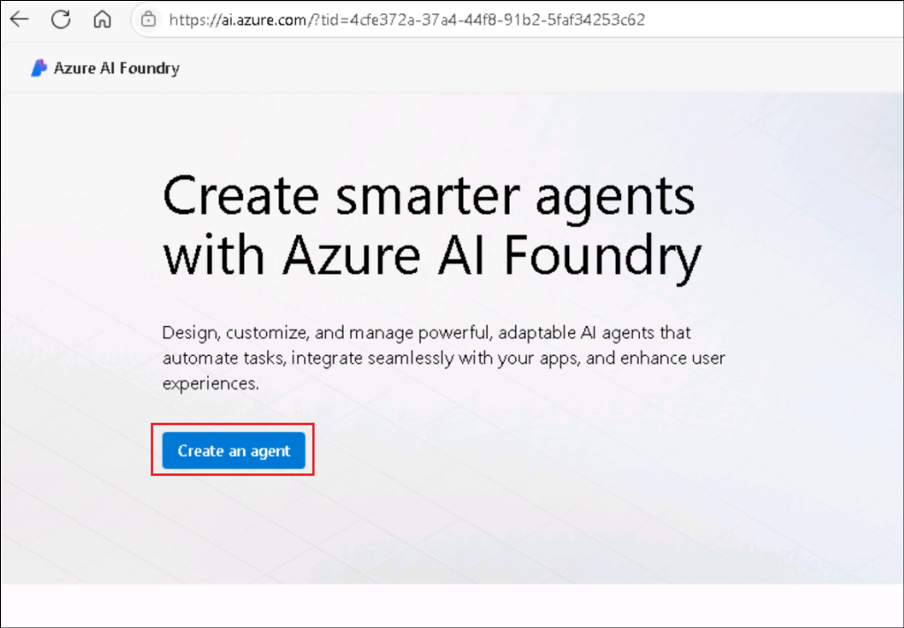
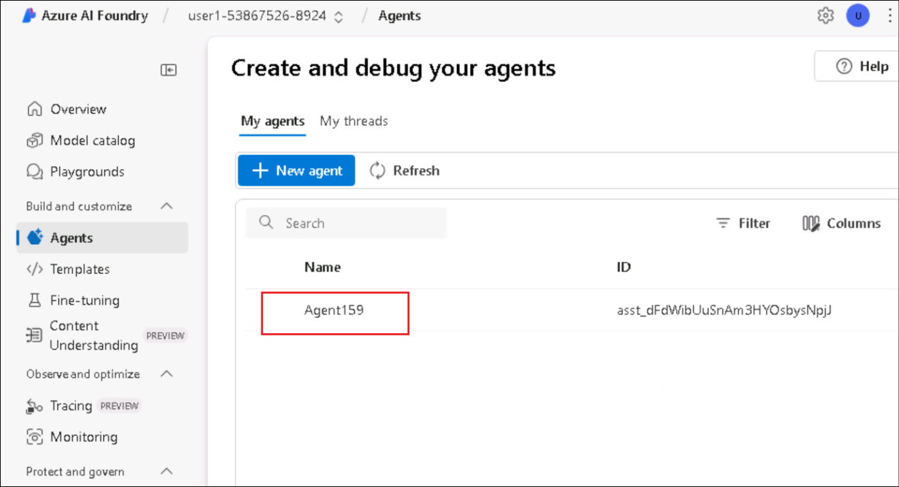
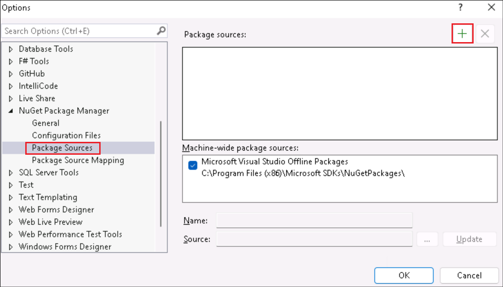
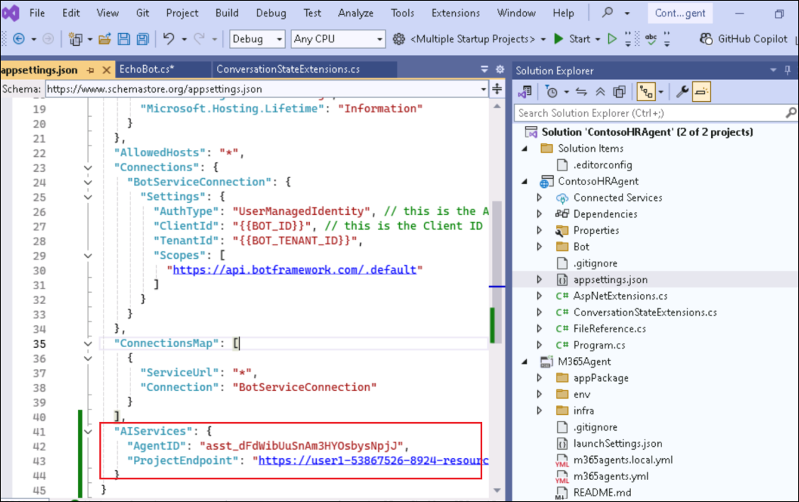

# 實驗室 3 - 使用 M365 代理 SDK 和 Semantic kernel構建自己的代理

實驗室時間 – 80 分鐘

## 目標

在本實驗室中，你將開發一個自定義引擎代理，該代理使用 Microsoft 365 代理
SDK 和語義內核跨 Microsoft Teams、Microsoft 365 Copilot Chat
甚至外部渠道運行。

在 Azure AI Foundry
中，你將定義代理的核心指令、工具和個性。從那裡，你將使用 Microsoft 365
代理 SDK 和 Visual Studio
使代理栩栩如生，自定義其行為並將其與語義內核集成以進行業務流程。然後，您將在
Microsoft Teams 中測試您的代理，將其引入 Copilot Chat，並看到它在
Microsoft 365 應用程序中變為現實。

在本實驗中，您將學習

- 在 Azure AI Foundry 中準備代理

- 使用 M365 代理 SDK 構建您的第一個代理

- 使用 SDK 配置代理的屬性

- 使用 Azure AI Foundry 將代理與 Teams 集成

- 將您的代理引入 Microsoft 365 Copilot 聊天

## 練習 1: 在 Azure AI Foundry 中準備代理

在本練習中，你將使用 Azure AI Foundry（Microsoft 用於創建、配置和縮放 AI
代理的平臺）準備自定義引擎代理，開始您的旅程。您將探索**Agents
Playground,**，定義代理的角色，個性化其說明，並將其連接到相關的內部文檔以支持Retrieval-Augmented
Generation (RAG)。

本練習使用 Microsoft 365 代理 SDK
**和語**義內核**為生成路徑的其餘部分奠定基礎**。你將模擬 Contoso
Electronics
的真實人力資源代理，該代理可以根據上傳的文檔（如員工手冊、角色庫和福利計劃）回答問題。

Azure AI Foundry 是一個平臺，使開發人員能夠輕鬆生成、部署和縮放 AI
代理。您將學習如何配置代理，並使用 Agents Playground
測試其功能。這種實踐經驗將深入瞭解 Azure AI
代理服務的功能以及它如何與各種 AI 模型和工具集成。

Azure AI Foundry 是構建 AI
代理的啟動板。在此任務中，你將使用登錄憑據登錄 Azure AI Foundry。

1.  打開瀏覽器並導航到+++<https://ai.azure.com>+++ 並登錄到你的 Azure
    帳戶。

    

2.  在 Azure AI Foundry 主頁中，選擇**Create an agent**.

    

3.  將項目名稱保留為建議，然後選擇 **Create**.

    

4.  這將在 Azure AI Foundry 中為你搭建一個新項目，通常需要 3-5 分鐘。

5.  創建項目後，您將被重定向到您的項目，展開左側欄並選擇**代理。**這將打開
    Agents Playground。

    

6.  從 左窗格中選擇**代理**。您將看到為您創建了一個新的代理。

    

7.  **選擇代理**，向下滾動並選擇**在 Playground 中嘗試**。

    

    現在，你已進入代理遊樂場，你將自定義代理的標識和行為，以匹配真實場景：Contoso
的內部 HR 代理。

8.  在代理的“設置”面板中，將代理命名為 +++Contoso HR
    Agent+++，並按如下方式更新說明：

    ```
    You are Contoso HR Agent, an internal assistant for Contoso Electronics. Your role is to help employees find accurate, policy-aligned answers to questions related to:
    - Job role descriptions and responsibilities
    - Performance review process
    - Health and wellness benefits (PerksPlus, Northwind Standard, Northwind Plus)
    - Employee rights and workplace safety
    - Company values and conduct
    Always base your responses on the content provided in the official documents such as the Employee Handbook, Role Library, and Benefit Plans. If you are unsure or the information is not covered, suggest the employee contact HR.
    Respond in a professional but approachable tone. Keep answers factual and to the point.
    Example scenarios you should support:
    - What is the deductible for Northwind Standard?
    - Can I use PerksPlus for spa treatments?
    - What does the CTO at Contoso do?
    - What happens during a performance review?

    ```

9.  在“知識”部分中，選擇“**+
    Add**”，然後選擇“**文件”**，然後選擇“**選擇本地文件**”。

    

    

    

10. 導航到 **C:\Labfiles\M365 Agents SDK**
    然後選擇其中的所有文件，然後單擊 **打開**。

    

11. 選擇 **Upload and save**
    上傳它們。這將為我們的代理創建一個向量存儲。

    

12. 當您上傳文檔時，Foundry
    會自動將它們轉換為向量，這種格式允許代理有效地搜索和檢索相關信息。

    

13. 將 **Agent ID**
    保存到記事本，這將在接下來的練習中進行。您可以在代理的詳細信息中找到您的代理
    ID。

    

14. 此外，轉到“**概述**”頁，並將 **Azure AI Foundry project
    endpoint**的值保存到記事本。

    

通過自定義說明和上傳相關文檔，您可以教代理如何行為以及依賴哪些知識。這是Retrieval-Augmented
Generation (RAG) 的簡化形式。

## 練習 2 : 使用 M365 Agents SDK 構建您的第一個代理

現在，你已經瞭解了如何使用 Azure AI Foundry
生成代理，讓我們換個角度，探索如何使用 Microsoft 365 代理 SDK
在本地生成自己的代理。此 SDK 允許你生成可在 Microsoft Teams、Microsoft
365 Copilot 和其他首選渠道中運行的多渠道生產就緒代理。

1.  在 Windows 開始模式下，搜索“Visual”並打開 **Visual Studio
    2022**。選擇 **Skip and add accounts later**。

    

2.  選擇 **Start Visual Studio**.

    

3.  選擇 **Create a new project**.

    

4.  尋找 +++**Microsoft**+++，然後選擇**Microsoft 365
    Agents** 模板。點擊 **Next**.

    

5.  為您的代理提供名稱+++**ContosoHRAgent**+++ ，然後選擇**Create**.

    

6.  從模板列表中, 選擇 **Echo Bot** ，然後選擇**Create**.

    

7.  在彈出窗口中選擇 **Allow access**。

    

8.  搭建項目模板後，轉到右側面板上的“解決方案資源管理器”並瀏覽代理模板。展開
    **ContosoHRAgent** 項目。

    - 打開**Program.cs**，此代碼配置並運行託管代理的 Web
      服務器。它設置所需的服務，如身份驗證、路由、存儲並註冊 **EchoBot**
      並注入基於內存的狀態處理。

    

1.  打開 **Bot \> EchoBot.cs**，並觀察此示例使用
    **Microsoft.Agents.Builder** 設置基本 AI
    代理。當用戶加入聊天並偵聽任何消息並回顯正在運行的消息計數時，它會發送歡迎消息。

    

    您已經從 **Echo Bot** 開始，這是一個簡單的機器人，可以重複用戶發送的任何消息。這是驗證您的設置並瞭解如何在幕後處理對話的有用方法。

9.  在 Visual Studio 中，選擇 **Tools -\> NuGet Package Manager -\>
    Package Manager Settings**, 將 NuGet.org 添加到包源。

    

10. 選擇 **Package Sources** ，然後單擊 **+** 符號以添加新的包源。

    

11. 輸入以下詳細信息，然後選擇 **Ok**.

    -  名稱 - +++nuget.org+++

    -  來源 - +++https://api.nuget.org/v3/index.json+++

    

12. 測試回聲代理, 點擊 **Start** 或者 **F5**.
    這將在本地主機中自動啟動測試工具，您可以在其中與代理交互。如果
    Visual Studio 要求你確認創建自頒發的 SSL
    證書以在本地測試應用程序，請 **確認** 並 **繼續**。

    

    

13. 在安全警報中選擇 **Allow access。**

    

14. 應用程序現在啟動。

    

15. 等到座席消息“您好，歡迎光臨！”，然後鍵入任何內容，例如 “Hi”,
    “Hello”. 觀察代理回應所有內容。

    

    

16. 從 Visual Studio通過選擇停止調試 **Debug** -\> **Stop Debugging**.

    

你已完成使用 M365 代理 SDK
構建第一個代理練習。這個簡單的代理構成了更強大體驗的基礎。在下一步中，你將把它與
Azure AI Foundry 代理相結合，以啟用更豐富的上下文感知答案。

## 練習 3: 在 Teams 上配置代理屬性和測試

現在您已經創建了一個基本機器人，是時候使用 Generative AI
功能對其進行增強並將其升級為 AI
代理了。在本練習中，你將安裝語義內核等關鍵庫，並準備代理更智能地推理和響應，為
Teams 或 Copilot 聊天做好準備。

1.  添加 **Semantic Kernel Nuget**包。此包將支持 Azure AI 集成。

2.  右鍵單擊 **ContosoHRAgent** 項目，然後選擇**“Manage Nuget Packages
    for Solution**.

    

3.  選擇**“Browse”**選項卡並搜索
    +++Microsoft.SemanticKernel.Agents.AzureAI+++. 選中“ **Include
    prerelease** **”**複選框。

    

4.  選擇 **package**,在項目下，選擇**Contoso**然後選擇**Install**.

    

    

5.  在“預覽更改”對話框中選擇 **Apply**.

    

6.  在許可證接受對話框中選擇 **I Accept**

    

7.  軟件包現已安裝。

    

8.  選擇 **Program.cs** 並輸入+++builder.Services.AddKernel();+++
    線以上, **var app = builder.Build()** (Line 31).

    

    這會註冊語義內核，這是一個核心組件，允許您的代理與生成式 AI
模型進行交互。

9.  右鍵單擊 **ContosoHRAgent** 項目，然後選擇**“Add \> Class. **”。

    

10. 將類名稱輸入為 +++**FileReference.cs**+++ ，然後選擇“ **Create”**.

    

11. 此類定義在響應中引用特定文檔時使用的結構，當您的代理引用上傳文件中的內容時非常有用。

    將現有代碼替換為以下內容。

    ```
    using Microsoft.Agents.Core.Models;

    namespace ContosoHRAgent
    {
        public class FileReference(string fileId, string fileName, string quote, Citation citation)
        {
            public string FileId { get; set; } = fileId;
            public string FileName { get; set; } = fileName;
            public string Quote { get; set; } = quote;
            public Citation Citation { get; set; } = citation;
        }
    }

    ```

    

12. 右鍵單擊 **ContosoHRAgent**
    項目，然後選擇“**添加\>類**”，並將類名稱定義為
    +++ConversationStateExtensions.cs+++。將現有代碼替換為以下內容

    ```
    using Microsoft.Agents.Builder.State;

    namespace ContosoHRAgent
    {
    public static class ConversationStateExtensions
    {
        public static int MessageCount(this ConversationState state) => state.GetValue<int>("countKey");

        public static void MessageCount(this ConversationState state, int value) => state.SetValue("countKey", value);

        public static int IncrementMessageCount(this ConversationState state)
        {
            int count = state.GetValue<int>("countKey");
            state.SetValue("countKey", ++count);
            return count;
        }

        public static string ThreadId(this ConversationState state) => state.GetValue<string>("threadId");

        public static void ThreadId(this ConversationState state, string value) => state.SetValue("threadId", value);
    }
    }

    ```

    

    此類添加了幫助程序方法來管理和跟蹤用戶消息數，演示在正在進行的對話期間如何存儲和修改狀態。

## 練習 4: 將 Azure AI Foundry 代理與 M365 代理 SDK 集成

您已使用 M365 Agents SDK 構建了代理，並為其配置了生成式 AI
功能。現在，你將此本地代理連接到之前創建的 Azure AI Foundry
代理。這使您的代理能夠使用存儲在 Foundry
項目中的企業數據和指令進行響應，從而使一切順利進行。

### 任務 1: 配置EchoBot.cs以與 Azure AI Foundry 代理連接

在此任務中，你將通過添加客戶端來在EchoBot.cs中提取和調用 Foundry
託管的模型，從而連接到 Azure AI Foundry 代理。

1.  在 **ContosoHRAgent** 項目, 打開 **Bot/EchoBot.cs** 並在 EchoBot
    公共類中添加以下行。

    ```
    private readonly PersistentAgentsClient _projectClient;
    private readonly string _agentId;

    ```


2.  將現有**的 EchoBot constructor** 替換為以下內容。

    ```
    public EchoBot(AgentApplicationOptions options, IConfiguration configuration) : base(options)
    {

        OnConversationUpdate(ConversationUpdateEvents.MembersAdded, WelcomeMessageAsync);

        // Listen for ANY message to be received. MUST BE AFTER ANY OTHER MESSAGE HANDLERS 
        OnActivity(ActivityTypes.Message, OnMessageAsync);

        // Azure AI Foundry Project ConnectionString
        string projectEndpoint = configuration["AIServices:ProjectEndpoint"];
        if (string.IsNullOrEmpty(projectEndpoint))
        {
            throw new InvalidOperationException("ProjectEndpoint is not configured.");
        }
        _projectClient = new PersistentAgentsClient(projectEndpoint, new AzureCliCredential());

        // Azure AI Foundry Agent Id
        _agentId = configuration["AIServices:AgentID"];
        if (string.IsNullOrEmpty(_agentId))
        {
            throw new InvalidOperationException("AgentID is not configured.");
        }

    }

    ```

    

3.  將 **OnMessageAsync** 方法替換為以下內容。

    ```
    protected async Task OnMessageAsync(ITurnContext turnContext, ITurnState turnState, CancellationToken cancellationToken)
    {
        // send the initial message to the user
        await turnContext.StreamingResponse.QueueInformativeUpdateAsync("Working on it...", cancellationToken);

        // get the agent definition from the project
        var agentDefinition = await _projectClient.Administration.GetAgentAsync(_agentId, cancellationToken);

        // initialize a new agent instance from the agent definition
        var agent = new AzureAIAgent(agentDefinition, _projectClient);

        // retrieve the threadId from the conversation state
        // this is set if the agent has been invoked before in the same conversation
        var threadId = turnState.Conversation.ThreadId();

        // if the threadId is not set, we create a new thread
        // otherwise, we use the existing thread
        var thread = string.IsNullOrEmpty(threadId)
            ? new AzureAIAgentThread(_projectClient)
            : new AzureAIAgentThread(_projectClient, threadId);

        try
        {
            // increment the message count in state and queue the count to the user
            int count = turnState.Conversation.IncrementMessageCount();
            turnContext.StreamingResponse.QueueTextChunk($"({count}) ");

            // create the user message to send to the agent
            var message = new ChatMessageContent(AuthorRole.User, turnContext.Activity.Text);

            // invoke the agent and stream the responses to the user
            await foreach (AgentResponseItem<StreamingChatMessageContent> agentResponse in agent.InvokeStreamingAsync(message, thread, cancellationToken: cancellationToken))
            {
                // if the threadId is not set, we set it from the agent response
                // and store it in the conversation state for future use
                if (string.IsNullOrEmpty(threadId))
                {
                    threadId = agentResponse.Thread.Id;
                    turnState.Conversation.ThreadId(threadId);
                }

                turnContext.StreamingResponse.QueueTextChunk(agentResponse.Message.Content);
            }
        }
        finally
        {
            // ensure we end the streaming response
            await turnContext.StreamingResponse.EndStreamAsync(cancellationToken);
        }
    }

    ```

4.  粘貼上述代碼摘錄時，可能會看到警告
    （SKEXP0110），因為此功能仍處於預覽狀態。目前可以通過右鍵單擊
    AzureAIAgent，選擇“**Quick Actions and Refactorings \> Suppress or
    configure issues \> Configure SKEXP0110 Severity \> Silent**。

    

5.  代碼現在將如下所示。

    

6.  ***OnMessageAsync***
    方法是代理響應邏輯的核心。通過替換默認回顯行為，你已使代理能夠將用戶的消息發送到
    Azure AI Foundry
    代理，將響應實時流式傳輸回用戶，跟蹤和附加引文和文件引用以提高透明度，並添加敏感度和
    AI 生成的標簽以實現安全性和可跟蹤性。

### 任務 2: 配置 Azure AI 代理服務密鑰

在此任務中，您將把 Foundry 連接詳細信息添加到appsettings.json，這些值將
M365 代理連接到正確的 Foundry 項目和代理。

1.  在 **ContosoHRAgent** 項目中，打開**appsettings.json**並在
    appsettings 列表的底部添加以下行（在第 40 行）。

    ```
    ,
    "AIServices": {
    "AgentID": "<AzureAIFoundryAgentId>",
    "ProjectEndpoint": "<ProjectEndpoint>"
    }
    ```

    將 **AzureAIFoundryAgentId**   和 **ProjectEndpoint**  的占位符替換 為在練習 1 結束時保存到記事本的值。

    

2.  **appsettings.json**的最終版本 如下所示：

    ```
    {
    "AgentApplicationOptions": {
        "StartTypingTimer": false,
        "RemoveRecipientMention": false,
        "NormalizeMentions": false
    },

    "TokenValidation": {
        "Audiences": [
        "{{ClientId}}" // this is the Client ID used for the Azure Bot
        ]
    },

    "Logging": {
        "LogLevel": {
        "Default": "Information",
        "Microsoft.AspNetCore": "Warning",
        "Microsoft.Agents": "Warning",
        "Microsoft.Hosting.Lifetime": "Information"
        }
    },
    "AllowedHosts": "*",
    "Connections": {
        "BotServiceConnection": {
        "Settings": {
            "AuthType": "UserManagedIdentity", // this is the AuthType for the connection, valid values can be found in Microsoft.Agents.Authentication.Msal.Model.AuthTypes.
            "ClientId": "{{BOT_ID}}", // this is the Client ID used for the connection.
            "TenantId": "{{BOT_TENANT_ID}}",
            "Scopes": [
            "https://api.botframework.com/.default"
            ]
        }
        }
    },
    "ConnectionsMap": [
        {
        "ServiceUrl": "*",
        "Connection": "BotServiceConnection"
        }
    ],
    "AIServices": {
    "AgentID": "<AzureAIFoundryAgentId>",
    "ProjectEndpoint": "<ProjectEndpoint>"
    }
    }

    ```

### 任務 3: 在 Teams 上測試代理

在此任務中，你將在 Teams 中測試創建的代理。

1.  打開 **Windows command prompt**並輸入 +++where
    az+++。這是為了獲取安裝 Azure CLI 的路徑並更新路徑環境變量。

    複製並粘貼列為輸出的路徑。

    

2.  在“ **開始”** 窗口中，搜索 +++Environment+++ 並選擇
    **“編輯系統環境變量”**。

    

3.  選擇**Environment variables**.

    

4.  在 **System variables**, 選擇 **Path** ，然後選擇 **Edit**.

    

5.  將獲取的路徑添加為命令的輸出， **其中 az**
    （此任務的第一步），然後單擊 **“確定**”。

    

6.  在**Environment Settings**. 的其他打開窗口中選擇。

7.  在 Visual Studio 中，打開 **Tools \> Command Line \> Developer
    Command Prompt**.

    

8.  執行以下命令。

    +++az login+++

    瀏覽器上將彈出一個窗口。選擇 **“Work or school account** ”，然後使用登錄憑據登錄。

    

    

9.  登錄後，輸入 **1** 選擇訂閱。

    

10. 展開“**開始”**，然後選擇 **Dev Tunnels \> Create a Tunnel**:

    

11. 提供以下詳細信息，然後選擇 **Ok**.

    - 將創建隧道的帳戶 - 選擇**“Sign in** -\> **Work or school
    account**”，然後使用登錄憑據登錄。

    - 名稱 - +++DevTunnel+++.

    - 隧道類型 - **Temporary**

    - 訪問 - **Public**

    

    

12. 右鍵點擊 **M365Agent** 項目，選擇 **Microsoft 365 Agents Toolkit \>
    Select Microsoft 365 Account**.

    

    

13. 選擇您的帳戶並單擊 **Continue**.

    

14. 展開“**Multiple startup projects**”
    **旁邊**的**下拉列表**，然後選擇“**Microsoft Teams（瀏覽器）**。

    

    現在，你已準備好運行集成代理並在 Microsoft Teams 中實時測試它。

15. 點擊**“開始”**或 **F5** 開始調試。Microsoft Teams
    將自動啟動，您的代理應用程序將在窗口中彈出。選擇**添加**並**打開**以開始與您的代理聊天。

    

    

16. 您可以提出以下問題之一來與代理交互。

    - +++What’s the difference between Northwind Standard and Health Plus
    when it comes to emergency and mental health coverage?+++

    - +++Can I use PerksPlus to pay for both a rock climbing class and a
    virtual fitness program?+++

    - +++What values guide behavior and decision-making at Contoso
    Electronics?+++

    應注意，在 Azure AI Foundry 上創建的代理會收到類似的響應。

    

    

## 練習 5:  將您的代理帶到 Copilot Chat

在本練習中，您將通過更新代理的清單將自定義引擎代理引入 Copilot
Chat。通過在應用清單中啟用 copilotAgents，你將直接在 Copilot 體驗中提供
AI 支持的助手。

1.  打開 **M365Agent/AppPackage/manifest.json**,
    更新清單架構和版本，如下所示。

    ```
    "$schema": "https://developer.microsoft.com/en-us/json-schemas/teams/v1.22/MicrosoftTeams.schema.json",
    "manifestVersion": "1.22",

    ```

    

2.  將**機器人**部分替換 為以下內容，這也將在清單中添加 copilotAgents。

    此塊將代理聲明為 M365 Copilot 的自定義引擎代理。它告訴 Microsoft 365 在
Copilot Chat 中公開此代理，並在對話 UI
中顯示其命令列表以及對話啟動器，以幫助用戶快速入門。

    ```
    "bots": [ 
    { 
        "botId": "${{BOT_ID}}", 
        "scopes": [ 
        "personal", 
        "team", 
        "groupChat" 
        ], 
        "supportsFiles": false, 
        "isNotificationOnly": false, 
        "commandLists": [ 
        { 
            "scopes": [ "personal", "team", "groupChat" ], 
            "commands": [ 
            { 
                "title": "Emergency and Mental Health",
                "description": "What’s the difference between Northwind Standard and Health Plus when it comes to emergency and mental health coverage?" 
            }, 
            { 
                "title": "PerksPlus Details", 
                "description": "Can I use PerksPlus to pay for both a rock climbing class and a virtual fitness program?" 
            }, 
            { 
                "title": "Contoso Electronics Values", 
                "description": "What values guide behavior and decision making at Contoso Electronics?" 
            } 
            ] 
        } 
        ] 
    } 
    ], 
    "copilotAgents": { 
    "customEngineAgents": [ 
        { 
        "id": "${{BOT_ID}}", 
        "type": "bot" 
        } 
    ] 
    },

    ```

    

3.  點擊 **“開始”** 或 **F5** 開始調試。Microsoft Teams 將自動啟動。

4.  在瀏覽器中打開Microsoft Teams
    時，請忽略應用彈出窗口，然後選擇“**Apps \> Manage your apps \>
    Upload an app”**，然後選擇“**Upload a custom app.**.

    

    

5.  在文件資源管理器中，轉到項目文件夾。如果在項目設置期間未更改路徑，則路徑將為
    **C：\Users\Admin\source\repos\ContosoHRAgent\ContosoHRAgent**。導航到
    **\ContosoHRAgent\M365Agent\appPackage\build select
    appPackage.local.zip** 並點擊 **Open**.

    

6.  應用將再次在 Teams 上彈出，選擇 **Add**

    

7.  選擇 **Open with Copilot**  以在 Copilot 上測試您的代理。

    

8.  選擇對話啟動器 **PerksPlus 詳細信息並** 點擊 **發送**。

    

    

9.  請注意，您現在正在 Copilot Chat 上收到來自 AI Foundry 代理的響應。

    

## 總結

在本實驗室中，你剛剛使用 Microsoft 365 代理 SDK 和 Azure AI Foundry
生成了自定義引擎代理。

您學會了如何

1.  使用代理場在 Azure AI Foundry 中配置 AI 代理

2.  上傳企業文檔以支持代理的回復

3.  在 Visual Studio 中使用 M365 代理 SDK 搭建機器人

4.  添加語義內核並連接到 Azure AI 代理服務

5.  將機器人與 Azure AI Foundry 代理集成，以實現實時、紮根的推理

6.  在 **Microsoft Teams 和 Copilot Chat** 中部署和測試代理
