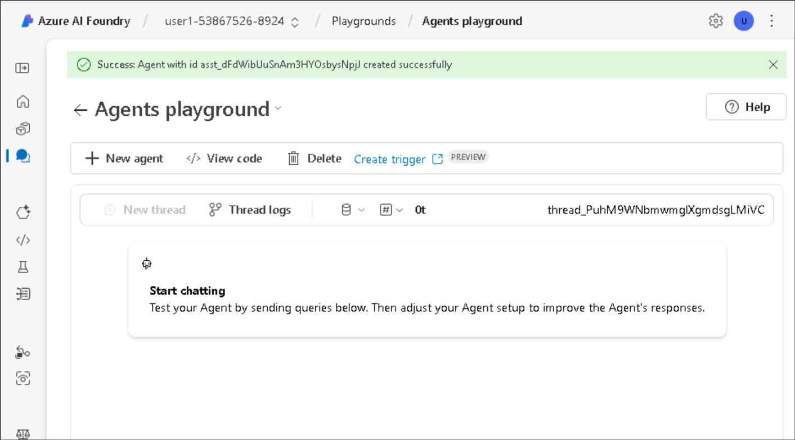
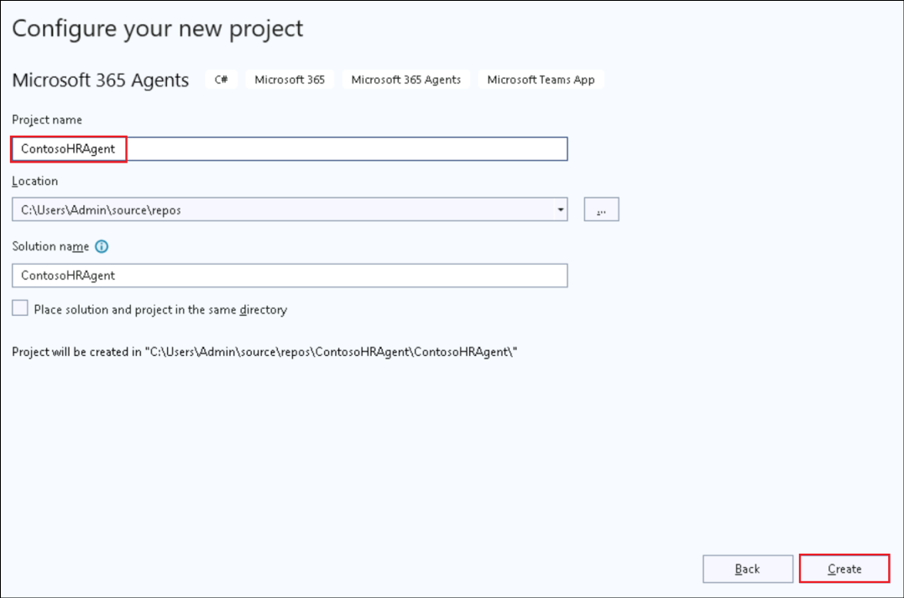
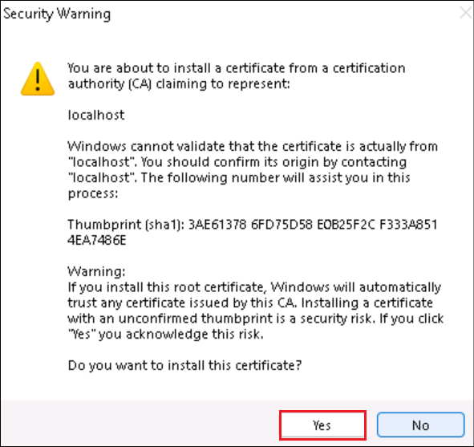

# Lab 3 - Build your own agent with the M365 Agents SDK and Semantic Kernel

Lab duration – 80 minutes

## Objective

In this lab, you will develop a custom engine agent that runs across
Microsoft Teams, Microsoft 365 Copilot Chat, and even external channels
using the Microsoft 365 Agents SDK and Semantic Kernel.

In Microsoft Foundry, you’ll define your agent’s core instructions,
tools, and personality. From there, you’ll use the Microsoft 365 Agents
SDK and Visual Studio to bring your agent to life, customizing its
behaviors and integrating it with Semantic Kernel for orchestration.
You’ll then test your agent in Microsoft Teams, bring it into Copilot
Chat, and see it come to life across Microsoft 365 applications.

In this lab, you will learn to

- Prepare your agent in Microsoft Foundry

- Build your first agent using the M365 Agents SDK

- Configure your agent’s properties using the SDK

- Integrate your agent with Teams using Microsoft Foundry

- Bring your agent into Microsoft 365 Copilot Chat

## Exercise 1: Prepare your agent in Microsoft Foundry

In this exercise, you’ll begin your journey by preparing a custom engine
agent using Microsoft Foundry, Microsoft’s platform for creating,
configuring, and scaling AI agents. You'll explore the **Agents
Playground**, define your agent's role, personalize its instructions,
and connect it to relevant internal documents to support
Retrieval-Augmented Generation (RAG).

This exercise sets the foundation for the rest of the Build Path using
the **Microsoft 365 Agents SDK** and **Semantic Kernel**. You’ll
simulate a real-world Human Resources agent for Contoso Electronics that
can answer questions based on uploaded documents like the Employee
Handbook, Role Library, and Benefit Plans.

Microsoft Foundry is a platform that enables developers to build, deploy,
and scale AI agents with ease. You'll learn how to configure an agent,
and test its functionality using the Agents Playground. This hands-on
experience will provide insight into the capabilities of Azure AI Agent
Service and how it integrates with various AI models and tools.

Microsoft Foundry is your launchpad for building AI agents. In this task,
you’ll log in to Microsoft Foundry with your login credentials.

1.  Open the browser and navigate to +++https://ai.azure.com+++ and
    **Sign in** using your credentials from the **Resources** tab.

    

2.  From the Microsoft Foundry homepage, select **Create an agent**.

    

3.  Leave the project name as recommended, select the Resource group that starts with **ResourceGroup1** and select **Create**.

    

4.  This will scaffold a new project for you in Microsoft Foundry, it
    usually takes 3-5 minutes.

5.  When your project is created, you'll land in the **Agents Playground**.

    

6.  Select **Agents** from the left pane. You will see that a new Agent
    is created for you. Select the **agent**.

    

7.  Scroll down and select **Try in
    playground**.

    

   Now that you're inside the Agents Playground, you'll customize your
agent's identity and behavior to match a real-world scenario: an
internal HR Agent at Contoso.

8.  In your agent's Setup panel, Name your agent as +++Contoso HR
    Agent+++ and update the Instructions as the following:

    ```
    You are Contoso HR Agent, an internal assistant for Contoso Electronics. Your role is to help employees find accurate, policy-aligned answers to questions related to:
    - Job role descriptions and responsibilities
    - Performance review process
    - Health and wellness benefits (PerksPlus, Northwind Standard, Northwind Plus)
    - Employee rights and workplace safety
    - Company values and conduct
    Always base your responses on the content provided in the official documents such as the Employee Handbook, Role Library, and Benefit Plans. If you are unsure or the information is not covered, suggest the employee contact HR.
    Respond in a professional but approachable tone. Keep answers factual and to the point.
    Example scenarios you should support:
    - What is the deductible for Northwind Standard?
    - Can I use PerksPlus for spa treatments?
    - What does the CTO at Contoso do?
    - What happens during a performance review?

    ```
    

10. In the Knowledge section, select **+ Add** and select **Files**,
    then **Select local files**.

    

    

    

11. Navigate to **C:\Labfiles\M365 Agents SDK** and select all the files
    inside that and click **Open**.

    

12. Select **Upload and save** to upload them. This will create a vector
    store for our agent.

    

13. When you upload documents, Foundry automatically converts them into
    vectors, a format that allows the agent to search and retrieve
    relevant information efficiently.

    

14. Save the **Agent id** to a notepad, that'll be required in the next
    exercises. You can find your Agent id in the agent’s details.

    

15. Also, go to the **Overview** page and save the value of **Azure AI
    Foundry project endpoint** to the notepad.

    

By customizing the instructions and uploading relevant documents, you're
teaching the agent how to behave and what knowledge to rely on. This is
a simplified form of Retrieval-Augmented Generation (RAG).

## Exercise 2 : Build your first agent using M365 Agents SDK

Now that you’ve seen how to build an agent using Microsoft Foundry, let’s
switch gears and explore how to build your own agent locally using the
Microsoft 365 Agents SDK. This SDK lets you build multi-channel,
production-ready agents that can run in Microsoft Teams, Microsoft 365
Copilot, and other preferred channels.

1.  From **Desktop**, open **Visual Studio 2022**.

    

3.  Select **Create a new project**.

    

    Select **Close** in the **Sign in** window.

    
    
5.  Search for +++**Microsoft**+++and select **Microsoft 365 Agents** template. Click on **Next**.

    

6.  Provide a name for your agent as +++**ContosoHRAgent**+++ and
    select **Create**.

    

7.  Scroll down in the list of templates, select **Echo Bot** and select **Create**.

    

8.  Select **Allow access** in the pop up.

    

9.  When the project template is scaffolded, go to Solution Explorer on
    the right-side panel and explore the agent template. Expand
    the **ContosoHRAgent** project.

    - Open **Program.cs**, this code configures and runs the web server
      that hosts your agent. It sets up required services like
      authentication, routing, storage and registers the **EchoBot** and
      injects memory-based state handling.
    
      

    - Open **Bot \> EchoBot.cs** and observe that this sample sets up a
  basic AI agent using the **Microsoft.Agents.Builder**. It sends a
  welcome message when a user joins the chat and listens for any message
  and echoes it back with a running message count.

      

    You've started with an **Echo Bot**, a simple bot that repeats back any message a user sends. It’s a useful way to verify your setup and understand how conversations are handled behind the scenes.

9.  From Visual Studio, select **Tools -\> NuGet Package Manager -\>
    Package Manager Settings**, to add the NuGet.org to the package
    sources.

    

10. Select **Package Sources** and click on the **+** symbol to add a
    new Package source.

    

11. Enter the below details and then select **Ok**.

    - Name - +++nuget.org+++

    - Source - +++https://api.nuget.org/v3/index.json+++

    

12. To test your echo agent, hit **Start** or **F5**. This will launch
    Test Tool automatically in localhost where you can interact with
    your agent. In case Visual Studio will ask you to confirm the
    creation of a self-issued SSL certificate to test the application
    locally, **confirm** and **proceed**.

    

    

13. Select **Allow access** in the security alert.

    

14. The application now starts.

    

15. Wait until the agent's message "Hello and Welcome!" (If you dont get a welcome message, refresh the browser once), then type anything such as “Hi”, “Hello”. Observe that the agent echoes everything back.

    

    

16. Stop debugging by selecting **Debug** -\> **Stop Debugging** from
    Visual Studio.

    

    You have completed Build your first agent using M365 Agents SDK
exercise. This simple agent forms the base for more powerful
experiences. In the next step, you'll combine this with your Azure AI
Foundry agent to enable richer, context-aware answers.

## Exercise 3: Configure agent properties and test on Teams

Now that you’ve created a basic bot, it’s time to enhance it with
generative AI capabilities and upgrade it to an AI agent. In this
exercise, you’ll install key libraries such as Semantic Kernel and
prepare your agent to reason and respond more intelligently, ready for
Teams or Copilot Chat.

1.  Add **Semantic Kernel Nuget** Package. This package will provide
    support for Azure AI integration.

2.  Right-click to **ContosoHRAgent solution** and select **Manage Nuget Packages for Solution**.

    

3.  Select **Browse** tab and search
    for +++Microsoft.SemanticKernel.Agents.AzureAI+++. Check the
    **Include prerelease** checkbox.

    

4.  Select the **package**, select **Contoso** under Project and
    select **Install**.

    

    

5.  Select **Apply** in the Preview Changes dialog.

    

6.  Select **I Accept** in the License Acceptance dialog.

    

7.  The package is now installed.

    

8.  Select **Program.cs** and enter +++builder.Services.AddKernel();+++
    above the line, **var app = builder.Build()** (Line 31).

    

    This registers the Semantic Kernel, a core component that allows your
agent to interact with generative AI models.

9.  Right-click to **ContosoHRAgent** project and select **Add \>
    Class**.

    

10. Enter the class name as +++**FileReference.cs**+++ and hit **Enter** to create the class.

    

11. This class defines the structure used when referencing specific
    documents in responses—useful when your agent cites content from
    uploaded files.

    Replace the existing code with the following.

    ```
    using Microsoft.Agents.Core.Models;
    
    namespace ContosoHRAgent
    {
        public class FileReference(string fileId, string fileName, string quote, Citation citation)
        {
            public string FileId { get; set; } = fileId;
            public string FileName { get; set; } = fileName;
            public string Quote { get; set; } = quote;
            public Citation Citation { get; set; } = citation;
        }
    }
    ```

    

12. Right-click to **ContosoHRAgent** project and select **Add \>
    Class** and define your class name
    as +++ConversationStateExtensions.cs+++. Replace existing the code
    with following

    ```
    using Microsoft.Agents.Builder.State;
    
    namespace ContosoHRAgent
    {
     public static class ConversationStateExtensions
     {
         public static int MessageCount(this ConversationState state) => state.GetValue<int>("countKey");
    
         public static void MessageCount(this ConversationState state, int value) => state.SetValue("countKey", value);
    
         public static int IncrementMessageCount(this ConversationState state)
         {
             int count = state.GetValue<int>("countKey");
             state.SetValue("countKey", ++count);
             return count;
         }
    
         public static string ThreadId(this ConversationState state) => state.GetValue<string>("threadId");
    
         public static void ThreadId(this ConversationState state, string value) => state.SetValue("threadId", value);
     }
    }
    
    ```

    

    This class adds helper methods to manage and track the number of user
messages—demonstrating how state is stored and modified during an
ongoing conversation.

## Exercise 4: Integrate Microsoft Foundry Agent with M365 Agents SDK

You’ve built an agent using the M365 Agents SDK and configured it with
generative AI capabilities. Now, you’ll connect this local agent to the
Microsoft Foundry agent you created earlier. This enables your agent to
respond using enterprise data and instructions stored in the Foundry
project, bringing everything full circle.

### Task 1: Configure EchoBot.cs to Connect with Microsoft Foundry Agent

In this task, you’ll connect to the Microsoft Foundry agent by adding a
client to fetch and invoke your Foundry-hosted model inside the
EchoBot.cs.

1.  In **ContosoHRAgent** project, open **Bot/EchoBot.cs** and add the
    following lines inside the EchoBot public class.

    ```
    private readonly PersistentAgentsClient _projectClient;
    private readonly string _agentId;
    ```

    

2.  Replace the existing **EchoBot constructor** with the following.

    ```
    public EchoBot(AgentApplicationOptions options, IConfiguration configuration) : base(options)
    {
    
        OnConversationUpdate(ConversationUpdateEvents.MembersAdded, WelcomeMessageAsync);
    
        // Listen for ANY message to be received. MUST BE AFTER ANY OTHER MESSAGE HANDLERS 
        OnActivity(ActivityTypes.Message, OnMessageAsync);
    
        // Microsoft Foundry Project ConnectionString
        string projectEndpoint = configuration["AIServices:ProjectEndpoint"];
        if (string.IsNullOrEmpty(projectEndpoint))
        {
            throw new InvalidOperationException("ProjectEndpoint is not configured.");
        }
        _projectClient = new PersistentAgentsClient(projectEndpoint, new AzureCliCredential());
    
        // Microsoft Foundry Agent Id
        _agentId = configuration["AIServices:AgentID"];
        if (string.IsNullOrEmpty(_agentId))
        {
            throw new InvalidOperationException("AgentID is not configured.");
        }
    
    }
    ```
    
    

3.  Replace **OnMessageAsync** method with the following.

    ```
    protected async Task OnMessageAsync(ITurnContext turnContext, ITurnState turnState, CancellationToken cancellationToken)
    {
        // send the initial message to the user
        await turnContext.StreamingResponse.QueueInformativeUpdateAsync("Working on it...", cancellationToken);
    
        // get the agent definition from the project
        var agentDefinition = await _projectClient.Administration.GetAgentAsync(_agentId, cancellationToken);
    
        // initialize a new agent instance from the agent definition
        var agent = new AzureAIAgent(agentDefinition, _projectClient);
    
        // retrieve the threadId from the conversation state
        // this is set if the agent has been invoked before in the same conversation
        var threadId = turnState.Conversation.ThreadId();
    
        // if the threadId is not set, we create a new thread
        // otherwise, we use the existing thread
        var thread = string.IsNullOrEmpty(threadId)
            ? new AzureAIAgentThread(_projectClient)
            : new AzureAIAgentThread(_projectClient, threadId);
    
        try
        {
            // increment the message count in state and queue the count to the user
            int count = turnState.Conversation.IncrementMessageCount();
            turnContext.StreamingResponse.QueueTextChunk($"({count}) ");
    
            // create the user message to send to the agent
            var message = new ChatMessageContent(AuthorRole.User, turnContext.Activity.Text);
    
            // invoke the agent and stream the responses to the user
            await foreach (AgentResponseItem<StreamingChatMessageContent> agentResponse in agent.InvokeStreamingAsync(message, thread, cancellationToken: cancellationToken))
            {
                // if the threadId is not set, we set it from the agent response
                // and store it in the conversation state for future use
                if (string.IsNullOrEmpty(threadId))
                {
                    threadId = agentResponse.Thread.Id;
                    turnState.Conversation.ThreadId(threadId);
                }
    
                turnContext.StreamingResponse.QueueTextChunk(agentResponse.Message.Content);
            }
        }
        finally
        {
            // ensure we end the streaming response
            await turnContext.StreamingResponse.EndStreamAsync(cancellationToken);
        }
    }
    ```

4.  When pasting the above code excerpt, you might see a
    warning (SKEXP0110) because this feature is still in preview. You
    can safely suppress this warning for now by right-clicking on
    AzureAIAgent, selecting **Quick Actions and Refactorings \> Suppress
    or configure issues \> Configure SKEXP0110 Severity \> Silent**.

    

5.  The code will now look like this.

    

6.  The ***OnMessageAsync*** method is the heart of your agent’s
    response logic. By replacing the default echo behavior, you’ve
    enabled your agent to send the user’s message to your Azure AI
    Foundry agent, stream the response back to the user in real time,
    track and attach citations and file references for transparency and
    add sensitivity and AI-generated labels for security and
    traceability.

### Task 2: Configure Azure AI Agent Service Keys

In this task, you will add your Foundry connection details to
appsettings.json, these values connect your M365 agent to the correct
Foundry project and agent.

1.  In **ContosoHRAgent** project, open **appsettings.json** and add the
    following lines at the bottom of the appsettings list (At line 40).

    ```
    ,
      "AIServices": {
       "AgentID": "<AzureAIFoundryAgentId>",
       "ProjectEndpoint": "<ProjectEndpoint>"
      }
    ```

    Replace the place holders for **AzureAIFoundryAgentId** and **ProjectEndpoint** with the values you saved to the notepad at the end of Exercise 1.

    

2.  Final version of the **appsettings.json** will look like below.

    ```
    {
      "AgentApplicationOptions": {
        "StartTypingTimer": false,
        "RemoveRecipientMention": false,
        "NormalizeMentions": false
      },
    
      "TokenValidation": {
        "Audiences": [
          "{{ClientId}}" // this is the Client ID used for the Azure Bot
        ]
      },
    
      "Logging": {
        "LogLevel": {
          "Default": "Information",
          "Microsoft.AspNetCore": "Warning",
          "Microsoft.Agents": "Warning",
          "Microsoft.Hosting.Lifetime": "Information"
        }
      },
      "AllowedHosts": "*",
      "Connections": {
        "BotServiceConnection": {
          "Settings": {
            "AuthType": "UserManagedIdentity", // this is the AuthType for the connection, valid values can be found in Microsoft.Agents.Authentication.Msal.Model.AuthTypes.
            "ClientId": "{{BOT_ID}}", // this is the Client ID used for the connection.
            "TenantId": "{{BOT_TENANT_ID}}",
            "Scopes": [
              "https://api.botframework.com/.default"
            ]
          }
        }
      },
      "ConnectionsMap": [
        {
          "ServiceUrl": "*",
          "Connection": "BotServiceConnection"
        }
      ],
      "AIServices": {
       "AgentID": "<AzureAIFoundryAgentId>",
       "ProjectEndpoint": "<ProjectEndpoint>"
      }
    }
    ```

### Task 3: Test your agent on Teams

In this task, you will test the created agent in Teams.

1.  Open the **Windows command prompt** and enter +++where az+++. This
    is to get the path where the Azure CLI is installed and update the
    Path Environment variable.

    Copy and paste the paths that are listed as the output to a notepad.

    

2.  From the **Start** window, search for +++Environment+++ and select
    **Edit the system environment variables**.

    

3.  Select **Environment variables**.

    

4.  Under **System variables**, select **Path** and then select
    **Edit**.

    

5.  Add the path obtained as the output for the command **where az**
    (the first step of this Task) and click on **Ok**.

    

6.  Select **Ok** in the other Open windows of the **Environment
    Settings**.

7.  From the Visual Studio, open **Tools \> Command Line \> Developer
    Command Prompt**.

    

8.  Execute the below command.

    +++az login+++

    A window will pop up on your browser. Select **Work or school account** and login with your login credentials.

    

    

9.  Once logged in, enter **1** to select the subscription.

    

10. Expand **Start** and select **Dev Tunnels \> Create a Tunnel**:

    

11. Provide the below details and select **Ok**.

    - The account that will create the tunnel - Select **Sign in** -\>
      **Work or school account** and login with your login credentials.
    
    - Name - +++DevTunnel+++.
    
    - Tunnel Type - **Temporary**
    
    - Access - **Public**

    

    

12. Right click to **M365Agent** project, select **Microsoft 365 Agents
    Toolkit > Select Microsoft 365 Account**.

    

    

13. Select your account and click on **Continue**.

    

14. Expand the **drop down** next to **Multiple startup projects** and
    select **Microsoft Teams (browser)**.

    

   You're now ready to run your integrated agent and test it live in
Microsoft Teams.

15. Hit **Start** or **F5** to start debugging. Microsoft Teams will
    launch automatically, and your agent app will pop up on the window.
    Select **Add** and **Open** to start chatting with your agent.

    

    

16. You can ask one of the following questions to interact with the
    agent.

    - +++What’s the difference between Northwind Standard and Health Plus when it comes to emergency and mental health coverage?+++
    
    - +++Can I use PerksPlus to pay for both a rock climbing class and a virtual fitness program?+++
    
    - +++What values guide behavior and decision-making at Contoso Electronics?+++

    You should observe that you are getting similar responses with the agent you've created on Microsoft Foundry.

    

    

17. Stop debugging from **Visual Studio 2022**.

## Exercise 5:  Bring your agent to Copilot Chat

In this exercise, you’ll bring your custom engine agent into Copilot
Chat by updating the agent's manifest. By enabling copilotAgents in the
app manifest, you’ll make your AI-powered assistant available directly
inside the Copilot experience.

1.  From Visual Studio 2022, open **M365Agent/AppPackage/manifest.json**, update the manifest
    schema and version as following (Replace the first 2 lines).

    ```
    "$schema": "https://developer.microsoft.com/en-us/json-schemas/teams/v1.22/MicrosoftTeams.schema.json",
    "manifestVersion": "1.22",
    ```

    

2.  Replace **bots** section with the following that will also add
    copilotAgents in the manifest.

    This block declares your agent as a custom engine agent for M365
Copilot. It tells Microsoft 365 to expose this agent in Copilot Chat and
surface its command list in the conversation UI along with the
conversation starters to help users get started quickly.

    ```
    "bots": [ 
      { 
        "botId": "${{BOT_ID}}", 
        "scopes": [ 
          "personal", 
          "team", 
          "groupChat" 
        ], 
        "supportsFiles": false, 
        "isNotificationOnly": false, 
        "commandLists": [ 
          { 
            "scopes": [ "personal", "team", "groupChat" ], 
            "commands": [ 
              { 
                "title": "Emergency and Mental Health",
                "description": "What’s the difference between Northwind Standard and Health Plus when it comes to emergency and mental health coverage?" 
              }, 
              { 
                "title": "PerksPlus Details", 
                "description": "Can I use PerksPlus to pay for both a rock climbing class and a virtual fitness program?" 
              }, 
              { 
                "title": "Contoso Electronics Values", 
                "description": "What values guide behavior and decision making at Contoso Electronics?" 
              } 
            ] 
          } 
        ] 
      } 
    ], 
    "copilotAgents": { 
      "customEngineAgents": [ 
        { 
          "id": "${{BOT_ID}}", 
          "type": "bot" 
        } 
      ] 
    },
    ```

    

3.  Hit **Start** or **F5** to start debugging. Microsoft Teams will
    launch automatically.

4.  When Microsoft Teams open in your browser, ignore the app pop-up and
    select **Apps \> Manage your apps \> Upload an app** and then select
    **Upload a custom app**.

    

5.  In the File Explorer go to your project folder. The path will be
    **C:\Users\Admin\source\repos\ContosoHRAgent\ContosoHRAgent** if you
    have not changed the path during the project setup. Navigate to
    **\ContosoHRAgent\M365Agent\appPackage\build select
    appPackage.local.zip** and click **Open**.

    

7.  Your app will pop-up on Teams again, select **Add**

    

8.  Select **Open with Copilot** to test your agent on Copilot.

    

9.  Select the conversation starter, **PerksPlus Details** and hit
    **Send**.

    

    

10. Observe that you are getting the response from the AI Foundry agent,
    now on Copilot Chat.

    

## Summary

In this lab, you've just built your Custom Engine Agent using the
Microsoft 365 Agents SDK and Microsoft Foundry.

You learned how to

  - Configure an AI agent in Microsoft Foundry using the Agent Playground
  
  - Upload enterprise documents to ground your agent’s responses
  
  - Scaffold a bot using the M365 Agents SDK in Visual Studio
  
  - Add Semantic Kernel and connect to Azure AI Agent Service
  
  - Integrate your bot with the Microsoft Foundry agent for real-time,
    grounded reasoning
  
  - Deploy and test your agent in **Microsoft Teams** and **Copilot Chat**
