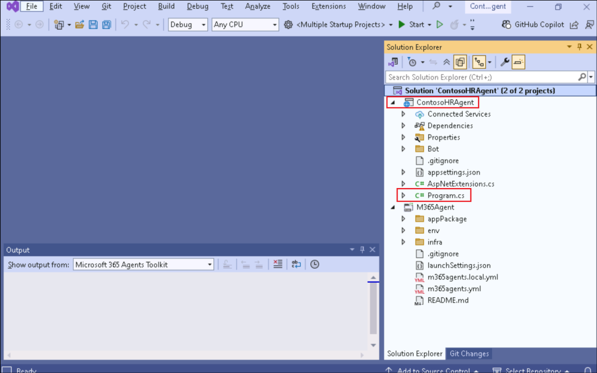
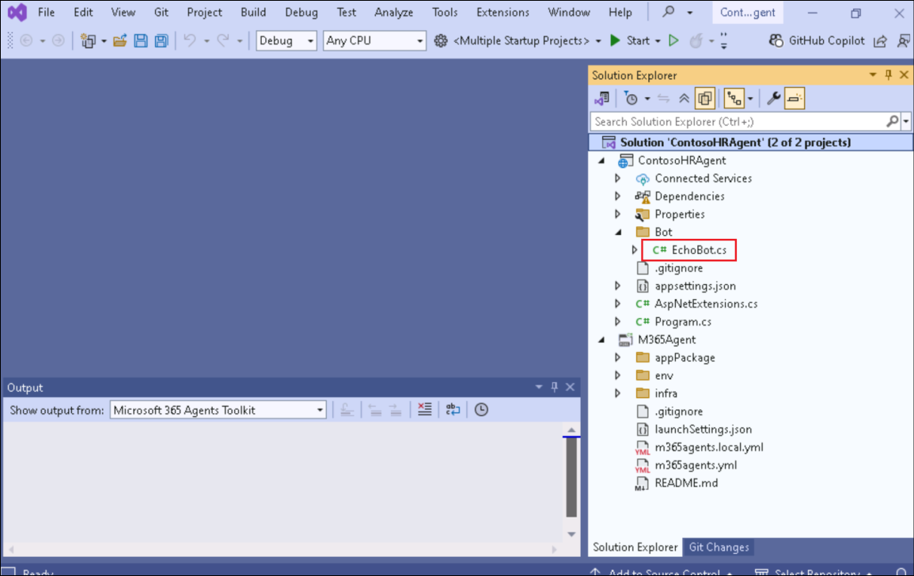
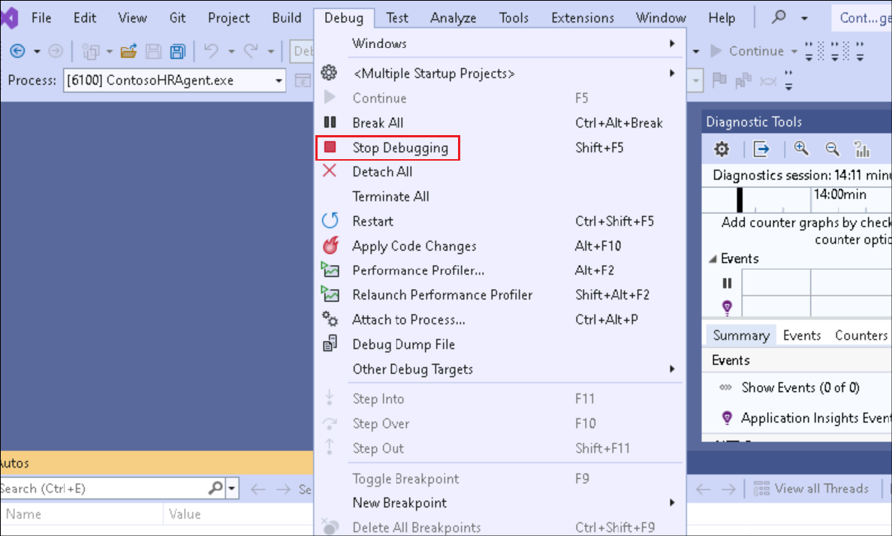

# Laboratório 3 - Crie seu próprio agente com o M365 Agents SDK e o Semantic Kernel

Duração do laboratório – 80 minutos

## Objetivo

Neste laboratório, você desenvolverá um agente de mecanismo
personalizado que é executado no Microsoft Teams, no Microsoft 365
Copilot Chat e até mesmo em canais externos usando o Microsoft 365
Agents SDK e o Semantic Kernel.

No Azure AI Foundry, você definirá as principais instruções, ferramentas
e personalidade do seu agente. A partir daí, você usará o Microsoft 365
Agents SDK e o Visual Studio para dar vida ao seu agente, personalizando
seus comportamentos e integrando-o ao Semantic Kernel para orquestração.
Em seguida, você testará seu agente no Microsoft Teams, o trará para o
Copilot Chat e o verá ganhar vida nos aplicativos do Microsoft 365.

Neste laboratório, você aprenderá a:

- Preparar seu agente no Azure AI Foundry

- Criar seu primeiro agente usando o M365 Agents SDK

- Configurar as propriedades do seu agente usando o SDK

- Integrar seu agente ao Teams usando o Azure AI Foundry

- Trazer seu agente para o Microsoft 365 Copilot Chat

## Exercício 1: Preparar seu agente no Azure AI Foundry

Neste exercício, você começará sua jornada preparando um agente de
mecanismo personalizado usando o Azure AI Foundry, a plataforma da
Microsoft para criar, configurar e dimensionar agentes de AI. Você
explorará o **Agents Playground**, definirá a função do seu agente,
personalizará suas instruções e o conectará a documentos internos
relevantes para suporte de Retrieval-Augmented Generation (RAG).

Este exercício define a base para o restante do Caminho de Construção
usando o **Microsoft 365 Agents SDK** e o **Semantic Kernel**. Você
simulará um agente de Recursos Humanos do mundo real para a Contoso
Electronics que pode responder a perguntas com base em documentos
carregados, como o Manual do Funcionário, a Biblioteca de Funções e os
Planos de Benefícios.

O Azure AI Foundry é uma plataforma que permite que os desenvolvedores
criem, implantem e dimensionem agentes de IA com facilidade. Você
aprenderá a configurar um agente e testar sua funcionalidade usando o
Agents Playground. Essa experiência prática fornecerá informações sobre
os recursos do Azure AI Agent Service e como ele se integra a vários
modelos e ferramentas de AI.

O Azure AI Foundry é sua plataforma de lançamento para a criação de
agentes de AI. Nesta tarefa, você fará logon no Azure AI Foundry com
suas credenciais de loin.

1.  Abra o navegador, vá até +++<https://ai.azure.com>+++ e entre em sua
    conta do Azure.

    

2.  Na página inicial do Azure AI Foundry, selecione **Create an
    agent**.

    

3.  Deixe o nome do projeto como recomendado e selecione **Create**.

    

4.  Isso criará um novo projeto para você no Azure AI Foundry,
    geralmente leva de 3 a 5 minutos.

5.  Quando seu projeto for criado, você será redirecionado para ele,
    estenda a barra lateral esquerda e selecione **Agents**. Isso abrirá
    o **Agents Playground**.

    

6.  Selecione **Agents** no painel esquerdo. Você verá que um novo
    agente foi criado para você.

    

7.  **Selecione** o agente, role para baixo e selecione **Try in
    playground**.

    

    Agora que você está dentro do Agents Playground, você personalizará a
identidade e o comportamento do seu agente para corresponder a um
cenário do mundo real: um Agente de RH interno na Contoso.

8.  No painel de Configuração do agente, nomeie-o como +++Contoso HR
    Agent+++ e atualize as **Instructions** da seguinte forma:

    ```
    You are Contoso HR Agent, an internal assistant for Contoso Electronics. Your role is to help employees find accurate, policy-aligned answers to questions related to:
    - Job role descriptions and responsibilities
    - Performance review process
    - Health and wellness benefits (PerksPlus, Northwind Standard, Northwind Plus)
    - Employee rights and workplace safety
    - Company values and conduct
    Always base your responses on the content provided in the official documents such as the Employee Handbook, Role Library, and Benefit Plans. If you are unsure or the information is not covered, suggest the employee contact HR.
    Respond in a professional but approachable tone. Keep answers factual and to the point.
    Example scenarios you should support:
    - What is the deductible for Northwind Standard?
    - Can I use PerksPlus for spa treatments?
    - What does the CTO at Contoso do?
    - What happens during a performance review?

    ```

9.  Na seção **Knowledge**, selecione **+ Add** e selecione **Files**,
    em seguida, selecione **local files**.

    

    

    

10. Navegue até **C:\Labfiles\M365 Agents SDK** , selecione todos os
    arquivos dentro da pasta e clique em **Open**.

    

11. Selecione **Upload and save** para carregá-los. Isso criará um
    armazenamento de vetores para o nosso agente.

    

12. Quando você carrega documentos, o Foundry os converte
    automaticamente em vetores, um formato que permite ao agente
    pesquisar e recuperar informações relevantes de forma eficiente.

    

13. Salve o **Agent id** em um bloco de notas, isso será necessário nos
    próximos exercícios. Você pode encontrar seu ID de agente nos
    detalhes do agente.

    

14. Além disso, vá para a página **Overview** e salvar o valor de
    **Azure AI Foundry project endpoint** no bloco de notas.

    

    Ao personalizar as instruções e fazer upload de documentos relevantes,
você está ensinando ao agente como se comportar e em qual conhecimento
confiar. Esta é uma forma simplificada de Retrieval-Augmented Generation
(RAG).

## Exercício 2: Criar seu primeiro agente usando o SDK de agentes do M365

Agora que você viu como criar um agente usando o Azure AI Foundry, vamos
mudar de assunto e explorar como criar seu próprio agente localmente
usando o Microsoft 365 Agents SDK. Esse SDK permite que você crie
agentes multicanais prontos para produção que podem ser executados no
Microsoft Teams, no Microsoft 365 Copilot e em outros canais
preferenciais.

1.  Em Iniciar do Windows, procure Visual e abra **Visual Studio 2022**.
    Selecione **Skip and add accounts later**.

    

2.  Selecione **Start Visual Studio**.

    

3.  Selecione **Create a new project**.

    

4.  Busque por +++**Microsoft**+++ e selecione o modelo **Microsoft 365
    Agents**. Clique em **Next**.

    

5.  Forneça um nome para o seu agente como +++**ContosoHRAgent**+++ e
    selecione **Create**.

    

6.  Na lista de modelos, selecione **Echo Bot** e selecione **Create**.

    

7.  Selecione **Allow access** no pop-up.

    

8.  Quando o modelo de projeto for estruturado, acesse o Solution
    Explorer no painel do lado direito e explore o modelo de agente.
    Expanda o projeto **ContosoHRAgent**.

    - Abra **Program.cs**, esse código configura e executa o servidor
      web que hospeda seu agente. Ele configura os serviços necessários,
      como autenticação, roteamento, armazenamento e registra o
      **EchoBot** e injeta manipulação de estado baseada em memória.

    

    - Abra **Bot \> EchoBot.cs** e observe que este exemplo configura um agente de IA básico usando o **Microsoft.Agents.Builder**. Ele envia uma mensagem de boas-vindas quando um usuário entra no chat e escuta qualquer mensagem e a ecoa de volta com uma contagem de mensagens em execução.

    

    Você começou com um **Echo Bot**, um bot simples que repete qualquer mensagem que um usuário envie. É uma maneira útil de verificar sua configuração e entender como as conversas são tratadas nos bastidores.

9.  No Visual Studio, selecione **Tools -\> NuGet Package Manager -\>
    Package Manager Settings**, para adicionar o NuGet.org às fontes do
    pacote.

    

10. Selecione **Package Sources** e clique no símbolo **+** para
    adicionar uma nova fonte de pacote.

    

11. Insira os detalhes abaixo e selecione **Ok**.

    - Name: +++nuget.org+++

    - Source: +++https://api.nuget.org/v3/index.json+++

    

12. Para testar seu agente de eco, pressione **Iniciar** ou **F5**. Isso
    iniciará a Ferramenta de Teste automaticamente no host local, onde
    você pode interagir com seu agente. Caso o Visual Studio solicite
    que você confirme a criação de um certificado SSL autoemitido para
    testar o aplicativo localmente, **confirme** e **prossiga**.

    

    

13. Selecione **Allow access** em Security Alert.

    

14. O aplicativo agora começa.

    

15. Aguarde até a mensagem do agente " Hello and Welcome!" e digite
    qualquer coisa como "Hi", "Hello". Observe que o agente ecoa tudo de
    volta.

    

    

16. Pare a depuração selecionando **Debug** -\> **Stop Debugging** no
    Visual Studio.

    

    Você concluiu a construção do seu primeiro agente usando o exercício
M365 Agents SDK. Esse agente simples forma a base para experiências mais
poderosas. Na próxima etapa, você combinará isso com seu agente do Azure
AI Foundry para habilitar respostas mais avançadas e com reconhecimento
de contexto.

## Exercício 3: Configurar propriedades do agente e testar no Teams

Agora que você criou um bot básico, é hora de aprimorá-lo com recursos
de AI generativa e atualizá-lo para um agente de AI. Neste exercício,
você instalará bibliotecas importantes, como o Kernel Semântico, e
preparará seu agente para raciocinar e responder de forma mais
inteligente, pronto para o Teams ou o Copilot Chat.

1.  Adicione o pacote **Semantic Kernel Nuget**. Este pacote fornecerá
    suporte para integração do Azure AI.

2.  Clique com o botão direito do mouse para projetar
    **ContosoHRAgent** e selecione **Manage Nuget Packages for
    Solution**.

    

3.  Selecione a guia **Browse**  e busque por
     +++Microsoft.SemanticKernel.Agents.AzureAI+++. Marque a caixa de
    seleção **Include prerelease**.

    

4.  Selecione o **pacote**, selecione **Contoso** em **Project** e
    selecione **Install**.

    

    

5.  Selecione **Apply** na caixa de diálogo Preview Changes.

    

6.  Selecione **I Accept** na caixa de diálogo License Acceptance.

    

7.  O pacote agora está instalado.

    

8.  Selecionw **Program.cs** e digite
    +++builder.Services.AddKernel();+++ acima da linha **var app =
    builder.Build()** (linha 31).

    

    Isso registra o Semantic Kernel, um componente principal que permite que
seu agente interaja com modelos de AI generativa.

9.  Clique com o botão direito do mouse para projetar **ContosoHRAgent**
    e selecione **Add \> Class**.

    

10. Insira o nome da classe como +++FileReference.cs+++ e selecione
    **Create**.

    

11. Essa classe define a estrutura usada ao fazer referência a
    documentos específicos em respostas, útil quando o agente cita
    conteúdo de arquivos carregados.

    Substitua o código existente pelo seguinte:

    ```
    using Microsoft.Agents.Core.Models;

    namespace ContosoHRAgent
    {
        public class FileReference(string fileId, string fileName, string quote, Citation citation)
        {
            public string FileId { get; set; } = fileId;
            public string FileName { get; set; } = fileName;
            public string Quote { get; set; } = quote;
            public Citation Citation { get; set; } = citation;
        }
    }

    ```

    

12. Clique com o botão direito do mouse para projetar
    **ContosoHRAgent** e selecione **Add \> Class** and defina o class
    name como +++ConversationStateExtensions.cs+++. Substitua o código
    existente pelo seguinte:

    ```
    using Microsoft.Agents.Builder.State;

    namespace ContosoHRAgent
    {
    public static class ConversationStateExtensions
    {
        public static int MessageCount(this ConversationState state) => state.GetValue<int>("countKey");

        public static void MessageCount(this ConversationState state, int value) => state.SetValue("countKey", value);

        public static int IncrementMessageCount(this ConversationState state)
        {
            int count = state.GetValue<int>("countKey");
            state.SetValue("countKey", ++count);
            return count;
        }

        public static string ThreadId(this ConversationState state) => state.GetValue<string>("threadId");

        public static void ThreadId(this ConversationState state, string value) => state.SetValue("threadId", value);
    }
    }

    ```

    

    Essa classe adiciona métodos auxiliares para gerenciar e rastrear o
número de mensagens do usuário, demonstrando como o estado é armazenado
e modificado durante uma conversa em andamento.

## Exercício 4: Integrar o Azure AI Foundry Agent ao M365 Agents SDK

Você criou um agente usando o M365 Agents SDK e configurou-o com
recursos de IA generativa. Agora, você conectará esse agente local ao
agente do Azure AI Foundry criado anteriormente. Isso permite que seu
agente responda usando dados corporativos e instruções armazenadas no
projeto Foundry, fechando o círculo.

### Tarefa 1: Configurar o EchoBot.cs para se conectar com o Azure AI Foundry Agent

Nesta tarefa, você se conectará ao agente do Azure AI Foundry
adicionando um cliente para buscar e invocar seu modelo hospedado no
Foundry dentro do EchoBot.cs.

1.  No projeto **ContosoHRAgent**, abra **Bot/EchoBot.cs** e adicione as
    seguintes linhas dentro de public class no EchoBot.

    ```
    private readonly PersistentAgentsClient _projectClient;
    private readonly string _agentId;
    ```

    

2.  Substitua o **construtor EchoBot** existente pelo seguinte:

    ```
    public EchoBot(AgentApplicationOptions options, IConfiguration configuration) : base(options)
    {

        OnConversationUpdate(ConversationUpdateEvents.MembersAdded, WelcomeMessageAsync);

        // Listen for ANY message to be received. MUST BE AFTER ANY OTHER MESSAGE HANDLERS 
        OnActivity(ActivityTypes.Message, OnMessageAsync);

        // Azure AI Foundry Project ConnectionString
        string projectEndpoint = configuration["AIServices:ProjectEndpoint"];
        if (string.IsNullOrEmpty(projectEndpoint))
        {
            throw new InvalidOperationException("ProjectEndpoint is not configured.");
        }
        _projectClient = new PersistentAgentsClient(projectEndpoint, new AzureCliCredential());

        // Azure AI Foundry Agent Id
        _agentId = configuration["AIServices:AgentID"];
        if (string.IsNullOrEmpty(_agentId))
        {
            throw new InvalidOperationException("AgentID is not configured.");
        }

    }

    ```

    

3.  Substitua **o método OnMessageAsync** pelo seguinte:

    ```
    protected async Task OnMessageAsync(ITurnContext turnContext, ITurnState turnState, CancellationToken cancellationToken)
    {
        // send the initial message to the user
        await turnContext.StreamingResponse.QueueInformativeUpdateAsync("Working on it...", cancellationToken);

        // get the agent definition from the project
        var agentDefinition = await _projectClient.Administration.GetAgentAsync(_agentId, cancellationToken);

        // initialize a new agent instance from the agent definition
        var agent = new AzureAIAgent(agentDefinition, _projectClient);

        // retrieve the threadId from the conversation state
        // this is set if the agent has been invoked before in the same conversation
        var threadId = turnState.Conversation.ThreadId();

        // if the threadId is not set, we create a new thread
        // otherwise, we use the existing thread
        var thread = string.IsNullOrEmpty(threadId)
            ? new AzureAIAgentThread(_projectClient)
            : new AzureAIAgentThread(_projectClient, threadId);

        try
        {
            // increment the message count in state and queue the count to the user
            int count = turnState.Conversation.IncrementMessageCount();
            turnContext.StreamingResponse.QueueTextChunk($"({count}) ");

            // create the user message to send to the agent
            var message = new ChatMessageContent(AuthorRole.User, turnContext.Activity.Text);

            // invoke the agent and stream the responses to the user
            await foreach (AgentResponseItem<StreamingChatMessageContent> agentResponse in agent.InvokeStreamingAsync(message, thread, cancellationToken: cancellationToken))
            {
                // if the threadId is not set, we set it from the agent response
                // and store it in the conversation state for future use
                if (string.IsNullOrEmpty(threadId))
                {
                    threadId = agentResponse.Thread.Id;
                    turnState.Conversation.ThreadId(threadId);
                }

                turnContext.StreamingResponse.QueueTextChunk(agentResponse.Message.Content);
            }
        }
        finally
        {
            // ensure we end the streaming response
            await turnContext.StreamingResponse.EndStreamAsync(cancellationToken);
        }
    }

    ```

4.  Ao colar o trecho de código acima, você pode ver um aviso
    (SKEXP0110) porque esse recurso ainda está em versão prévia. Você
    pode suprimir esse aviso com segurança por enquanto clicando com o
    botão direito do mouse em AzureAIAgent, selecionando **Quick Actions
    and Refactorings \> Suppress or configure issues \> Configure
    SKEXP0110 Severity \> Silent**.

    

5.  O código agora ficará assim:

    

6.  O método ***OnMessageAsync*** é o coração da lógica de resposta do
    agente. Ao substituir o comportamento de eco padrão, você permitiu
    que seu agente enviasse a mensagem do usuário para o agente do Azure
    AI Foundry, transmitisse a resposta de volta ao usuário em tempo
    real, rastreasse e anexasse citações e referências de arquivo para
    transparência e adicionasse confidencialidade e rótulos gerados por
    AI para segurança e rastreabilidade.

### Tarefa 2: Configurar o Azure AI Agent Service Keys

Nesta tarefa, você adicionará os detalhes da conexão do Foundry a
appsettings.json, esses valores conectam o agente M365 ao projeto e ao
agente corretos do Foundry.

1.  No projeto **ContosoHRAgent**, abra **appsettings.json** e adicione
    as seguintes linhas na parte inferior da lista appsettings (linha
    40).

    ```
    ,
    "AIServices": {
    "AgentID": "<AzureAIFoundryAgentId>",
    "ProjectEndpoint": "<ProjectEndpoint>"
    }

    ```

    Substitua os espaços reservados para **AzureAIFoundryAgentId** e **ProjectEndpoint** pelos valores salvos no bloco de notas no final do Exercício 1.

    

2.  A versão final do **appsettings.json** será semelhante a seguir:

    ```
    {
    "AgentApplicationOptions": {
        "StartTypingTimer": false,
        "RemoveRecipientMention": false,
        "NormalizeMentions": false
    },

    "TokenValidation": {
        "Audiences": [
        "{{ClientId}}" // this is the Client ID used for the Azure Bot
        ]
    },

    "Logging": {
        "LogLevel": {
        "Default": "Information",
        "Microsoft.AspNetCore": "Warning",
        "Microsoft.Agents": "Warning",
        "Microsoft.Hosting.Lifetime": "Information"
        }
    },
    "AllowedHosts": "*",
    "Connections": {
        "BotServiceConnection": {
        "Settings": {
            "AuthType": "UserManagedIdentity", // this is the AuthType for the connection, valid values can be found in Microsoft.Agents.Authentication.Msal.Model.AuthTypes.
            "ClientId": "{{BOT_ID}}", // this is the Client ID used for the connection.
            "TenantId": "{{BOT_TENANT_ID}}",
            "Scopes": [
            "https://api.botframework.com/.default"
            ]
        }
        }
    },
    "ConnectionsMap": [
        {
        "ServiceUrl": "*",
        "Connection": "BotServiceConnection"
        }
    ],
    "AIServices": {
    "AgentID": "<AzureAIFoundryAgentId>",
    "ProjectEndpoint": "<ProjectEndpoint>"
    }
    }

    ```

### Tarefa 3: Teste seu agente no Teams

Nesta tarefa, você testará o agente criado no Teams.

1.  Abra o **prompt de comando do Windows** e digite +++onde az+++. Isso
    é para obter o caminho em que a CLI do Azure está instalada e
    atualizar a variável de ambiente de caminho.

    Copie e cole os caminhos listados como saída.

    

2.  Na janela **Iniciar**, procure por +++Ambiente+++ e selecione **Edit
    the system environment variables**.

    

3.  Selecione **Environment Variables**.

    

4.  Em **System variables**, selecione **Path** e, em seguida, selecione
    **Edit**.

    

5.  Add the path obtained as the output for the command **where az** (a
    primeira etapa desta tarefa) e clique em **Ok**.

    

6.  Selecione **Ok** nas outras janelas abertas do **Environment
    Settings**.

7.  No Visual Studio, abra **Tools \> Command Line \> Developer Command
    Prompt**.

    

8.  Execute o comando abaixo:

    +++az login+++

    Uma janela aparecerá no seu navegador. Selecione **Work or school account** e faça login com suas credenciais.

    

    

9.  Uma vez logado, digite **1** para selecionar a assinatura.

    

10. Expanda **Start** e selecione **Dev Tunnels \> Create a Tunnel**:

    

11. Forneça os detalhes abaixo e selecione **Ok**.

    - A conta que criará o túnel - Selecione **Sign in** -\> **Work or
    school account** e faça login com suas credenciais.

    - Name - +++DevTunnel+++.

    - Tunnel Type - **Temporary**

    - Access - **Public**

    

    

12. Clique com o botão direito do mouse no projeto **M365Agent**,
    selecione **Microsoft 365 Agents Toolkit \> Select Microsoft 365
    Account**.

    

    

13. Selecione sua conta e clique em **Continue**.

    

14. Expanda o **menu suspenso** ao lado de **Multiple startup projects**
    e selecione **Microsoft Teams (browser)**.

    

    Agora você está pronto para executar seu agente integrado e testá-lo ao
vivo no Microsoft Teams.

15. Pressione **Iniciar** ou **F5** para iniciar a depuração. O
    Microsoft Teams será iniciado automaticamente e seu aplicativo de
    agente aparecerá na janela. Selecione **Add** e **Open** para
    começar a conversar com seu agente.

    

    

16. Você pode fazer uma das seguintes perguntas para interagir com o
    agente.

    - +++What’s the difference between Northwind Standard and Health Plus
    when it comes to emergency and mental health coverage?+++

    - +++Can I use PerksPlus to pay for both a rock climbing class and a
    virtual fitness program?+++

    - +++What values guide behavior and decision-making at Contoso
    Electronics?+++

    Você deve observar que está obtendo respostas semelhantes com o agente criado no Azure AI Foundry.

    

    

## Exercício 5: Traga seu agente para o Copilot Chat

Neste exercício, você trará seu agente de mecanismo personalizado para o
Copilot Chat atualizando o manifesto do agente. Ao habilitar
copilotAgents no manifesto do aplicativo, você disponibilizará seu
assistente com tecnologia de IA diretamente na experiência do Copilot.

1.  Abra **M365Agent/AppPackage/manifest.json**, atualize o esquema e a
    versão do manifesto da seguinte maneira:

    ```
    "$schema": "https://developer.microsoft.com/en-us/json-schemas/teams/v1.22/MicrosoftTeams.schema.json",
    "manifestVersion": "1.22",

    ```

    

2.  Substitua a seção **bots** pela seguinte, que também adicionará
    copilotAgents no manifesto.

    Este bloco declara seu agente como um agente de mecanismo personalizado
para o M365 Copilot. Ele informa ao Microsoft 365 para expor esse agente
no Copilot Chat e exibir sua lista de comandos na interface do usuário
da conversa, juntamente com os iniciadores de conversa, para ajudar os
usuários a começar rapidamente.

    ```
    "bots": [ 
    { 
        "botId": "${{BOT_ID}}", 
        "scopes": [ 
        "personal", 
        "team", 
        "groupChat" 
        ], 
        "supportsFiles": false, 
        "isNotificationOnly": false, 
        "commandLists": [ 
        { 
            "scopes": [ "personal", "team", "groupChat" ], 
            "commands": [ 
            { 
                "title": "Emergency and Mental Health",
                "description": "What’s the difference between Northwind Standard and Health Plus when it comes to emergency and mental health coverage?" 
            }, 
            { 
                "title": "PerksPlus Details", 
                "description": "Can I use PerksPlus to pay for both a rock climbing class and a virtual fitness program?" 
            }, 
            { 
                "title": "Contoso Electronics Values", 
                "description": "What values guide behavior and decision making at Contoso Electronics?" 
            } 
            ] 
        } 
        ] 
    } 
    ], 
    "copilotAgents": { 
    "customEngineAgents": [ 
        { 
        "id": "${{BOT_ID}}", 
        "type": "bot" 
        } 
    ] 
    },

    ```

    

3.  Pressione **Iniciar** ou **F5** para iniciar a depuração. O
    Microsoft Teams será iniciado automaticamente.

4.  Quando o Microsoft Teams abrir em seu navegador, ignore o pop-up do
    aplicativo, selecione **Apps \> Manage your apps \> Upload an app**
    e, em seguida, selecione **Upload a custom app**. 

    

5.  No Explorador de Arquivos, vá para a pasta do seu projeto. O caminho
    será **C:\Users\Admin\source\repos\ContosoHRAgent\ContosoHRAgent**
    se você não alterou o caminho durante a configuração do projeto.
    Navegue até **\ContosoHRAgent\M365Agent\appPackage\build select
    appPackage.local.zip** e clique em **Open**.

    

6.  Seu aplicativo aparecerá no Teams novamente, selecione **Add**

    

7.  Selecione **Open with Copilot** para testar seu agente no Copilot.

    

8.  Selecione o iniciador da conversa, **PerksPlus Details** e pressione
    **Send**.

    

    

9.  Observe que você está recebendo a resposta do agente do AI Foundry,
    agora no Copilot Chat.

    

## Resumo

Neste laboratório, você acabou de criar seu agente de mecanismo
personalizado usando o Microsoft 365 Agents SDK e o Azure AI Foundry.

Você aprendeu a:

- Configurar um agente de AI no Azure AI Foundry usando o Agent
  Playground

- Carregar documentos corporativos para fundamentar as respostas do seu
  agente

- Estruturar um bot usando o SDK do M365 Agents no Visual Studio

- Adicionar Semantic Kernel e conectar-se a Azure AI Agent Service

- Integrar seu bot ao agente do Azure AI Foundry para raciocínio
  fundamentado em tempo real

- Implementar e teste seu agente no **Microsoft Teams** e no **Copilot
  Chat**
