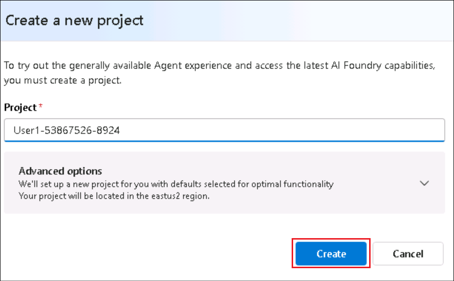
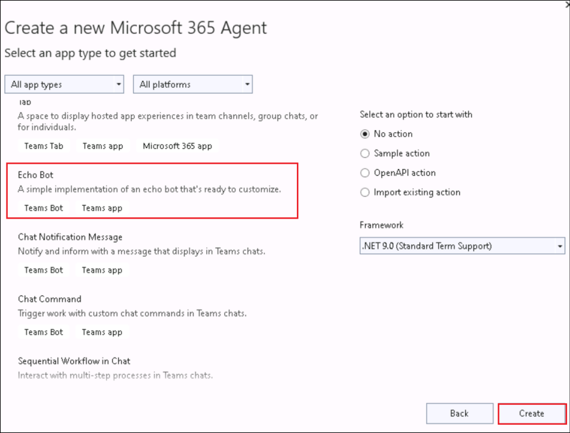
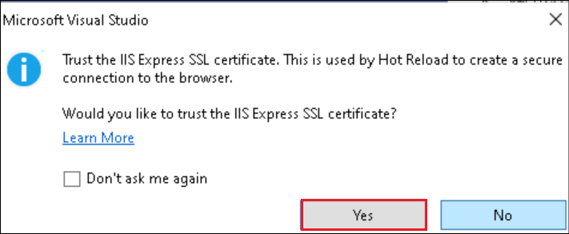
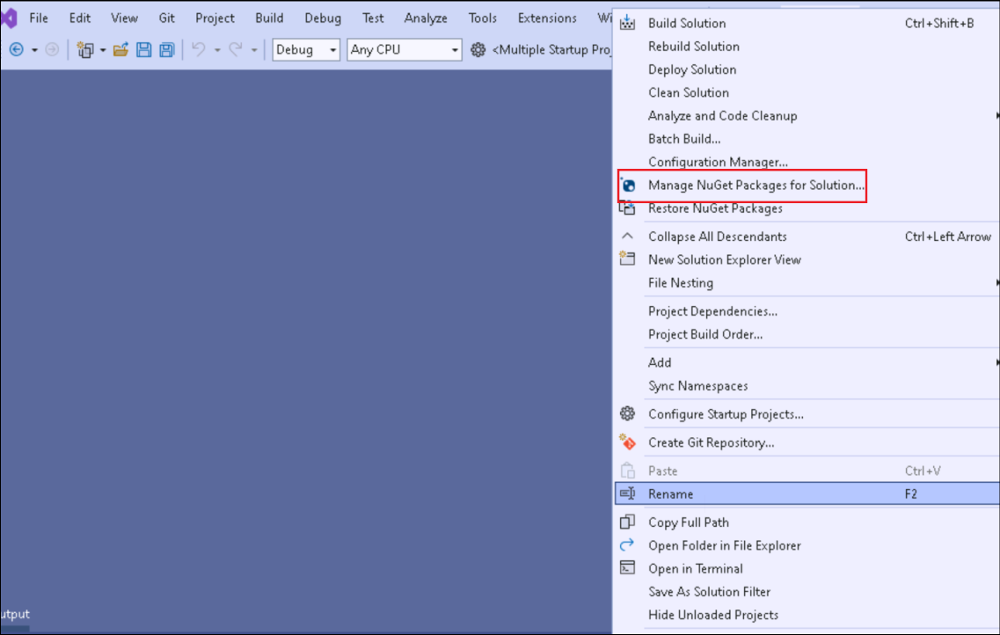

# 实验室 3 - 使用 M365 代理 SDK 和 Semantic kernel构建自己的代理

实验室时间 – 80 分钟

## 目标

在本实验室中，你将开发一个自定义引擎代理，该代理使用 Microsoft 365 代理
SDK 和语义内核跨 Microsoft Teams、Microsoft 365 Copilot Chat
甚至外部渠道运行。

在 Azure AI Foundry
中，你将定义代理的核心指令、工具和个性。从那里，你将使用 Microsoft 365
代理 SDK 和 Visual Studio
使代理栩栩如生，自定义其行为并将其与语义内核集成以进行业务流程。然后，您将在
Microsoft Teams 中测试您的代理，将其引入 Copilot Chat，并看到它在
Microsoft 365 应用程序中变为现实。

在本实验中，您将学习

- 在 Azure AI Foundry 中准备代理

- 使用 M365 代理 SDK 构建您的第一个代理

- 使用 SDK 配置代理的属性

- 使用 Azure AI Foundry 将代理与 Teams 集成

- 将您的代理引入 Microsoft 365 Copilot 聊天

## 练习 1: 在 Azure AI Foundry 中准备代理

在本练习中，你将使用 Azure AI Foundry（Microsoft 用于创建、配置和缩放 AI
代理的平台）准备自定义引擎代理，开始您的旅程。您将探索**Agents
Playground,**，定义代理的角色，个性化其说明，并将其连接到相关的内部文档以支持Retrieval-Augmented
Generation (RAG)。

本练习使用 Microsoft 365 代理 SDK
**和语**义内核**为生成路径的其余部分奠定基础**。你将模拟 Contoso
Electronics
的真实人力资源代理，该代理可以根据上传的文档（如员工手册、角色库和福利计划）回答问题。

Azure AI Foundry 是一个平台，使开发人员能够轻松生成、部署和缩放 AI
代理。您将学习如何配置代理，并使用 Agents Playground
测试其功能。这种实践经验将深入了解 Azure AI
代理服务的功能以及它如何与各种 AI 模型和工具集成。

Azure AI Foundry 是构建 AI
代理的启动板。在此任务中，你将使用登录凭据登录 Azure AI Foundry。

1.  打开浏览器并导航到+++<https://ai.azure.com>+++ 并登录到你的 Azure
    帐户。

    

2.  在 Azure AI Foundry 主页中，选择**Create an agent**.

    

3.  将项目名称保留为建议，然后选择 **Create**.

    

4.  这将在 Azure AI Foundry 中为你搭建一个新项目，通常需要 3-5 分钟。

5.  创建项目后，您将被重定向到您的项目，展开左侧栏并选择**代理。**这将打开
    Agents Playground。

    

6.  从 左窗格中选择**代理**。您将看到为您创建了一个新的代理。

    

7.  **选择代理**，向下滚动并选择**在 Playground 中尝试**。

    

现在，你已进入代理游乐场，你将自定义代理的标识和行为，以匹配真实场景：Contoso
的内部 HR 代理。

8.  在代理的“设置”面板中，将代理命名为 +++Contoso HR
    Agent+++，并按如下方式更新说明：

    ```
    You are Contoso HR Agent, an internal assistant for Contoso Electronics. Your role is to help employees find accurate, policy-aligned answers to questions related to:
    - Job role descriptions and responsibilities
    - Performance review process
    - Health and wellness benefits (PerksPlus, Northwind Standard, Northwind Plus)
    - Employee rights and workplace safety
    - Company values and conduct
    Always base your responses on the content provided in the official documents such as the Employee Handbook, Role Library, and Benefit Plans. If you are unsure or the information is not covered, suggest the employee contact HR.
    Respond in a professional but approachable tone. Keep answers factual and to the point.
    Example scenarios you should support:
    - What is the deductible for Northwind Standard?
    - Can I use PerksPlus for spa treatments?
    - What does the CTO at Contoso do?
    - What happens during a performance review?

    ```

9.  在“知识”部分中，选择“**+
    Add**”，然后选择“**文件”**，然后选择“**选择本地文件**”。

    

    

    

10. 导航到 **C:\Labfiles\M365 Agents SDK**
    然后选择其中的所有文件，然后单击 **打开**。

    

11. 选择 **Upload and save**
    上传它们。这将为我们的代理创建一个向量存储。

    

12. 当您上传文档时，Foundry
    会自动将它们转换为向量，这种格式允许代理有效地搜索和检索相关信息。

    

13. 将 **Agent ID**
    保存到记事本，这将在接下来的练习中进行。您可以在代理的详细信息中找到您的代理
    ID。

    

14. 此外，转到“**概述**”页，并将 **Azure AI Foundry project
    endpoint**的值保存到记事本。

    

通过自定义说明和上传相关文档，您可以教代理如何行为以及依赖哪些知识。这是Retrieval-Augmented
Generation (RAG) 的简化形式。

## 练习 2 : 使用 M365 Agents SDK 构建您的第一个代理

现在，你已经了解了如何使用 Azure AI Foundry
生成代理，让我们换个角度，探索如何使用 Microsoft 365 代理 SDK
在本地生成自己的代理。此 SDK 允许你生成可在 Microsoft Teams、Microsoft
365 Copilot 和其他首选渠道中运行的多渠道生产就绪代理。

1.  在 Windows 开始模式下，搜索“Visual”并打开 **Visual Studio
    2022**。选择 **Skip and add accounts later**。

    

2.  选择 **Start Visual Studio**.

    

3.  选择 **Create a new project**.

    

4.  寻找 +++**Microsoft**+++，然后选择**Microsoft 365
    Agents** 模板。点击 **Next**.

    

5.  为您的代理提供名称+++**ContosoHRAgent**+++ ，然后选择**Create**.

    

6.  从模板列表中, 选择 **Echo Bot** ，然后选择**Create**.

    

7.  在弹出窗口中选择 **Allow access**。

    

8.  搭建项目模板后，转到右侧面板上的“解决方案资源管理器”并浏览代理模板。展开
    **ContosoHRAgent** 项目。

    - 打开**Program.cs**，此代码配置并运行托管代理的 Web
      服务器。它设置所需的服务，如身份验证、路由、存储并注册 **EchoBot**
      并注入基于内存的状态处理。

      

    -  打开 **Bot > EchoBot.cs**，并观察此示例使用
    **Microsoft.Agents.Builder** 设置基本 AI
    代理。当用户加入聊天并侦听任何消息并回显正在运行的消息计数时，它会发送欢迎消息。

      

    您已经从 **Echo Bot** 开始，这是一个简单的机器人，可以重复用户发送的任何消息。这是验证您的设置并了解如何在幕后处理对话的有用方法。

9.  在 Visual Studio 中，选择 **Tools -\> NuGet Package Manager -\>
    Package Manager Settings**, 将 NuGet.org 添加到包源。

    

10. 选择 **Package Sources** ，然后单击 **+** 符号以添加新的包源。

    

11. 输入以下详细信息，然后选择 **Ok**.

    -  名称 - +++nuget.org+++

    -  来源 - +++https://api.nuget.org/v3/index.json+++

    

12. 测试回声代理, 点击 **Start** 或者 **F5**.
    这将在本地主机中自动启动测试工具，您可以在其中与代理交互。如果
    Visual Studio 要求你确认创建自颁发的 SSL
    证书以在本地测试应用程序，请 **确认** 并 **继续**。

    

    

13. 在安全警报中选择 **Allow access。**

    

14. 应用程序现在启动。

    

15. 等到座席消息“您好，欢迎光临！”，然后键入任何内容，例如 “Hi”,
    “Hello”. 观察代理回应所有内容。

    

    

16. 从 Visual Studio通过选择停止调试 **Debug** -\> **Stop Debugging**.

    

你已完成使用 M365 代理 SDK
构建第一个代理练习。这个简单的代理构成了更强大体验的基础。在下一步中，你将把它与
Azure AI Foundry 代理相结合，以启用更丰富的上下文感知答案。

## 练习 3: 在 Teams 上配置代理属性和测试

现在您已经创建了一个基本机器人，是时候使用 Generative AI
功能对其进行增强并将其升级为 AI
代理了。在本练习中，你将安装语义内核等关键库，并准备代理更智能地推理和响应，为
Teams 或 Copilot 聊天做好准备。

1.  添加 **Semantic Kernel Nuget**包。此包将支持 Azure AI 集成。

2.  右键单击 **ContosoHRAgent** 项目，然后选择**“Manage Nuget Packages
    for Solution**.

    

3.  选择**“Browse”**选项卡并搜索
    +++Microsoft.SemanticKernel.Agents.AzureAI+++. 选中“ **Include
    prerelease** **”**复选框。

    

4.  选择 **package**,在项目下，选择**Contoso**然后选择**Install**.

    

    

5.  在“预览更改”对话框中选择 **Apply**.

    

6.  在许可证接受对话框中选择 **I Accept**

    

7.  软件包现已安装。

    

8.  选择 **Program.cs** 并输入+++builder.Services.AddKernel();+++
    线以上, **var app = builder.Build()** (Line 31).

    

    这会注册语义内核，这是一个核心组件，允许您的代理与生成式 AI
模型进行交互。

9.  右键单击 **ContosoHRAgent** 项目，然后选择**“Add \> Class. **”。

    

10. 将类名称输入为 +++**FileReference.cs**+++ ，然后选择“ **Create”**.

    

11. 此类定义在响应中引用特定文档时使用的结构，当您的代理引用上传文件中的内容时非常有用。

    将现有代码替换为以下内容。

    ```
    using Microsoft.Agents.Core.Models;

    namespace ContosoHRAgent
    {
        public class FileReference(string fileId, string fileName, string quote, Citation citation)
        {
            public string FileId { get; set; } = fileId;
            public string FileName { get; set; } = fileName;
            public string Quote { get; set; } = quote;
            public Citation Citation { get; set; } = citation;
        }
    }
    ```

    

12. 右键单击 **ContosoHRAgent**
    项目，然后选择“**添加\>类**”，并将类名称定义为
    +++ConversationStateExtensions.cs+++。将现有代码替换为以下内容

    ```
    using Microsoft.Agents.Builder.State;

    namespace ContosoHRAgent
    {
    public static class ConversationStateExtensions
    {
        public static int MessageCount(this ConversationState state) => state.GetValue<int>("countKey");

        public static void MessageCount(this ConversationState state, int value) => state.SetValue("countKey", value);

        public static int IncrementMessageCount(this ConversationState state)
        {
            int count = state.GetValue<int>("countKey");
            state.SetValue("countKey", ++count);
            return count;
        }

        public static string ThreadId(this ConversationState state) => state.GetValue<string>("threadId");

        public static void ThreadId(this ConversationState state, string value) => state.SetValue("threadId", value);
    }
    }

    ```

    

    此类添加了帮助程序方法来管理和跟踪用户消息数，演示在正在进行的对话期间如何存储和修改状态。

## 练习 4: 将 Azure AI Foundry 代理与 M365 代理 SDK 集成

您已使用 M365 Agents SDK 构建了代理，并为其配置了生成式 AI
功能。现在，你将此本地代理连接到之前创建的 Azure AI Foundry
代理。这使您的代理能够使用存储在 Foundry
项目中的企业数据和指令进行响应，从而使一切顺利进行。

### 任务 1: 配置EchoBot.cs以与 Azure AI Foundry 代理连接

在此任务中，你将通过添加客户端来在EchoBot.cs中提取和调用 Foundry
托管的模型，从而连接到 Azure AI Foundry 代理。

1.  在 **ContosoHRAgent** 项目, 打开 **Bot/EchoBot.cs** 并在 EchoBot
    公共类中添加以下行。

    ```
    private readonly PersistentAgentsClient _projectClient;
    private readonly string _agentId;
    ```


2.  将现有**的 EchoBot constructor** 替换为以下内容。

    ```
    public EchoBot(AgentApplicationOptions options, IConfiguration configuration) : base(options)
    {

        OnConversationUpdate(ConversationUpdateEvents.MembersAdded, WelcomeMessageAsync);

        // Listen for ANY message to be received. MUST BE AFTER ANY OTHER MESSAGE HANDLERS 
        OnActivity(ActivityTypes.Message, OnMessageAsync);

        // Azure AI Foundry Project ConnectionString
        string projectEndpoint = configuration["AIServices:ProjectEndpoint"];
        if (string.IsNullOrEmpty(projectEndpoint))
        {
            throw new InvalidOperationException("ProjectEndpoint is not configured.");
        }
        _projectClient = new PersistentAgentsClient(projectEndpoint, new AzureCliCredential());

        // Azure AI Foundry Agent Id
        _agentId = configuration["AIServices:AgentID"];
        if (string.IsNullOrEmpty(_agentId))
        {
            throw new InvalidOperationException("AgentID is not configured.");
        }

    }
    ```

    

3.  将 **OnMessageAsync** 方法替换为以下内容。

    ```
    protected async Task OnMessageAsync(ITurnContext turnContext, ITurnState turnState, CancellationToken cancellationToken)
    {
        // send the initial message to the user
        await turnContext.StreamingResponse.QueueInformativeUpdateAsync("Working on it...", cancellationToken);

        // get the agent definition from the project
        var agentDefinition = await _projectClient.Administration.GetAgentAsync(_agentId, cancellationToken);

        // initialize a new agent instance from the agent definition
        var agent = new AzureAIAgent(agentDefinition, _projectClient);

        // retrieve the threadId from the conversation state
        // this is set if the agent has been invoked before in the same conversation
        var threadId = turnState.Conversation.ThreadId();

        // if the threadId is not set, we create a new thread
        // otherwise, we use the existing thread
        var thread = string.IsNullOrEmpty(threadId)
            ? new AzureAIAgentThread(_projectClient)
            : new AzureAIAgentThread(_projectClient, threadId);

        try
        {
            // increment the message count in state and queue the count to the user
            int count = turnState.Conversation.IncrementMessageCount();
            turnContext.StreamingResponse.QueueTextChunk($"({count}) ");

            // create the user message to send to the agent
            var message = new ChatMessageContent(AuthorRole.User, turnContext.Activity.Text);

            // invoke the agent and stream the responses to the user
            await foreach (AgentResponseItem<StreamingChatMessageContent> agentResponse in agent.InvokeStreamingAsync(message, thread, cancellationToken: cancellationToken))
            {
                // if the threadId is not set, we set it from the agent response
                // and store it in the conversation state for future use
                if (string.IsNullOrEmpty(threadId))
                {
                    threadId = agentResponse.Thread.Id;
                    turnState.Conversation.ThreadId(threadId);
                }

                turnContext.StreamingResponse.QueueTextChunk(agentResponse.Message.Content);
            }
        }
        finally
        {
            // ensure we end the streaming response
            await turnContext.StreamingResponse.EndStreamAsync(cancellationToken);
        }
    }
    ```

4.  粘贴上述代码摘录时，可能会看到警告
    （SKEXP0110），因为此功能仍处于预览状态。目前可以通过右键单击
    AzureAIAgent，选择“**Quick Actions and Refactorings \> Suppress or
    configure issues \> Configure SKEXP0110 Severity \> Silent**。

    

5.  代码现在将如下所示。

    

6.  ***OnMessageAsync***
    方法是代理响应逻辑的核心。通过替换默认回显行为，你已使代理能够将用户的消息发送到
    Azure AI Foundry
    代理，将响应实时流式传输回用户，跟踪和附加引文和文件引用以提高透明度，并添加敏感度和
    AI 生成的标签以实现安全性和可跟踪性。

### 任务 2: 配置 Azure AI 代理服务密钥

在此任务中，您将把 Foundry 连接详细信息添加到appsettings.json，这些值将
M365 代理连接到正确的 Foundry 项目和代理。

1.  在 **ContosoHRAgent** 项目中，打开**appsettings.json**并在
    appsettings 列表的底部添加以下行（在第 40 行）。

    ```
    ,
    "AIServices": {
    "AgentID": "<AzureAIFoundryAgentId>",
    "ProjectEndpoint": "<ProjectEndpoint>"
    }
    ```

    将 **AzureAIFoundryAgentId**   和 **ProjectEndpoint**  的占位符替换 为在练习 1 结束时保存到记事本的值。

    

2.  **appsettings.json**的最终版本 如下所示：

    ```
    {
    "AgentApplicationOptions": {
        "StartTypingTimer": false,
        "RemoveRecipientMention": false,
        "NormalizeMentions": false
    },

    "TokenValidation": {
        "Audiences": [
        "{{ClientId}}" // this is the Client ID used for the Azure Bot
        ]
    },

    "Logging": {
        "LogLevel": {
        "Default": "Information",
        "Microsoft.AspNetCore": "Warning",
        "Microsoft.Agents": "Warning",
        "Microsoft.Hosting.Lifetime": "Information"
        }
    },
    "AllowedHosts": "*",
    "Connections": {
        "BotServiceConnection": {
        "Settings": {
            "AuthType": "UserManagedIdentity", // this is the AuthType for the connection, valid values can be found in Microsoft.Agents.Authentication.Msal.Model.AuthTypes.
            "ClientId": "{{BOT_ID}}", // this is the Client ID used for the connection.
            "TenantId": "{{BOT_TENANT_ID}}",
            "Scopes": [
            "https://api.botframework.com/.default"
            ]
        }
        }
    },
    "ConnectionsMap": [
        {
        "ServiceUrl": "*",
        "Connection": "BotServiceConnection"
        }
    ],
    "AIServices": {
    "AgentID": "<AzureAIFoundryAgentId>",
    "ProjectEndpoint": "<ProjectEndpoint>"
    }
    }
    ```

### 任务 3: 在 Teams 上测试代理

在此任务中，你将在 Teams 中测试创建的代理。

1.  打开 **Windows command prompt**并输入 +++where
    az+++。这是为了获取安装 Azure CLI 的路径并更新路径环境变量。

    复制并粘贴列为输出的路径。

    

2.  在“ **开始”** 窗口中，搜索 +++Environment+++ 并选择
    **“编辑系统环境变量”**。

    

3.  选择**Environment variables**.

    

4.  在 **System variables**, 选择 **Path** ，然后选择 **Edit**.

    

5.  将获取的路径添加为命令的输出， **其中 az**
    （此任务的第一步），然后单击 **“确定**”。

    

6.  在**Environment Settings**. 的其他打开窗口中选择。

7.  在 Visual Studio 中，打开 **Tools \> Command Line \> Developer
    Command Prompt**.

    

8.  执行以下命令。

    +++az login+++

    浏览器上将弹出一个窗口。选择 **“Work or school account**”，然后使用登录凭据登录。

    

    

9.  登录后，输入 **1** 选择订阅。

    

10. 展开“**开始”**，然后选择 **Dev Tunnels \> Create a Tunnel**:

    

11. 提供以下详细信息，然后选择 **Ok**.

    - 将创建隧道的帐户 - 选择**“Sign in** -\> **Work or school
    account**”，然后使用登录凭据登录。

    - 名称 - +++DevTunnel+++.

    - 隧道类型 - **Temporary**

    - 访问 - **Public**

    

    

12. 右键点击 **M365Agent** 项目，选择 **Microsoft 365 Agents Toolkit \>
    Select Microsoft 365 Account**.

    

    

13. 选择您的帐户并单击 **Continue**.

    

14. 展开“**Multiple startup projects**”
    **旁边**的**下拉列表**，然后选择“**Microsoft Teams（浏览器）**。

    

    现在，你已准备好运行集成代理并在 Microsoft Teams 中实时测试它。

15. 点击**“开始”**或 **F5** 开始调试。Microsoft Teams
    将自动启动，您的代理应用程序将在窗口中弹出。选择**添加**并**打开**以开始与您的代理聊天。

    

    

16. 您可以提出以下问题之一来与代理交互。

    - +++What’s the difference between Northwind Standard and Health Plus
    when it comes to emergency and mental health coverage?+++

    - +++Can I use PerksPlus to pay for both a rock climbing class and a
    virtual fitness program?+++

    - +++What values guide behavior and decision-making at Contoso
    Electronics?+++

    > 应注意，在 Azure AI Foundry 上创建的代理会收到类似的响应。

    

    

## 练习 5:  将您的代理带到 Copilot Chat

在本练习中，您将通过更新代理的清单将自定义引擎代理引入 Copilot
Chat。通过在应用清单中启用 copilotAgents，你将直接在 Copilot 体验中提供
AI 支持的助手。

1.  打开 **M365Agent/AppPackage/manifest.json**,
    更新清单架构和版本，如下所示。

    ```
    "$schema": "https://developer.microsoft.com/en-us/json-schemas/teams/v1.22/MicrosoftTeams.schema.json",
    "manifestVersion": "1.22",
    ```

    

2.  将**机器人**部分替换 为以下内容，这也将在清单中添加 copilotAgents。

    此块将代理声明为 M365 Copilot 的自定义引擎代理。它告诉 Microsoft 365 在
Copilot Chat 中公开此代理，并在对话 UI
中显示其命令列表以及对话启动器，以帮助用户快速入门。

    ```
    "bots": [ 
    { 
        "botId": "${{BOT_ID}}", 
        "scopes": [ 
        "personal", 
        "team", 
        "groupChat" 
        ], 
        "supportsFiles": false, 
        "isNotificationOnly": false, 
        "commandLists": [ 
        { 
            "scopes": [ "personal", "team", "groupChat" ], 
            "commands": [ 
            { 
                "title": "Emergency and Mental Health",
                "description": "What’s the difference between Northwind Standard and Health Plus when it comes to emergency and mental health coverage?" 
            }, 
            { 
                "title": "PerksPlus Details", 
                "description": "Can I use PerksPlus to pay for both a rock climbing class and a virtual fitness program?" 
            }, 
            { 
                "title": "Contoso Electronics Values", 
                "description": "What values guide behavior and decision making at Contoso Electronics?" 
            } 
            ] 
        } 
        ] 
    } 
    ], 
    "copilotAgents": { 
    "customEngineAgents": [ 
        { 
        "id": "${{BOT_ID}}", 
        "type": "bot" 
        } 
    ] 
    },
    ```

    

3.  点击 **“开始”** 或 **F5** 开始调试。Microsoft Teams 将自动启动。

4.  在浏览器中打开Microsoft Teams
    时，请忽略应用弹出窗口，然后选择“**Apps \> Manage your apps \>
    Upload an app”**，然后选择“**Upload a custom app.**.

    

    

5.  在文件资源管理器中，转到项目文件夹。如果在项目设置期间未更改路径，则路径将为
    **C：\Users\Admin\source\repos\ContosoHRAgent\ContosoHRAgent**。导航到
    **\ContosoHRAgent\M365Agent\appPackage\build select
    appPackage.local.zip** 并点击 **Open**.

    

6.  应用将再次在 Teams 上弹出，选择 **Add**

    

7.  选择 **Open with Copilot**  以在 Copilot 上测试您的代理。

    

8.  选择对话启动器 **PerksPlus 详细信息并** 点击 **发送**。

    

    

9.  请注意，您现在正在 Copilot Chat 上收到来自 AI Foundry 代理的响应。

    

## 总结

在本实验室中，你刚刚使用 Microsoft 365 代理 SDK 和 Azure AI Foundry
生成了自定义引擎代理。

您学会了如何

1.  使用代理场在 Azure AI Foundry 中配置 AI 代理

2.  上传企业文档以支持代理的回复

3.  在 Visual Studio 中使用 M365 代理 SDK 搭建机器人

4.  添加语义内核并连接到 Azure AI 代理服务

5.  将机器人与 Azure AI Foundry 代理集成，以实现实时、扎根的推理

6.  在 **Microsoft Teams 和 Copilot Chat** 中部署和测试代理
