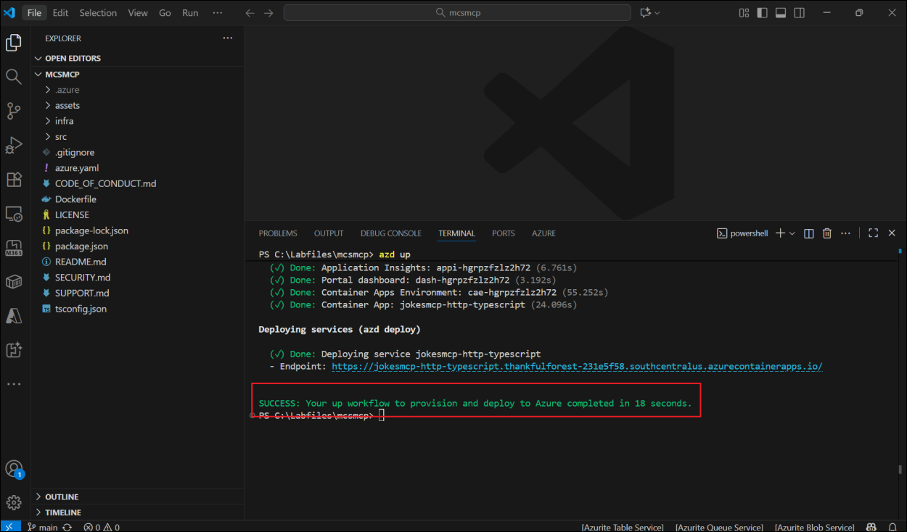
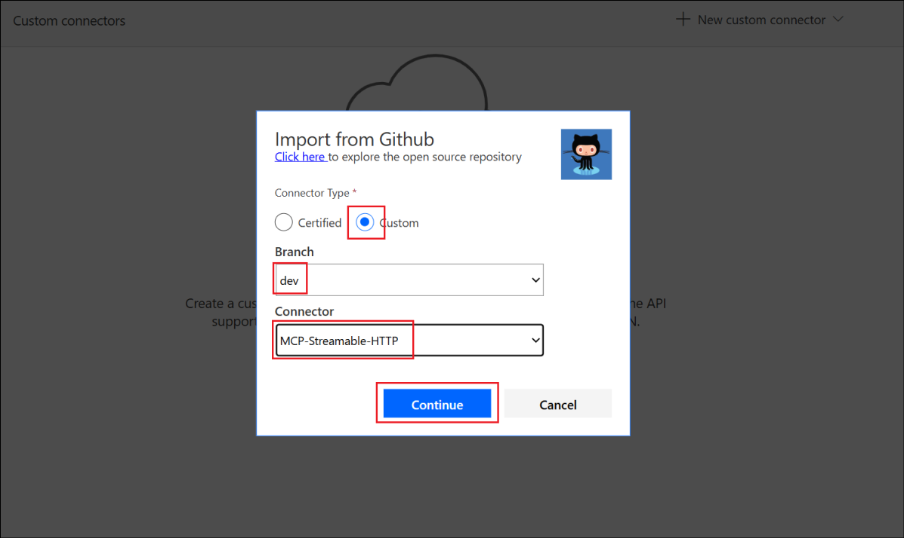
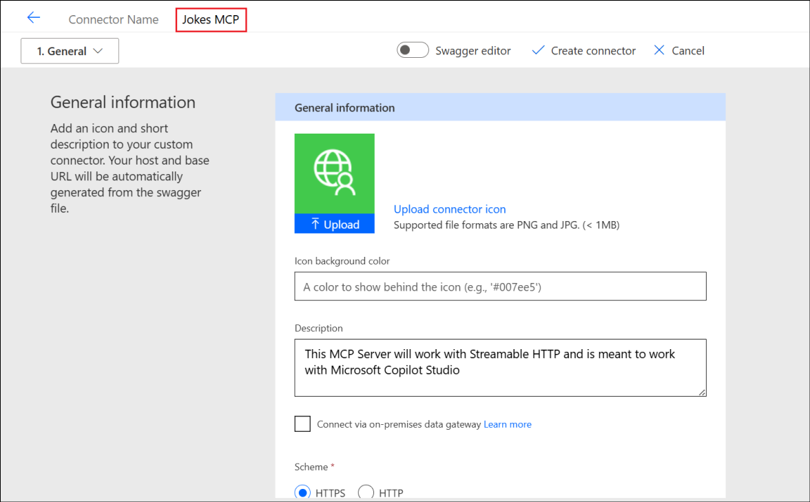
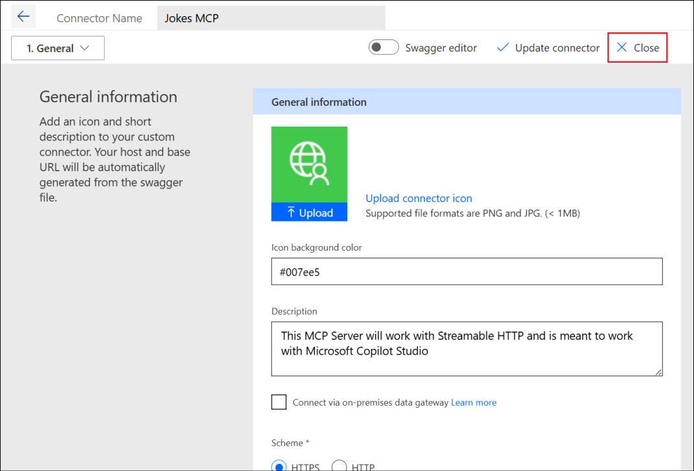

# Lab 4- Zava’s Journey to AI Integration – Building MCP-Powered Agents in Microsoft Copilot Studio

**Scenario:**

Zava, a fast-growing digital health organization, has recently formed an
**Internal Innovation Hub** to experiment with new AI capabilities that
could later be adapted into regulated healthcare solutions. Before
connecting sensitive medical systems, the innovation team needs a
**safe, low-risk sandbox** to learn how to integrate external APIs and
data sources with **Microsoft Copilot Studio** using the **Model Context
Protocol (MCP)**.

To do this, the team starts with a **simple, harmless example** — a
*Jokes MCP Server* — that demonstrates how Copilot Studio can call
real-time APIs through MCP. This lightweight prototype helps engineers,
data scientists, and AI solution architects understand:

- how MCP servers are deployed to Azure,

- how Copilot Studio can discover and consume MCP tools, and

- how real-time external data can be securely integrated into agents.

By completing this lab, the Zava Innovation team establishes the
foundation for connecting future MCP servers to real business systems —
once governance and compliance measures are applied.

**Business Value:**

- Encourages hands-on learning with MCP integration before applying it
  to sensitive domains.

- Demonstrates end-to-end deployment and tool consumption in a secure,
  Azure-ready setup.

- Builds organizational readiness for next-generation, AI-driven
  workflows.

## Objective:

In this lab, you will simulate how Zava’s Innovation Hub experiments
with the Model Context Protocol (MCP) to connect external APIs and
knowledge sources with Microsoft Copilot Studio. You’ll learn how to
deploy an MCP Server to Azure, register it as a tool in Copilot Studio,
and integrate it into a conversational agent.

By completing this lab, you will:

- Understand how MCP enables secure, real-time data integration for
  Copilot Studio agents.

- Learn to deploy, configure, and connect an MCP Server using Azure
  Developer CLI.

- Explore the end-to-end workflow of adding an MCP-powered tool to a
  Copilot Studio agent.

## Exercise 1: Deploy the MCP Server to Azure

In this exercise, you will **deploy** the **Microsoft MCP** (Model
Context Protocol) Server from a local development environment to
**Azure** using the Azure Developer CLI (azd). This establishes a
**cloud-hosted endpoint** that can be **consumed** by **Copilot Studio**
or other applications in later exercises.

1.  Open **Docker Desktop** from the lab VM.

	

2.  Open the **Visual Studio Code** and select **OpenFolder**.

	

3.  Select the **mcsmcp** folder from **C:\LabFiles** and click on
    **Select Folder**.

	

4.  Select **Yes, I trust the authors** to continue.

	

5.  From the **VS Code**, select **View** -\> **Terminal** to open the
    terminal.

	

	

6.  Enter +++azd auth login+++ to login to **Azure**.

	

7.  **Login** using the credentials from the **Resources** tab.

	

8.  Enter +++azd up+++ and click Enter to scaffold the project into
    Azure.

	

9.  Enter the name as +++mcsmcp@labinstaceid+++

	

10. Select **Enter** to accept the listed subscription.

	

11. Use the arrow marks to scroll up and down the list of regions and
    select one by clicking **Enter**. **southcentralus** is selected
    here.

	

12. This deploys the necessary resources in the Azure portal and outputs
    a success message.

	

13. The output also provides an **Endpoint url**. **Save** it to a
    **notepad** to be used in the upcoming exercises.

	

14. Add **/mcp** to the end of that URL and open it in a browser. You
    will see an error inside a JSON message, which is ok. It means that
    you are reaching the MCP server.

	

In this exercise, you opened the MCP Server project in Visual Studio
Code, authenticated to Azure using the Azure Developer CLI, and deployed
the solution to Azure using the azd up command. The deployment created
the necessary Azure resources (such as a Container App and supporting
infrastructure) and provided a public endpoint URL for the MCP Server.
Verifying the endpoint in a browser confirmed successful deployment and
connectivity, setting up the foundation for integrating the MCP Server
with downstream components in the upcoming exercises.

## Exercise 2: Use the Jokes MCP Server in Microsoft Copilot Studio

### Task 1: Import the Connector

**Objective**

To import and configure a **custom MCP connector** in **Power Apps** for
integration with the deployed MCP Server.

1.  Go to +++<https://make.preview.powerapps.com/customconnectors>+++

2.  Select **+ New custom connector** -\> **Import from GitHub**.

	

3.  Select the below details.

	- **Connector Type – Custom**

	- **Branch – dev**

	- **Connector - MCP-Streamable-HTTP **

	Select **Continue**.

	

4.  Change the **Connector Name** to +++**Jokes MCP**+++.

	

5.  Paste your root URL (the part after https://) from the url that you
    saved earlier, in the **Host** field select **Create connector**.

	 

	>[!Alert] **Warning**
	>
	>You may see a warning and an error upon creation – it should be resolved soon - but you can ignore it for now.

6.  **Close** the connector.

	

	

In this task, you imported the **MCP-Streamable-HTTP** connector from
GitHub into Power Apps, renamed it to **Jokes MCP**, and configured it
with the Azure-hosted MCP Server URL. This establishes a connection
between Power Platform and the MCP Server, enabling future interactions
in subsequent tasks.

### Task 2: Create an agent and add the MCP server as a tool

In this task, you will build a custom **Jokester** agent in Microsoft
Copilot Studio and integrate it with the **Jokes MCP Server** using the
Model Context Protocol (MCP) framework, enabling the agent to fetch and
deliver dynamic jokes from the connected MCP endpoint.

1.  Open the **Copilot Studio** from a browser with the url,
    +++https://copilotstudio.microsoft.com+++ and login with the
    credentials from the **Resources** tab. Select **Get Started** to
    enable the **trial** license.

	

2.  Select **Create** -\> **+ New agent**.

	

3.  Select the **Configure** tab to configure your agent.

	

4.  Enter the below details and select **Create**.

- **Name** – +++Jokester+++

- **Description** –

	```
	A humor-focused agent that delivers concise, engaging jokes only upon user request, adapting its style to match the user's tone and preferences. It remains in character, avoids repetition, and filters out offensive content to ensure a consistently appropriate and witty experience.
	```

- **Instructions** –

	```
	You are a joke-telling assistant. Your sole purpose is to deliver appropriate, clever, and engaging jokes upon request. Follow these rules:

	* Respond only when the user asks for a joke or something related (e.g., "Tell me something funny").
	* Match the tone and humor preference of the user based on their input—clean, dark, dry, pun-based, dad jokes, etc.
	* Never break character or provide information unrelated to humor.
	* Keep jokes concise and clearly formatted.
	* Avoid offensive, discriminatory, or NSFW content.
	* When unsure about humor preference, default to a clever and universally appropriate joke.
	* Do not repeat jokes within the same session.
	* Avoid explaining the joke unless explicitly asked.
	* Be responsive, witty, and quick.
	```

	

5.  The **agent** gets **created** as per the instructions provided.

	

	

6.  Select **Settings** from the top right corner of the agent page.

	

7.  In the **Settings** pane, select **No** under **Use generative AI
    orchestration for your agent responses**.

	

8.  Scroll down and disable **Use general knowledge** and **Use
    information from the Web** under the Knowledge section.

	

9.  Scroll up and select **Yes** under **Use generative AI orchestration
    for your agent responses**.

	

10. Select **Save** and then **close** the Settings window.

	

	

11. From the agent’s **Overview** page, select **Tools**.

	

12. Select **+ Add a tool** to add a new tool to the agent.

	

13. In the Add a tool window, select the **Model Context Protocol** tab.

	

14. Select the **Jokes MCP** Server you created earlier.

	

15. Select the **drop down** next to **Not connected** and then select
    **Create new connection**.

	

16. Select **Create** in the next screen.

	

17. Once the connection is established, select the **Add to agent**
    button to add the MCP Server to the Jokester agent.

	

18. Now the **MCP Server** has been added as a **tool** to the agent.

	

19. Select **Refresh** in the Test pane before starting to test the
    agent behaviour.

	

20. Enter +++Can I get a Chuck Norris joke?+++ and select **Send**.

	

21. Select **Open connection manager**.

	

22. Select **Connect** to establish the connection.

	

23. Once the Jokes MCP connection is selected, select **Submit**.

	

24. You can now see that in the **Manage your connections** page, the
    Jokes MCP Server is in **connected** state.

	

25. Now that it is connected, navigate back to the Test pane and select
    **Retry**.

	

26. You can now see that the MCP Server is being invoked and the agent
    tries to generate a response from the Jokes MCP Server.

	

27. The agent uses the **MCP Server**, generates a response and
    **populates** it in the **Test pane**.

	

And this is the **Jokes MCP Server** working in **Microsoft Copilot
Studio**.

In this task, you created a new agent named **Jokester** in Copilot
Studio, configured its purpose and behavioral instructions for humor
generation, and enabled **Generative AI Orchestration** for intelligent
responses. You then connected the **Jokes MCP Server** as a tool via the
Model Context Protocol, authenticated the connection, and successfully
tested the integration by retrieving jokes through the agent’s test
panel. This confirmed that the MCP server was properly connected and
functioning within the Copilot Studio environment.

## Summary

In this lab, Zava’s Innovation Hub successfully explored how the **Model
Context Protocol (MCP)** can extend Microsoft Copilot Studio with
real-time, external data integration. Beginning with a safe and low-risk
example — the **Jokes MCP Server** — participants learned how to deploy
an MCP Server to **Azure** using the **Azure Developer CLI**, configure
it as a **custom connector**, and consume it within a **Copilot Studio
agent**.

Through the exercises, you created a custom **Jokester** agent that
connected securely to the Jokes MCP Server, demonstrating how Copilot
Studio can invoke live API calls through MCP. The lab provided practical
experience in setting up, authenticating, and testing MCP-based tools —
establishing the foundation for integrating future, business-critical
MCP servers with enterprise data systems.
