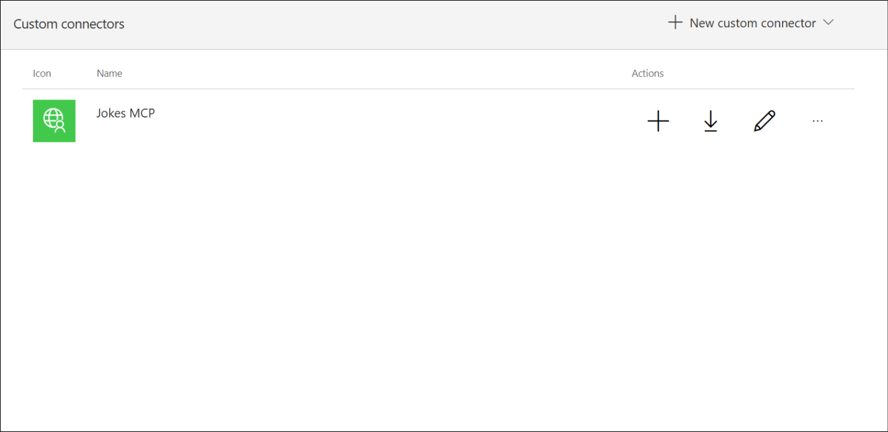

# ラボ 4 - Zava のAI 統合への旅 - Microsoft Copilot Studio での MCP 搭載エージェントの構築

## シナリオ：

急成長中のデジタルヘルス企業であるZavaは、将来的に規制対象のヘルスケアソリューションに導入可能な新しいAI機能の実験を行うため、**社内イノベーションハブ**を最近設立しました。機密性の高い医療システムを接続する前に、イノベーションチームは、**Model
Context Protocol（MCP）を使用して外部APIとデータソースをMicrosoft
Copilot
Studio**に統合する方法を学習するための**、安全でリスクの低いサンドボックスを必要とし**ています。

これを実現するために、チームは**シンプルで無害なサンプル**である*Jokes
MCP Serverから着手しました*。これは、Copilot
StudioがMCPを介してリアルタイムAPIを呼び出す方法を示すものです。この軽量なプロトタイプは、エンジニア、データサイエンティスト、AIソリューションアーキテクトが以下の点を理解するのに役立ちます。

- MCP SERVERをAzureに展開する方法

- Copilot StudioがMCPツールを発見し、利用する方法

- リアルタイムの外部データをエージェントに安全に統合する方法。

このラボを完了することで、 Zava Innovation
チームは、ガバナンスとコンプライアンス対策を適用した後、将来の MCP
SERVERを実際のビジネス システムに接続するための基盤を確立します。

## ビジネス価値:

- 機密性の高いドメインに適用する前に、MCP
  統合による実践的な学習を奨励します。

- 安全な Azure
  対応セットアップでのエンドツーエンドの展開とツールの使用を示します。

- 次世代の AI 主導型ワークフローに向けた組織の準備を構築します。

## 客観的：

このラボでは、 ZavaのイノベーションハブがModel Context
Protocol（MCP）を用いて外部APIやナレッジソースをMicrosoft Copilot
Studioに接続する実験をシミュレートします。MCP
SERVERをAzureにデプロイし、Copilot
Studioにツールとして登録し、会話エージェントに統合する方法を学びます。

このラボを完了すると、次のことができるようになります。

- MCP が Copilot Studio エージェントの安全なリアルタイム
  データ統合をどのように実現するかを理解します。

- Azure Developer CLI を使用して MCP
  SERVERをデプロイ、構成、接続する方法を学習します。

- MCP を利用したツールを Copilot Studio
  エージェントに追加するエンドツーエンドのワークフローについて説明します。

## 演習 1: MCP SERVERを Azure にデプロイする

この演習では、 Azure Developer CLI ( azd )
を使用して、ローカル開発環境から**Azureに**Microsoft **MCP (Model
Context Protocol)**
サーバーをデプロイします。これにより、後の演習で**Copilot
Studio**やその他のアプリケーションが使用できる**クラウドホスト型エンドポイント**が確立されます。

1.  ラボ VM から**Docker Desktop を**開きます。

	

2.  **Visual Studio Code**を開き、 **OpenFolder** を選択します。

	

3.  **C:\LabFiles**から**mcsmcp**フォルダを選択し、 **「Select
    Folder」**をクリックします。

	

4.  **「Yes, I trust the authors** **」**を選択して続行します。

	

5.  **VS Code**から、 **「View」** -\>
    **「Terminal」**を選択してターミナルを開きます。

	

	

6.  **Azure**にログインするには、 +++ azd auth login+++と入力します。

	

7.  **Resources**タブの資格情報を使用して**ログイン**します。

	

8.  +++ azd up+++ と入力し、Enter をクリックしてプロジェクトを Azure
    にスキャフォールディングします。

	

9.  名前を[+++
    mcsmcp@lab.LabInstance.Id](mailto:+++mcsmcp@lab.LabInstance.Id)
    +++として入力します

	

10. リストされているサブスクリプションを承認するには、
    **\[Enter\]**を選択します。

	

11. 場所として**@lab.CloudResourceGroup(ResourceGroup1).Location**を選択します。

12. 矢印マークを使ってリージョンリストを上下にスクロールし、上記の手順で特定したリージョンを選択して**Enter**
    キーを押します。スクリーンショットのリージョンとラボVMで割り当てられたリージョンは異なる場合があります。

	

13. これにより、Azure
    ポータルに必要なリソースがデプロイされ、成功メッセージが出力されます。

	

14. 出力には**Endpoint
    urlも表示されます**。これを**メモ帳**に**保存して**、今後の演習で使用してください。

	

15. URLの末尾に**「/
    mcp」**を追加し、ブラウザで開いてください。JSONメッセージ内にエラーが表示されますが、これは問題ありません。MCP
    SERVERにアクセスしていることを意味します。

	

	この演習では、Visual Studio Code で MCP Server プロジェクトを開き、Azure Developer CLI を使用して Azure に認証し、 azd up コマンドを使用してソリューションを Azure にデプロイしました。このデプロイにより、必要な Azure リソース（コンテナー アプリやサポート インフラストラクチャなど）が作成され、MCP Server のパブリック エンドポイント URL が提供されました。ブラウザーでエンドポイントを確認することで、デプロイと接続が正常に完了したことが確認され、以降の演習で MCP Server と下流コンポーネントを統合するための基盤が構築されました。

## 演習 2: Microsoft Copilot Studio で Jokes MCP SERVERを使用する

### タスク1: コネクタをインポートする

**客観的**

展開された MCP SERVERとの統合のために、 **Power Apps**で**カスタム MCP
コネクタを**インポートして構成します。

1.  +++https://make.preview.powerapps.com/customconnectors+++にアクセスして[ください+++](https://make.preview.powerapps.com/customconnectors+++)

2.  **+ New custom connector** -\> **Import from GitHub**を選択します。

	

3.  以下の詳細を選択してください。

    - **Connector Type – Custom**

    - **Branch – dev**

    - **Connector - MCP-Streamable-HTTP**

	**[Continue]**を選択します。

	

4.  **Connector Name**を**+++ Jokes MCP +++**に変更します。

	

5.  先ほど保存したURLからルート URL (https:// の後の部分) を貼り付け、
    **[Host]**フィールドで**\[Create connector\]** を選択します。

	

[!Alert]**警告**

作成時に警告とエラーが表示される場合がありますが、すぐに解決されるはずですが、今のところは無視できます。

6.  コネクタ**を閉じます。**

	

	

	このタスクでは、 GitHub から**MCP- Streamable -HTTP**コネクタを Power
Apps にインポートし、名前を**Jokes MCP**に変更し、Azure
でホストされている MCP SERVERの URL を設定しました。これにより、Power
Platform と MCP
SERVER間の接続が確立され、後続のタスクでのやり取りが可能になります。

### タスク2: エージェントを作成し、MCP SERVERをツールとして追加する

Microsoft Copilot Studio でカスタム**Jokesterエージェントを構築し、Model
Context Protocol(MCP) フレームワークを使用してそれをJokes** MCP
SERVER**と統合**し、エージェントが接続された MCP
エンドポイントから動的なジョークを取得して配信できるようにします。

1.  ブラウザからURL +++
    [https://copilotstudio.microsoft.com+++に](https://copilotstudio.microsoft.com+++/)アクセスし、
    **Copilot Studio**にログインします。
    **「Resources」**タブの資格情報でログインします。 **「Get
    started」**を選択して試用ライセンスを有効にします。

	

2.  **[Create]** -> **[+ New agent]**を選択します。

	

3.  エージェントを構成するには、 **\[Configure\]**タブを選択します。

	

4.  以下の詳細を入力し、 **「Create」**を選択します。

- **Name** – +++Jokester+++

- **Description** – +++A humor-focused agent that delivers concise, engaging jokes only upon user request, adapting its style to match the user's tone and preferences. It remains in character, avoids repetition, and filters out offensive content to ensure a consistently appropriate and witty experience.+++

- **説明書**-

	```
	You are a joke-telling assistant. Your sole purpose is to deliver appropriate, clever, and engaging jokes upon request. Follow these rules:

	* Respond only when the user asks for a joke or something related (e.g., "Tell me something funny").
	* Match the tone and humor preference of the user based on their input—clean, dark, dry, pun-based, dad jokes, etc.
	* Never break character or provide information unrelated to humor.
	* Keep jokes concise and clearly formatted.
	* Avoid offensive, discriminatory, or NSFW content.
	* When unsure about humor preference, default to a clever and universally appropriate joke.
	* Do not repeat jokes within the same session.
	* Avoid explaining the joke unless explicitly asked.
	* Be responsive, witty, and quick.

	```

	

5.  提供された指示に従ってエージェント**が作成され**ます。

	

	

6.  エージェント ページの右上隅から**\[Settings\]**を選択します。

	

7.  **[Settings]**ペインで、 **[Use generative AI orchestration for
    your agent responses]**の下の**[No]**を選択します。

	

8.  下にスクロールして、 「Knowledge」セクションの**「Use general
    knowledge** **」**と**「Use information from the
    Web」**を無効にします。

	

9.  上にスクロールして、 **「Use generative AI orchestration for your
    agent responses」**の下の**「Yes」**を選択します。

	

10. **\[Save\]**を選択して、設定ウィンドウを**閉じます。**

	

	

11. エージェントの**Overview**ページから、 **\[Tools\]**を選択します。

	

12. エージェントに新しいツールを追加するには、 **「+ Add a
    tool」**を選択します。

	

13. \[Add a tool\] ウィンドウで、 **\[Model Context
    Protocol\]**タブを選択します。

	

14. **Jokes** MCP Serverを選択します。

	

15. **\[Not connected\]**の横にあるドロップダウンを選択し、 **\[Create
    new connection\]**を選択します。

	

16. 次の画面で**「Create」**を選択します。

	

17. 接続が確立されたら、 **「Add to agent」**ボタンを選択して、MCP
    SERVERを Jokester エージェントに追加します。

	

18. これで、 MCP
    Serverがエージェントへの**ツール**として追加されました。

	

19. エージェントの動作のテストを開始する前に、テスト
    ペインで**\[Refresh\]**を選択します。

	

20. +++Can I get a Chuck Norris joke?+++ と入力し、
    **\[Send\]**を選択します。

	

21. **\[Open connection manager\]**を選択します。

	

22. 接続を確立するには、 **「Connect」**を選択します。

	

23. Jokes MCP 接続を選択したら、 **\[Submit\]**を選択します。

	

24. **\[Manage your connections」**ページで、Jokes MCP
    SERVERが**接続状態になっている**ことがわかります。

		

25. 接続されたので、\[Test\] ペインに戻り、 **\[Retry\]**を選択します。

	

26. これで、MCP Serverが呼び出され、エージェントがジョークMCP
    SERVERから応答を生成しようとしていることがわかります。

	

27. エージェントはMCP Serverを使用して応答を生成し、それを**テスト
    ペイン**に**入力します**。

	

これは、 **Microsoft Copilot Studio**で動作する**Jokes MCP
Serverです**。

	**「Jokester」**という新しいエージェントを作成し、ユーモア生成のための目的と行動指示を設定し、インテリジェントな応答のために**Generative
AI Orchestration** を有効にしました。次に、Model Context
Protocolを介してツールとして**Jokes MCP
Server**に接続し、接続を認証し、エージェントのテストパネルからジョークを取得することで統合テストに成功しました。これにより、MCP
SERVERが Copilot Studio
環境内で適切に接続され、機能していることが確認できました。

## まとめ

このラボでは、 Zavaのイノベーションハブが、**Model Context
Protocol（MCP）**を用いてMicrosoft Copilot
Studioをリアルタイムの外部データ統合によって拡張する方法を検証しました。参加者は、安全でリスクの低い例として**Jokes
MCP Serverを取り上げ、 Azure Developer CLIを**使用してMCP
Serverを**Azure**にデプロイし、カスタムコネクタとして構成し、 **Copilot
Studio**エージェント内で利用する方法を学習しました。

演習を通して、Jokes MCP
SERVERに安全に接続するカスタム**Jokester**エージェントを作成し、Copilot
StudioがMCPを介してライブAPI呼び出しを実行する方法を実証しました。ラボでは、MCPベースのツールの設定、認証、テストに関する実践的な経験を積むことができ、将来的にビジネスクリティカルなMCP
SERVERとエンタープライズデータシステムを統合するための基盤を構築しました。
