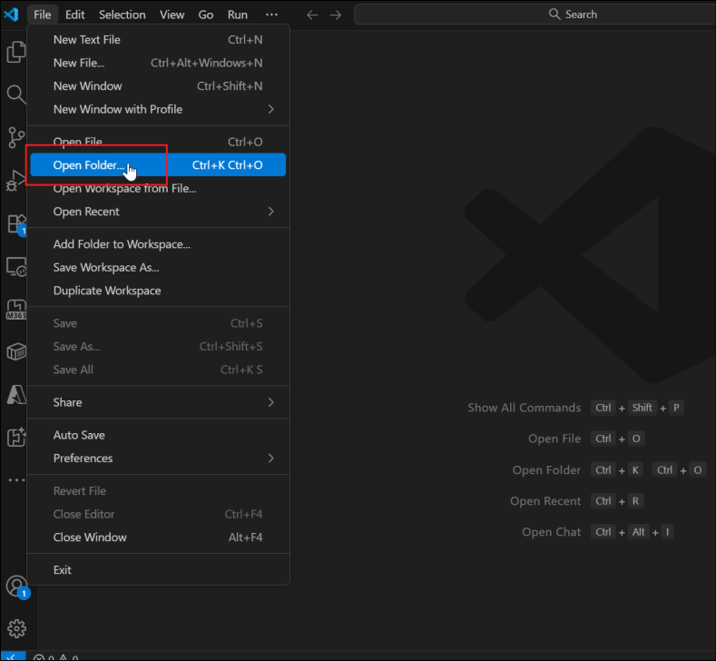
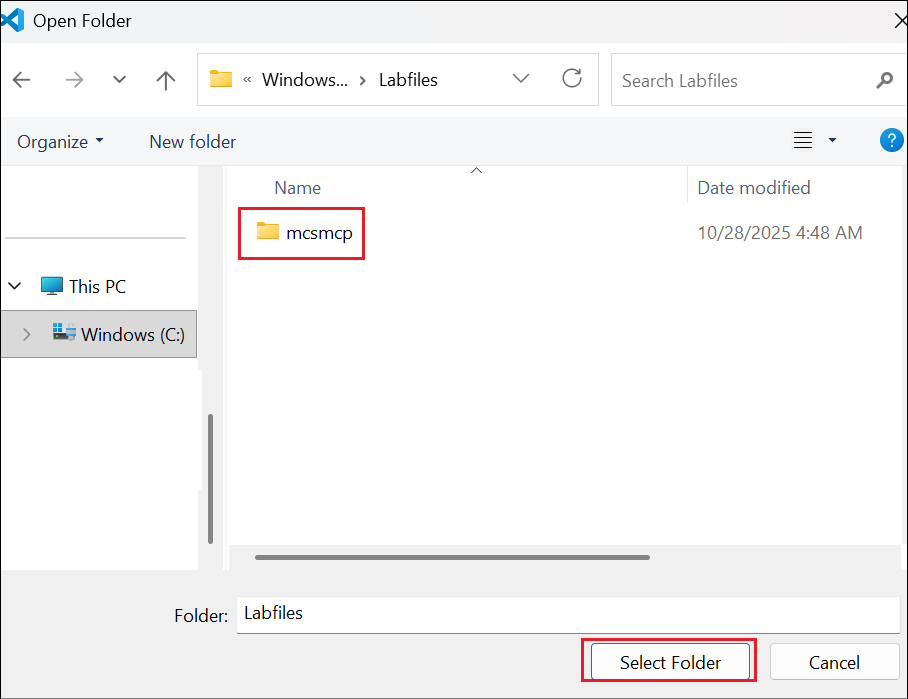
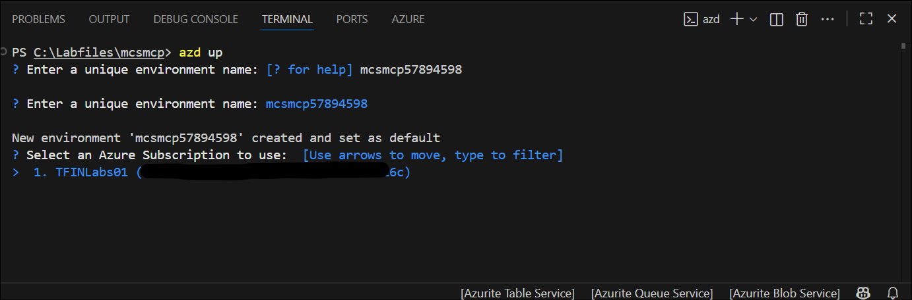
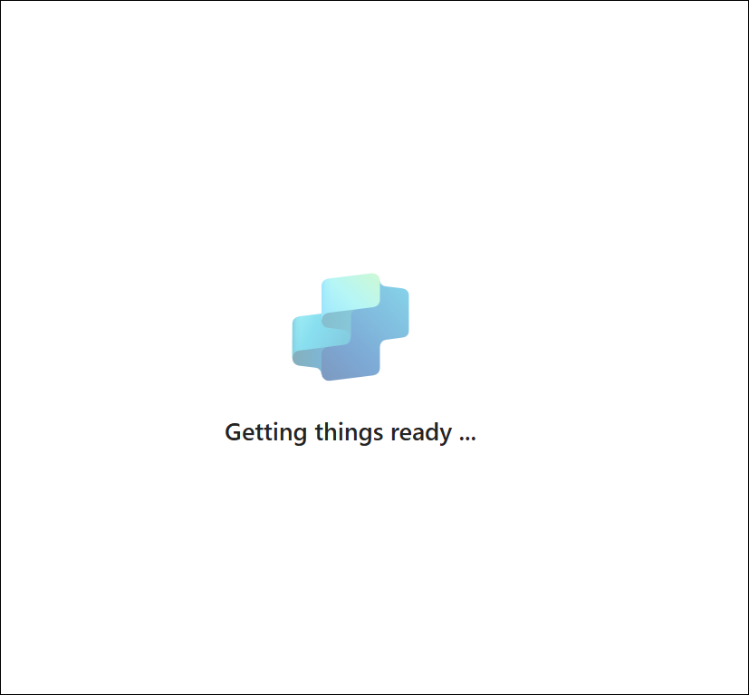

# Lab 4 - Deploy a MCP Server and use it in the Copilot Studio 

## Introduction

With Microsoft Copilot Studio you have the maximum potential for making
custom agents. You can use it to create agents that you can host in
multiple different channels like Microsoft Teams, custom web sites,
Skype, Slack, etc. You can also host your agents in Microsoft 365
Copilot chat.

Copilot Studio agents use the same infrastructure, orchestrator,
foundation model, and security controls as Microsoft 365 Copilot, which
ensures a consistent and familiar user experience.


The knowledge base can be like SharePoint Online, OneDrive for Business,
Public web sites, Microsoft Dataverse tables, Power Platform connectors

Agents interact with users through topics, which can define single-turn
or multi-turn conversations with the user. Every agent can have custom
actions to interact with Power Automate flows, Power Platform
connectors, external REST APIs, etc. Generally speaking, with Copilot
Studio you can create really powerful agents without the need to write
any line of code.

## Objective

In this lab, you are going to understand how to extend an agent made
with Microsoft Copilot Studio using an MCP (Model Context Protocol)
server. Specifically, you are going to consume an existing MCP server
that provides tools for managing a hypothetical list of candidates for a
job role. The MCP server will offer functionalities to:

- List all candidates

- Search for candidates by criteria

- Add new candidates

- Update existing candidate information

- Remove candidates

## Exercise 1 : Setting up the MCP Server

In this exercise you are going to setup a pre-built MCP server that
provides HR candidates management functionality. The server is based on
Microsoft .NET and relies on the MCP SDK for C#. The server provides
tools to manage a hypothetical list of job candidates. In this exercise
you are going to download and configure the server, so that you can run
it locally.

### Task 1: Understanding the MCP Server and prerequisites

The HR MCP server that you will be consuming in this lab provides the
following tools:

- **list_candidates**: Provides the whole list of candidates

- **search_candidates**: Searches for candidates by name, email, skills,
  or current role

- **add_candidate**: Adds a new candidate to the list

- **update_candidate**: Updates an existing candidate by email

- **remove_candidate**: Removes a candidate by email

The server manages candidates information including:

- Personal details (firstname, lastname, full name, email)

- Professional information (spoken languages, skills, current role)

1.  From the lab VM, open the **Visual Studio Code**. Select **File -\
    Open Folder**.

	

2.  Open the folder **hr-mcp-server** from **C:\Labfiles**.

	

3.  In the Do you trust the authors dialog, select **Yes, I trust the
    authors** option.

	

4.  Select **View -\ Terminal** to open the terminal in the VS Code.

	

### Running the MCP Inspector

The MCP inspector is a developer tool for testing and debugging MCP
servers.

1.  From the terminal, run the command +++npm install -g @modelcontextprotocol/inspector+++ to get the **MCP Inspector**
    running.

	

	

2.  Execute the command +++mcp-inspector+++ to start the inspector.

	

	

3.  The server will start up and the UI will be accessible
    at <http://localhost:6274. Open +++http://localhost:6274+++ to
    open the MCP Inspector.

	

### Task 2: Running the MCP Server

We have opened the HR-MCP-SERVER in the Visual Studio Code. We will
understand that and get the server running in this task.

The main elements of the project outline are:

- Configuration: folder with the HRMCPServerConfiguration.cs file
  defining the configuration settings for the MCP server.

- Data: folder with the candidates.json file providing the list of
  candidates.

- Services: folder with the ICandidateService.cs interface and the
  actual CandidateService.cs implementation of a service to load and
  manage the list of candidates.

- Tools: folder with the HRTools.cs file defining the MCP tools and
  the Models.cs file defining the data models used by the tools.

- DevTunnel_Instructions.MD: instructions about how to expose the MCP
  server via a dev tunnel.

- Progam.cs: the main entry point of the project, where the MCP server
  gets initialized.

1.  From the Visual Studio Code terminal, select the + symbol to open a
    new terminal window.

	

2.  Install dependencies, build, and start the .NET project by invoking
    the following command +++dotnet run+++

	

3.  Check that the MCP server is up and running.

	

4.  You should be able to consume the server via browser at the
    URL +++http://localhost:47002/+++. Open the link in a browser. You
    will see an error inside a JSON message, which is ok. It means that
    you are reaching the MCP server.

	

### Task 3: Configure the dev tunnel

Now, you need to expose the MCP server with a public URL. Since you are
running the server locally on your development machine, you need to rely
on a reverse proxy tool to expose your localhost via a public URL. For
the sake of simplicity, you can use the dev tunnel tool provided by
Microsoft, following these steps:

- Install dev tunnel on your environment following [these
  instructions](https://learn.microsoft.com/en-us/azure/developer/dev-tunnels/get-started)

- Login with dev tunnel, executing the following command:

1.  From the terminal, execute +++winget install Microsoft.devtunnel+++.

	

2.  Next, execute the command +++devtunnel user login+++ to login to the
    devtunnel.

	

3.  Login using your tenant credentials available in the Resources tab.

	

4.  Select the **No,this app only** option in the sign in dialog.

	

	

5.  Host your dev tunnel, executing the following commands.

	- +++devtunnel create hr-mcp -a --host-header unchanged+++

	

	

	- +++devtunnel port create hr-mcp -p 47002+++

	

	

	- +++devtunnel host hr-mcp+++

	

	

6.  Copy the **Connect via browser** **URL** and save it in a notepad.

	

7.  Open a browser and navigate to the just copied URL. Select
    **Continue** in the confirmation dialog.

	

 Be sure to leave both the dev tunnel command and the MCP server
 running as you do the exercises in this lab. If you need to restart
 it, just repeat the last command devtunnel host hr-mcp.

### Task 4: Testing the MCP server

You are now ready to test the MCP server on your local environment.

1.  Open the browser in which you opened the MCP Connector earlier.

	

2.  Configure the MCP Inspector with the following settings:

	- **Transport type**: Streamable HTTP

	- **URL**: the URL that you saved from the "Connect via browser" of the
	dev tunnel

	Then select the **Connect** button to start consuming the MCP server.

	

3.  The connection should be successful, and you should be able to have
    a green bullet and the message **Connected** just below the
    connection handling commands.

	

4.  Now, in the Tools section of the screen, select the **List
    Tools** command to retrieve the list of tools exposed by the MCP
    server. Then, select the **list_candidates** tool, and then select
    **Run tool** to invoke the selected tool.

	

5.  In case of successful response, you will see a **Success** message
    in green and the output of the tool invocation. In
    the **History** section you can always review all the invocations
    sent to the MCP server.

	

You are now ready to consume the MCP server from an agent in Microsoft
Copilot Studio.

## Exercise 2 : Creating a New Agent in Copilot Studio

In this exercise you are going to create a new agent in Microsoft
Copilot Studio that will consume the MCP server you configured in
Exercise 1.

### Task 1: Creating the new agent

In this task, you will describe the agent and create it.

1.  Open a browser and, using the work account of your target Microsoft
    365 tenant, go to +++https://copilotstudio.microsoft.com+++ to
    start using Microsoft Copilot Studio.

	Select the **Dev One** environment from the top right pane.

	Select **Create** in the left navigation menu, then choose **+ New**
	**Agent** to create a new agent.

	

2.  Select **Configure** to define your new agent with the following
    settings and select **Create**.

	- **Name -** +++HR Agent with MCP+++

	- Description - +++An AI assistant that helps manage HR candidates using
	  MCP server integration for comprehensive candidate management+++

	- **Instructions**
	
	```
	You are a helpful HR assistant that specializes in candidate
	management. You can help users search

	for candidates, check their availability, get detailed candidate
	information, and add new

	candidates to the system.

	Always provide clear and helpful information about candidates,
	including their skills, experience,

	contact details, and availability status.
	```

	

### Task 2: Configuring the agent's conversation starters

In this task, you will configure the prompts for the agent.

1.  After creating the agent, you'll be taken to the agent configuration
    page. In the **Suggested prompts** section, add these helpful
    prompts.

	

	

## Exercise 3 : Integrating MCP Server with Copilot Studio

In this exercise you are going to configure the integration between your
MCP server and the Copilot Studio agent.

1.  From the Visual Studio code, create a new file named
    +++mcp-connector.yaml+++.

	

2.  Paste the below content in the created file.

	```
	swagger: '2.0'

	info:

	title: HR MCP Server

	description: Allows to manage candidates for specific job roles
	providing tools to list, search, add, update, and remove candidates
	from a reference list

	version: 1.0.0

	host: \[Connect via browser host name of your dev tunnel\]

	basePath: /

	schemes:

	- https

	paths:

	/:

	post:

	summary: HR MCP Server

	x-ms-agentic-protocol: mcp-streamable-1.0

	operationId: InvokeMCP

	responses:

	'200':

	description: Success
	```

	

3.  Replace the **host** with the **actual hostname of your dev tunnel
    public URL**. The value for the host property should be something
    like 3dcwb74w-47002.euw.devtunnels.ms, without the https:// prefix
    and without the closing /. Simply use the hostname. **Save** the
    file and go back to the browser.

	

### Task 1: Adding tools exposed by the MCP server

1.  In your agent, navigate to the **Tools** section and select **+ Add
    a tool**.

	

2.  Choose **Model Context Protocol** group to see all the already
    existing MCP servers available to you agent. Now select **+ New
    tool** to add the actual HR MCP server.

	

3.  A new dialog shows up allowing you to select the kind of tool that
    you want to add.

	>[!note] If you select the **Model Context Protocol** option, you will
	be brought to the official Microsoft Copilot Studio documentation
	page Extend your agent with Model Context Protocol that explains you how
	to add a new MCP server as a Power Platform custom connector.

4.  In this lab we are going to create the actual custom connector for
    the MCP server. So, select **Custom connector** and proceed with the
    following steps.

	

5.  A new browser tab will open, providing you access to the Power Apps
    configuration page to manage custom connectors. Select **+ New
    custom connector** and then **Import an OpenAPI file**.

	

6.  Provide the **name** for the connector as +++HR MCP Server+++.
    Select **Import** and browse for the OpenAPI file
    **mcp-connector.yaml** that you just created. Once you have selected
    the file, click on **Continue**

	Connector name - +++HR MCP Server+++

	

7.  In the page to configure the connector, select to enable
    the **Swagger editor** to switch to the source code of the OpenAPI
    specification. You can see the content of the YAML file that you
    just uploaded and you can validate that the specification file is
    correct.

	

8.  Select the **Create connector** command and wait for the connector
    to be ready.

	

	

9.  Now go back to Copilot Studio, select the **Refresh** button and go
    back to the list of available tools.

	

10. Now, in the **Model Context Protocol** list, you should be able to
    find the **HR MCP Server**.

	

11. Select the **HR MCP Server connector**, connect to the server using
    the default connection user experience of Copilot Studio, and when
    the connector is connected select **Add and configure.**

	

12. All the tools exposed by the MCP server are now available to your
    agent, as you can verify in the window displaying the MCP server
    details and tools.

	

### Task 2: Test the new MCP server integration

In this task, you will publish and test your agent.

1.  Publish your agent by selecting **Publish** in the top right corner.

	

2.  Select **Publish** in the confirmation dialog.

	

3.  Once published, test the agent in the integrated Test panel using
    the following prompt.

	+++List all candidates+++

	

4.  The agent should use the MCP server's list_candidates tool to return
    a complete list of all candidates in your HR system. However, in
    order to being able to consume the list of candidates you will need
    to connect to the target connector. As such, Copilot Studio will ask
    you to **Open connection manager**, connect to the MCP server, and
    then **Retry** the request.

5.  Select the **Open connection manager** option.

	

6.  Select Connect in the Manage your connections screen.

	

7.  Once the connection is successful, select **Submit**.

	

	

8.  Select **Retry** in the Test pane.

	

9.  Once the connection is established, you can get the actual list of
    candidates from the HR MCP server.

	

## Summary

Through this lab, you learned how to set up and expose an MCP server,
test it using MCP Inspector, and integrate it with a custom agent in
Microsoft Copilot Studio. You explored how MCP extends Copilot Studio by
enabling agents to connect with external systems, in this case to manage
HR candidate data. By creating an OpenAPI-based custom connector and
adding it as a tool, you saw how agents can securely invoke MCP server
functions such as listing, searching, adding, updating, and removing
candidates. This demonstrates the flexibility and power of Copilot
Studio when combined with MCP for building tailored, real-world business
solutions.
