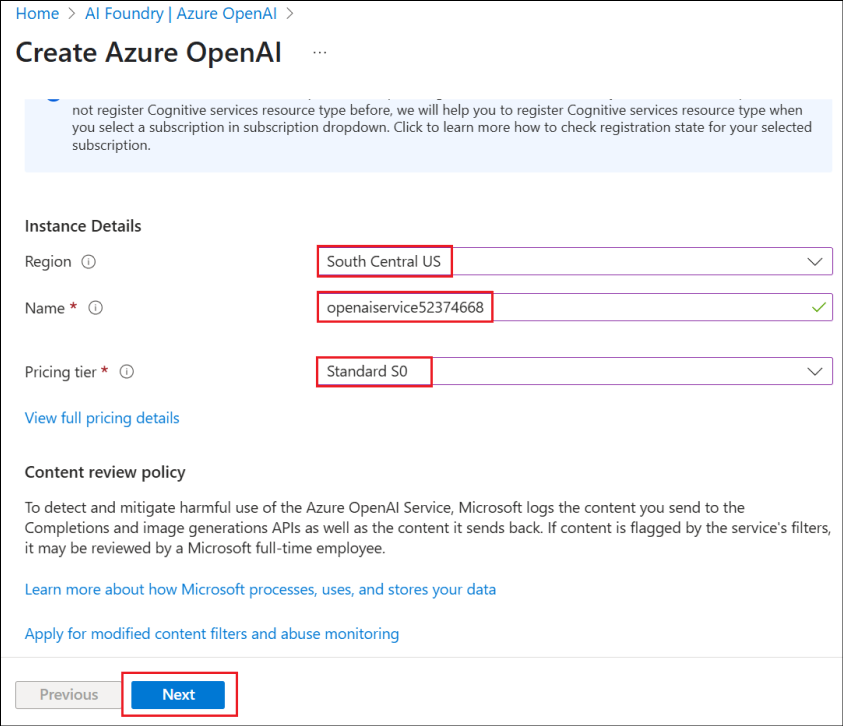
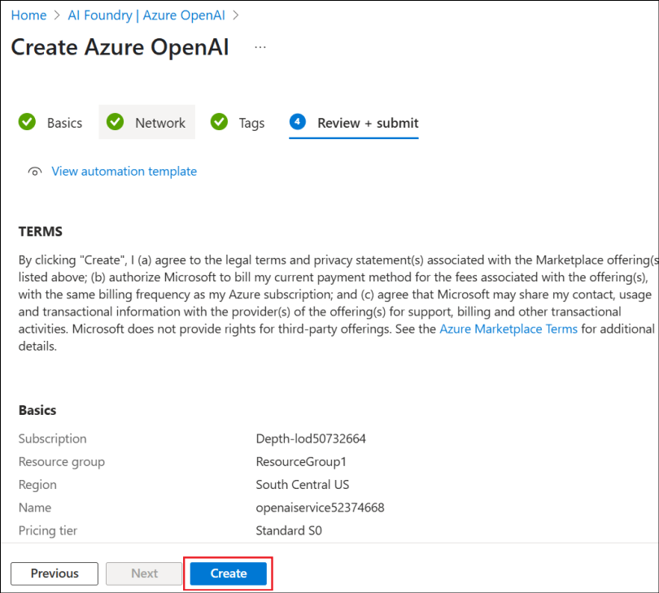
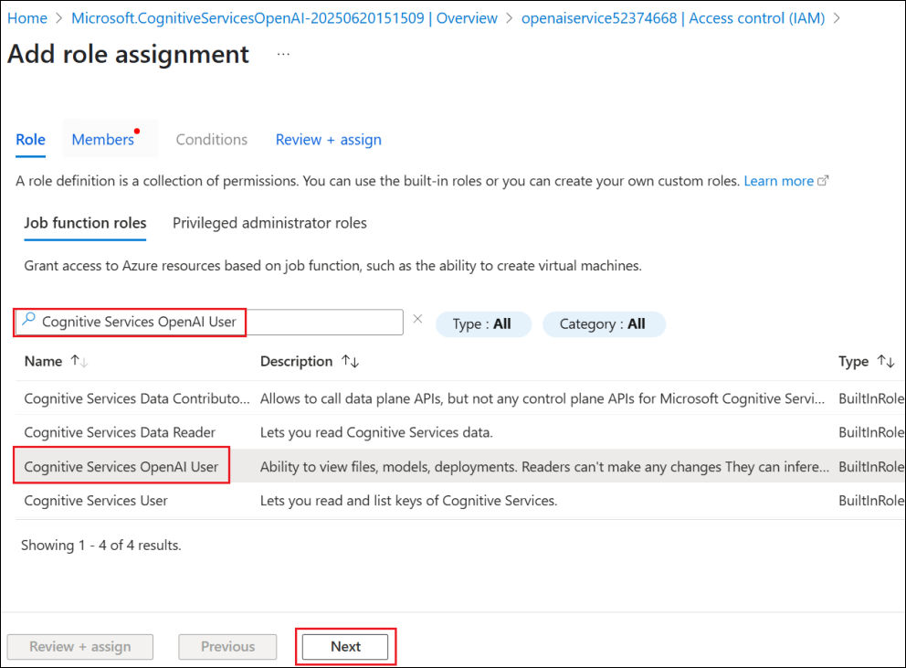

# Lab 5 - Create a Retail agent in Copilot Studio that leverages Azure AI Search and Bring your own model for your prompts

Lab duration – 60 minutes

## Objective

In a retail store site, customers frequently ask about product
specifications, warranty terms, or troubleshooting guides. Static FAQ
chatbots can’t cover all variations.

To help this scenario, the following will be implemented in this lab

- Product manuals, warranty documents, and FAQ PDFs are indexed into
  **Azure AI Search**.

- A Copilot Studio agent retrieves the right snippet when a customer
  asks a question regarding the products.

- The agent gives a natural-language answer plus a link to the relevant
  product manual.

This gives a reduced call-center load, 24/7 customer support and a
higher customer satisfaction.

We will also learn how to bring your own model from Azure AI Foundry
into the Copilot Studio.

## Exercise 1: Create an Azure AI Search resource

In this exercise, we will first create an Azure AI Search resource,
which will be used to search through the documents.

1. Open a browser, navigate to +++https://portal.azure.com+++ and login using the credentials from the **Resources** tab.
   
1.  From the Home page of the Azure portal, select **Foundry.**

    

2.  In the **AI Foundry page**, select **AI Search** from the left pane
    and then select **+ Create**.

    

3.  Enter the below details and select **Review + create**.

    - Subscription – Select your **assigned subscription**
    
    - Resource group – Select your **assigned Resource group**
      (**ResourceGroup1**)
    
    - Service name – +++**documentstore@lab.labinstance.id**+++
    
    - Location – Select your nearest region
    
    

4.  Once the validation passes, select **Create**.

    

5.  The deployment takes a few minutes. Select **Go to resource** once
    the search service is created.

    

6.  From the **Overview** page, copy the Url value and save it in a
    notepad to be used in a future exercise.

    

7.  Select **Keys** under **Settings** from the left pane. Copy the
    **Primary admin key** and save it in a notepad for using it in the
    upcoming exercises.

    

8.  Select **Identity** under **Settings** from the left pane.

    

9.  Toggle the Status to **On** under **System assigned** and then click
    on **Save**.

    

10. Select **Yes** in the **Enable system assigned managed identity**
    confirmation dialog. This setting will enable the search service to
    be listed under the managed identity resources, which can then be
    assigned roles as required.

    

## Exercise 2: Create a Storage account

This exercise is to create a storage account with Blob storage and
upload the documents required supporting the retail customers in it.

1.  From the Home page of the Azure portal,
    (+++https://portal.azure.com/+++), select **Storage accounts**.

    

2.  Select **+ Create** to create a new Storage account.

    

3.  Enter the below details, accept the default values in the other
    fields and click on **Review + create**.

    - Subscription – Select your **assigned subscription**
    
    - Resource group – Select your **assigned Resource group**
      (**ResourceGroup1**)
    
    - Region – Select your **assigned region**
    
    - Storage account name – +++**docstore@lab.labinstance.id**+++
    
    - Primary service – Select **Azure Blob Storage or Azure Data Lake
      Storage Gen 2**

    

4.  Once the validation passes, click on **Create**.

    

5.  Once the resource creation succeeds, click on **Go to resource**.

    

    

6.  Select **Containers** under **Data storage**. Select **+
    Container**, enter the name as +++**documents**+++ and click on
    **Create** to create the container.

    

7.  Select the created container **documents** to upload the leave
    policy document into it.

    

8.  Click on **Upload** and then select **Browse for files**.

    

9.  Select the **documents** from **C:\LabFiles\AISearch** folder and
    then click on **Upload**.

    

    

10. Navigate to the **docstoreXXXXXXX** Storage account
    (Select **Storageaccounts** from the **Home page** of the Azure
    portal and select the resource that starts with **docstore**) and select
    **Access Control (IAM)** from the left pane. Select **Add -\> Add
    role assignment**.

    

11. Search for +++**Storage Blob Data Reader**+++, select it and click
    on **Next**.

    

12. Click on **+Select members**, search for and select your **user
    id**, select your **user id** that gets listed and then click on
    **Select**. This adds the Storage Blob Data Reader role to your user
    id.

    

13. Select **Managed identity** and then select **+ Select members**.
    Select **Search service** under **Managed identity** and select the
    **searchleaves** search service that gets listed.

    

14. Click on **Select** to select the search service.

    

15. Back in the Add role assignment screen, click on **Review +
    assign**.

    

16. Select **Review + assign** again in the next screen.

    

17. Proceed to the next step once the roles are added.

    

In this exercise, we have created a Storage account and added the
documents and required Role permissions to it.

## Exercise 3: Create an Azure OpenAI Service and deploy a model 

The AI Search service will have to vectorize the data uploaded, in order
to perform the search over the documents. To vectorize the data, an
embedding model needs to be deployed. In this exercise, you will create
an Azure OpenAI Service and deploy the text-embedding model in it.

1.  From the Azure portal Home page, search for select +++Azure OpenAI+++.

    

2.  Select **+ Create -> Azure OpenAI**.

    

3.  Enter the below details and select **Next**.

    - Subscription – Select your **assigned subscription**
    
    - Resource group – Select your **assigned Resource group**
      (**ResourceGroup1**)
    
    - Region – Select your **assigned region**
    
    - Name – +++**openaiservice@lab.labinstance.id**+++ 
    
    - Pricing tier – Select **Standard**
    
    
    
    

4.  Select **Next** in the next 2 screens select **Create** in the
    **Review + submit** screen.

    

5.  Click on **Go to resource** once the service is created.

    

6.  Select **Access control (IAM)** from the left pane, select **Add -\>
    Add role assignment**.

    

7.  Search for +++**Cognitive Services OpenAI User**+++, select the role
    and click on **Next**.

    

8.  Select **+ Select members**, search for your **user id**, select it
    and click on **Select**.

    

9.  Back in the **Add role assignment** screen, select **Managed
    identity**. Then select **+ Select members**. In the **Select
    managed identities** screen, select **Search service** under
    **Managed identity** and select the resource that starts with **documentstore** service.

    

10. Once selected, click on **Select**.

    

11. Select Review + assign in the next 2 screens.

    

12. Wait for a **success** message on the role additions before
    proceeding with the next tasks.

    

13. From the **Overview** page of the Azure OpenAI Service resource,
    select **Go to Azure AI Foundry portal** to open the Azure OpenAI
    Service there and deploy a model.

    

14. Select **Deployments** from the left pane. Select **+ Deploy model**
    -\> **From base models**.

    

15. Search for +++**text-embedding**+++, select
    **text-embedding-3-large** and then select **Confirm**.

    

16. Select **Deploy** in the Deploy text-embedding-3-large.

    

17. The model gets deployed and the screen is loaded with the deployment
    details.

    

## Exercise 4: Create a vector index

The AI Search resource needs a Vector index to perform the vector
search. You will vectorize the uploaded data in this exercise.

1.  From the Azure portal, go to the AI Search service resource that starts with
    **documentstore**.
    Select **Import and vectorize data**.

    

2.  Select the **Azure Blob Storage** option.

    

3.  Select the **RAG** option in the **What scenarios are you
    targeting?** screen.

    

4.  Enter the below details, accept the other values as default and
    click **Next**.

    - Subscription – Select your **assigned subscription**
    
    - Storage account- Select the account that starts with **docstore**
    
    - Blob-container – Select **documents**
    
    

5.  In the Vectorize your text screen, the subscription is
    pre-populated. Enter the below details and click **Next**.

    - Azure OpenAI resource – Select **openaiserviceXXXXXX**
    
    - Model deployment – Select **text-embedding-3-large**
    
    - Authentication type – Select **System assigned identity**
    
    - Select the checkbox to acknowledge the cost alert of Azure OpenAI.
    
    

6.  Select Next in the **Vectorize and enrich your images** screen since
    we are not dealing with images here and select **Next** in the
    **Advanced settings** screen as well.

    

    

7.  Select **Create** in the **Review + create** screen.

    

8.  Click on **Close** in the success dialog box.

    

## Exercise 5: Create a retail assistant agent

In this exercise, you will create a retail assistant agent in Copilot
Studio.

1.  Login to +++https://copilotstudio.microsoft.com+++ using your login
    credentials.

    

2.  Select **Create** from the left pane.

    

3.  Select **+ New agent** to create a new agent.

    

4.  Enter +++You are a Retail assistant agent for customers HR who will
    answer questions related to the store products+++ and select
    **Send**.

    

    

5.  Once the agent is created, in the Test pane, enter +++What is the
    warranty period for Washing machine?+++ and click **Send.**

    

6.  It gives a generalized reply as in the screenshot below.

    

## Exercise 6: Add the Azure AI Search as a knowledge source

In this exercise, you will add the Azure AI Search that you created from
the Azure portal, as a knowledge source to the Retail assistance agent
in Copilot Studio.

1.  From the **Overview** page of the agent, select **+ Add knowledge**.

    

2.  Select **Azure AI Search** from the list of knowledge sources
    available.

    

3.  Click on the **drop down** next to **Not connected** in the next
    screen and select **Create new connection**.

    

4.  Enter the **Endpoint url** and the **Admin key** values which we
    saved to a notepad in a previous exercise and then click on
    **Create** to create the connection.

    

5.  Once the connection is established, the available index is listed
    and already selected. Click on **Add to agent**.

    

6.  The AI Search service is added as a knowledge source to the agent
    and is in **Ready** state now.

    

7.  Now, let us test the agent with the same question we have tried
    before.

8.  In the Test pane, enter +++ What is the warranty period for Washing
    machine?+++ and click **Send.**

    

9.  You can see that the response from the agent now is from the
    document uploaded in the AI Search service.

    

## Exercise 7: Deploy a Model in Azure AI Foundry

In this exercise, you will deploy a model in the Azure AI Foundry to use
it in the Copilot Studio (in the next exercise).

1.  Open the Azure AI Foundry Azure OpenAI resource created earlier.

2.  From the left pane, select **Deployments**.

    

3.  Select the drop down next to the **+ Deploy model** and select
    **Deploy base model**.

    

4.  Select **gpt-4o** and select **Confirm**.

    

5.  In the Deploy gpt-4o dialog, enter the **Deployment name** as
    +++**ModelforMCS**+++, accept the other defaults and select
    **Deploy.**

    

6.  Copy the Target URI and key values to a notepad to be used during
    the connection creation from the Copilot Studio.

    

Now that the model is deployed, you can use it in Copilot Studio’s agent
prompt.

## Exercise 8: Create a prompt in the Copilot Studio and use the model created in Azure AI Foundry

In this exercise, you will learn how to bring the deployed model from
Azure AI Foundry in the Copilot Studio. Here, we are using a base model
that is deployed. We can also create a fine tuned model as per the
business requirements and then use it in Copilot Studio.

1.  From the Copilot Studio agent, select **Tools** from the top menu
    bar.

    

2.  Select **+ New tool** to add a new tool to the agent

    

3.  Select Prompt since we are going to add a new prompt.

    

4.  In the Custom prompt screen, select the drop down next to the
    **model** name.

    

5.  Select + against **Azure AI Foundry Models** to add the model
    deployed in Azure AI Foundry and select **Connect a new model**.

    

    

6.  Enter the below details and click on Connect.

    - Model deployment name - +++ModelforMCS+++
    
    - Base model name - +++gpt-4o+++
    
    - Azure model endpoint URL – Enter the target url saved earlier
    
    - API Key – Enter the model API key saved earlier.

    

    

7.  Once connected, select **Close**.

    

8.  You can see that the model ModelforMCS is selected now

    

9.  Rename the prompt to +++WM Types+++. Enter +++What are the different
    types of Washing Machines?+++ and select **Test**.

    

10. Select **Save** to save the prompt.

    

11. Select the **Add to agent** option to add the prompt to the agent.

    

    

With this feature, we can fine-tune the model in Azure AI Foundry and
use it in Copilot Studio with ease. We can bring in the vast ecosystem
of the models in the Azure AI Foundry easily into the Copilot Studio.

## Summary

In this lab, we have learnt to connect the agent from the Copilot Studio
to an Azure AI Search service as a knowledge source and test the agent
based on the source. We have also learnt to bring the model deployed in
Azure AI Foundry into the Copilot Studio.
