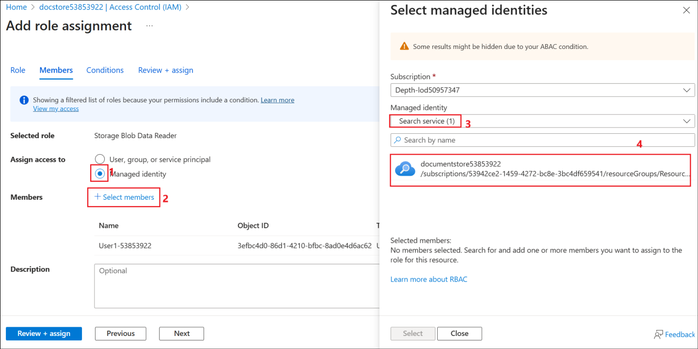

# 實驗室 - 在 Copilot Studio 中創建利用 Azure AI 搜索的零售代理，並為提示自帶模型

實驗室持續時間 – 60分鐘

## 目標

在零售店站點中，客戶經常詢問產品規格、保修條款或故障排除指南。靜態常見問題解答聊天機器人無法涵蓋所有變體。

為了幫助此方案，本實驗室將實現以下內容

- 產品手冊、保修文檔和常見問題解答 PDF 已編入 **Azure AI 搜索索引**。

- 當客戶詢問有關產品的問題時，Copilot Studio 代理會檢索正確的代碼片段。

- 客服人員會給出自然語言答案以及相關產品手冊的鏈接。

這減少了呼叫中心的負載、24/7 客戶支持和更高的客戶滿意度。

我們還將瞭解如何將自己的模型從 Azure AI Foundry 引入 Copilot Studio。

## 練習 1: 創建 Azure AI 搜索資源

在本練習中，我們將首先創建一個 Azure AI 搜索資源，該資源將用於搜索文檔。

1.  在 Azure 門戶的“主頁”中，選擇 **Azure AI Foundry.**

    

2.  在“**AI Foundry”頁**中，從 **左窗格中選擇“AI 搜索”，然後選擇 +
    Create**.”**。**

    

3.  輸入以下詳細信息，然後選擇 **Review + create**.

    - 訂閱 – 選擇**分配 的訂閱**

    - 資源組 – 選擇您的 **assigned Resource group** (**ResourceGroup1**)

    - 服務名稱 – +++ **documentstore53853922@lab.labinstanceid()**+++

    - 位置 – 選擇您的 **分配區域**

    

4.  驗證通過後，選擇 **Create**.

    

5.  部署需要幾分鐘時間。選擇 **Go to resource** 創建搜索服務後.

    

6.  在“**Overview**”頁面中，複製 Url
    值並將其保存在記事本中，以便在將來的練習中使用。

    

7.  從 左窗格中選擇“設置**”下的“鍵”**。複製**Primary admin
    key**並將其保存在記事本中，以便在接下來的練習中使用它。

    

8.  在左窗格中的“**Settings”**下選擇“ **Identity**”。

    

9.  將“**System
    assigned**”**下的**“狀態”切換為**“打開**”，然後單擊“**保存**”。

    

10. 在“**Enable system assigned managed
    identity”**對話框中選擇“**是**”。此設置將使搜索服務能夠列在託管標識資源下，然後可以根據需要為託管標識資源分配角色。

    

## 練習 2: 創建存儲帳戶

此練習是使用 Blob 存儲創建存儲帳戶，並上傳支持其中零售客戶所需的文檔。

1.  從 Azure 門戶的主頁, (+++https://portal.azure.com/+++), 選擇
    **Storage accounts**.

    

2.  選擇 **+ Create** 以創建新的存儲帳戶。

3.  輸入以下詳細信息，接受其他字段中的默認值，然後單擊 **Review +
    create**.

    - 訂閱 – 選擇**分配 的訂閱**

    - 資源組 – 選擇你的 **分配的資源組** (**ResourceGroup1**)

    - 區域 – 選擇你的**分配區域**

    - 存儲帳戶名稱 – +++ **docstore@lab.LabInstanceId()**+++

    - 主要服務 – 選擇 **Azure Blob Storage or Azure Data Lake Storage Gen
    2**

    

4.  驗證通過後，單擊 **“創建”**。

    

5.  資源創建成功後，單擊 **Go to resource**.

    

    

6.  選擇**Data storage**下的**Containers**. 選擇 **+ Container**,
    將名稱輸入為 +++**documents**+++ ，然後單擊“ **創建”** 以創建容器。

    

7.  選擇已創建的容器 **文檔** ，將休假政策文檔上傳到其中。

    

8.  點擊 **Upload** ，然後選擇 **Browse for files**.

    

9.  從 **C：\LabFiles\AISearch** 文件夾中選擇 **documents**
    ，然後單擊**上傳**。

    

    

10. 導航到 **<docstore@lab.LabInstanceId()>** 存儲帳戶（**從 Azure
    門戶的**“主頁**”中**選擇“**Storageaccounts**”，然後選擇**docstore@lab.LabInstanceId()**)
    ，從左窗格然後選擇 **Access Control (IAM)**。 選擇 **Add -\> Add
    role assignment**.

    

11. 尋找 +++**Storage Blob Data Reader**+++, 選擇它並單擊 **下一步**。

    

12. 點擊 **+Select members**, 搜索並選擇您的**用戶 ID**，選擇 列出的用戶
    ID，然後單擊**“選擇”**。這會將存儲 Blob 數據讀取者角色添加到用戶
    ID。

    

13. 選擇 **Managed identity** ，然後選擇 **+ Select members**.
    選擇“**託管標識”** 下的**“搜索服務”**，然後選擇列出的
    **searchleaves** 搜索服務。

    

14. 單擊 **“選擇”** 以選擇搜索服務。

    

15. 返回“添加角色分配”屏幕，單擊 **Review + assign**.

    

16. 在下一個屏幕中再次選擇“**Review + assign**”。

    

17. 添加角色後，繼續執行下一步。

    

在本練習中，我們創建了一個存儲帳戶，並向其添加了文檔和所需的角色權限。

## 練習 3: 創建 Azure OpenAI 服務並部署模型 

AI
搜索服務必須對上傳的數據進行矢量化，以便對文檔執行搜索。要矢量化數據，需要部署嵌入模型。在本練習中，你將創建
Azure OpenAI 服務並在其中部署文本嵌入模型。

1.  在 Azure 門戶主頁中，搜索 select +++Azure OpenAI++.

    

2.  選擇 **+ Create**.

    

3.  輸入以下詳細信息，然後選擇 **Next**.

    - 訂閱 – 選擇您的 **分配的訂閱**

    - 資源組 – 選擇您的 **分配的資源組** (**ResourceGroup1**)

    - 地區 – 選擇**分配 的區域**

    - 名字 – +++**openaiservice52374668**+++

    - 定價層 – 選擇 **Standard**

    

    

4.  在 接下來的 2 個屏幕中選擇下一步**，在**“**審閱 +
    提交”**屏幕中選擇**“創建”。**

    

5.  創建服務後**，單擊Go to resource**。

    

6.  從左窗格中**選擇“Access control (IAM)**”，選擇“**Add -\> Add role
    assignment. **”。

    

7.  尋找 +++**Cognitive Services OpenAI User**+++, 選擇角色並單擊
    **下一步**。

    

8.  選擇 **+ Select members**, 搜索您的 **用戶 ID**，選擇它並單擊
    **選擇**。

    

9.  返回到“**Add role assignment”**屏幕，選擇“**Managed identity”**。
    然後選擇 **+ Select members**。在“**Select managed
    identities”**屏幕中, 在 **Managed identity** 下 選擇**Search
    service** ，然後選擇 **documentstore@lab.LabInstanceId()** 服務。

    

10. 選擇後，單擊 **Select**.

    

11. 在接下來的 2 個屏幕中選擇“查看 + 分配”。

    

12. 等待 有關角色添加的成功消息，然後再繼續執行下一個任務。

    

13. 在 Azure OpenAI 服務資源的**“**概述”頁中，選擇“**Go to Azure AI
    Foundry portal**”，在該處打開 Azure OpenAI 服務並部署模型。

    

14. 從左窗格中 **選擇**“**Deployments**”。**從基本模型** 選擇 **+ Deploy
    model** -\>

    

15. 尋找 +++**text-embedding**+++, 選擇 **text-embedding-3-large**
    ，然後選擇 **Confirm**.

    

16. 在部署 text-embedding-3-large 中**選擇Deploy**。

    

17. 部署模型，並在屏幕上加載部署詳細信息。

    

## 練習 4: 創建 Vector索引

AI
搜索資源需要向量索引來執行向量搜索。在本練習中，您將對上傳的數據進行矢量化。

1.  在 Azure 門戶中，轉到 **documentstore@lab.LabInstanceId()**, AI
    搜索服務資源。選擇 **Import and vectorize data**.

    

2.  選擇 **Azure Blob Storage** .

    

3.  在“ the **What scenarios are you targeting?？** 屏幕選擇**RAG**
    選項。

    

4.  輸入以下詳細信息，接受其他值作為默認值，然後單擊 **Next**.

    - 訂閱 – 選擇分配 **的訂閱**

    - 存儲帳戶- Select the **docstore@lab@LabInstanceId()**

    - Blob-container – 選擇 **documents**

    

5.  在矢量化文本屏幕中，訂閱已預先填充。輸入以下詳細信息，然後單擊
    **Next**.

    - Azure OpenAI 資源 – Select **openaiservice@lab.LabInstanceId()**

    - 模型部署 – 選擇 **text-embedding-3-large**

    - 身份驗證類型 – 選擇 **System assigned identity**

    - 選中該複選框以確認 Azure OpenAI 的成本警報。

    

6.  在**Vectorize and enrich your
    images中選擇下一步**，因為我們在這裡不處理圖像，並在
    **高級設置**屏幕中也選擇**下一步**。

    

    

7.  在**“Review + create”**屏幕中選擇 **Create**。

    

8.  單擊 成功對話框中的“**Close** ”。

    

## 練習 5: 創建零售助理代理

在本練習中，您將在 Copilot Studio 中創建零售助理代理。

1.  登錄到 +++https://copilotstudio.microsoft.com+++ 使用您的登錄憑據。

    

2.  從 左窗格中選擇**創建**。

    

3.  選擇 **+ New agent**以創建新代理。

    

4.  輸入 +++You are a Retail assistant agent for customers HR who will
    answer questions related to the store products+++ ，然後選擇
    **發送**。

    

    

5.  創建代理後，在“測試”窗格中, 輸入 +++What is the warranty period for
    Washing machine?+++ ，然後單擊 **發送。**

    

6.  它給出了概括的回復，如下面的屏幕截圖所示。

    

## 練習 6: 將 Azure AI 搜索添加為知識源

在本練習中，您將從 Azure 門戶創建的 Azure AI 搜索作為知識源添加到
Copilot Studio 中的零售協助代理。

1.  在代理的“**Overview **頁中，選擇 **+ Add knowledge**.”。

    

2.  從可用知識源列表中選擇 **Azure AI Search**。

    

3.  在下一個屏幕中單擊“ **Not
    connected**”旁邊的下拉列表，然後選擇**“Create new connection**”。

    

4.  輸入
    我們在上一個練習中保存到記事本的**Endpoint url**和 **Admin key**值，然後單擊**Create**以創建連接。

    

5.  建立連接後，將列出可用索引並已選擇。點擊 **Add to agent**.

    

6.  AI 搜索服務將作為知識源添加到代理，現在處於 **就緒狀態** 。

    

7.  現在，讓我們用我們之前嘗試過的相同問題來測試代理。

8.  在“測試”窗格中, 輸入 +++ What is the warranty period for Washing
    machine?+++ ，然後單擊 **發送。**

    

9.  可以看到，現在代理的響應來自 AI 搜索服務中上傳的文檔。

    

## 練習 7: 在 Azure AI Foundry 中部署模型

在本練習中，您將在 Azure AI Foundry 中部署模型，以便在 Copilot Studio
中使用它（在下一個練習中）。

1.  打開之前創建的 Azure AI Foundry Azure OpenAI 資源。

2.  在左窗格中，選擇 **Deployments**.

    

3.  選擇旁邊的下拉菜單 **+ Deploy model** ，然後選擇 **Deploy base
    model**.

    

4.  選擇 **gpt-4o** 然後選擇 **Confirm**.

    

5.  在“部署 gpt-4o”對話框中，將**“Deployment name”**輸入為 +++**ModelforMCS**+++, 接受其他默認值，然後選擇 **“部署”。**

    

6.  將目標 URI 和鍵值複製到記事本，以便在從 Copilot Studio
    創建連接期間使用。

    

現在模型已部署，您可以在 Copilot Studio 的代理提示中使用它。

## 練習 8: 在 Copilot Studio 中創建提示並使用 Azure AI Foundry 中創建的模型

在本練習中，您將學習如何在 Copilot Studio 中從 Azure AI Foundry
引入已部署的模型。在這裡，我們使用的是部署的基本模型。我們還可以根據業務需求創建微調模型，然後在
Copilot Studio 中使用它。

1.  在 Copilot Studio 代理中，從 頂部菜單欄中選擇**工具**。

    

2.  選擇 **+ New tool** 向代理添加新工具

    

3.  選擇提示，因為我們將添加新提示。

    

4.  在“自定義提示”屏幕中，選擇模型名稱旁邊的下拉列表 。

    

5.  針對 **Azure AI Foundry Models**選擇**“+”** 以添加部署在 Azure AI
    Foundry 中的模型，然後選擇“ **Connect a new model**”。

    

    

6.  輸入以下詳細信息，然後單擊連接。

    - 模型部署名稱 - +++ModelforMCS+++

    - 基本型號名稱 - +++gpt-4o+++

    - Azure model endpoint URL – 輸入之前保存的目標 URL

    - API Key – 輸入之前保存的模型 API 密鑰。

    

    

7.  連接後，選擇 **Close**.

    

8.  您可以看到模型 ModelforMCS 現在已選擇

    

9.  將提示重命名為 +++WM Types+++. Enter +++What are the different types
    of Washing Machines?+++ ，然後選擇“ **Test**”。

    

10. 選擇 **“Save ”** 以保存提示。

    

11. 選擇“**Add to agent**”選項，將提示添加到代理。

    

    

借助此功能，我們可以在 Azure AI Foundry 中微調模型，並在 Copilot Studio
中輕鬆使用它。我們可以輕鬆地將 Azure AI Foundry 中龐大的模型生態系統引入
Copilot Studio。

## 總結

在本實驗室中，我們學習了將代理從 Copilot Studio 連接到 Azure AI
搜索服務作為知識源，並基於源測試代理。我們還學會了將部署在 Azure AI
Foundry 中的模型引入 Copilot Studio。
