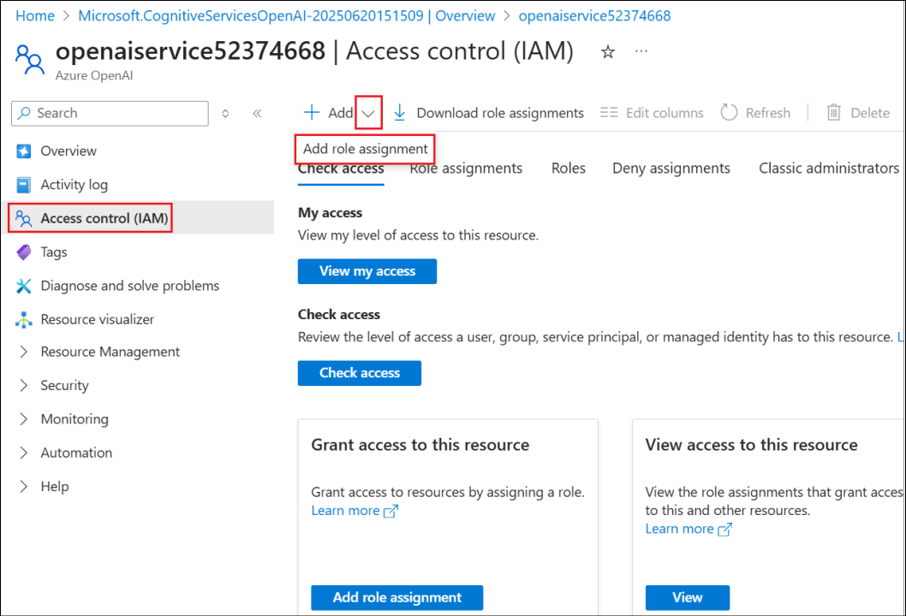

# Laboratorio: Crear un agente de Retail en Copilot Studio que utilice Azure AI Search y Bring Your Own Model para sus prompts

Duración del laboratorio: 60 minutos

## Objetivo

En un sitio de tienda minorista, los clientes consultan con frecuencia
sobre especificaciones de productos, términos de garantía o guías de
solución de problemas.

Los chatbots de preguntas frecuentes estáticos no son capaces de cubrir
todas las variaciones posibles.

- Los manuales de productos, documentos de garantía y archivos PDF de
  preguntas frecuentes se indexan en **Azure AI Search**.

- Un agente de Copilot Studio recupera el fragmento adecuado cuando un
  cliente realiza una consulta sobre los productos.

- El agente proporciona una respuesta en lenguaje natural junto con un
  enlace al manual de producto correspondiente.

Esto permite reducir la carga del centro de llamadas, ofrecer soporte al
cliente 24/7 y aumentar la satisfacción del cliente.

Además, se aprenderá cómo integrar un modelo propio desde Azure AI
Foundry en Copilot Studio

## Ejercicio 1: Crear un recurso de Azure AI Search

En este ejercicio, primero crearemos un recurso de Azure AI Search, que
se utilizará para realizar búsquedas en los documentos.

1.  Desde la página de inicio del portal de Azure, seleccione **Azure AI
    Foundry.**

    

2.  En la página de **AI Foundry**, seleccione **AI Search** en el panel
    izquierdo y, a continuación, haga clic en **+ Create**.

    

3.  Ingrese los siguientes detalles y seleccione **Review + create**.

    - Subscription – Seleccione su **suscripción asignada**.

    - Resource group – Seleccione su **Resource group** asignado (por
    ejemplo, **ResourceGroup1**).

    - Service name – +++**documentstore53853922@lab.labinstanceid()**+++

    - Location – Seleccione su **región asignada.**

    

4.  Una vez que la validación se complete correctamente, seleccione
    **Create**.

    

5.  La implementación tardará algunos minutos. Una vez creado el
    servicio de búsqueda, seleccione **Go to resource**.

    

6.  Desde la página de **Overview**, copie el valor de Url y guárdelo en
    un bloc de notas para usarlo en un ejercicio posterior.

    

7.  En el panel izquierdo, bajo **Settings**, seleccione **Keys**. Copie
    la **Primary admin key** y guárdela en un bloc de notas para usarla
    en los próximos ejercicios.

    

8.  En el panel izquierdo, bajo **Settings**, seleccione **Identity**.

    

9.  Active el interruptor de Status en **On** bajo **System assigned**
    y, a continuación, haga clic en **Save.**

    

10. En el cuadro de diálogo de confirmación **Enable system assigned
    managed identity**, seleccione **Yes**. Esta configuración permitirá
    que el servicio de búsqueda se liste entre los recursos con
    identidad administrada, los cuales podrán asignarse a roles según
    sea necesario.

    

## Ejercicio 2: Crear una cuenta de almacenamiento

En este ejercicio se creará una cuenta de almacenamiento con Blob
storage y se subirán los documentos necesarios para brindar soporte a
los clientes minoristas.

1.  Desde la página de inicio del **portal de Azure**
    ([**https://portal.azure.com/**](https://portal.azure.com/)),
    seleccione **Storage accounts**.

    

2.  Seleccione **+ Create** para crear una nueva **cuenta de
    almacenamiento**.

    

3.  Ingrese los siguientes detalles, acepte los valores predeterminados
    en los demás campos y haga clic en **Review + create**.

    - Subscription – Seleccione la **suscripción asignada.**

    - Resource group – Seleccione el grupo de **recursos asignado**
    (**ResourceGroup1**)

    - Region – Seleccione la **región asignada**

    - Storage account name – +++ **docstore@lab.LabInstanceId()**+++

    - Primary service – Seleccione **Azure Blob Storage o Azure Data Lake
    Storage Gen 2**

    

4.  Una vez que la validación sea exitosa, haga clic en **Create**.

    

5.  Una vez que la creación del recurso sea exitosa, haga clic en **Go
    to resource**.

    

    

6.  Seleccione **Containers** bajo **Data storage**. Seleccione **+
    Container**, ingrese el nombre **+++documents+++** y haga clic en
    **Create** para crear el contenedor.

    

7.  Seleccione el contenedor **documents** creado para subir el
    documento de **leave policy**.

    

8.  Haga clic en **Upload** y luego seleccione **Browse for files**.

    

9.  Seleccione los documentos desde la carpeta **C:\LabFiles\AISearch**
    y luego haga clic en **Upload**.

    

    

10. Navegue a la cuenta de almacenamiento
    [**docstore@lab.LabInstanceId()**](mailto:docstore@lab.LabInstanceId())
    (Seleccione **Storage accounts** desde la **página de inicio** del
    portal de Azure y luego seleccione **docstore@lab.LabInstanceId()**
    y elija **Access Control (IAM)** en el panel izquierdo. Seleccione
    **Add → Add role assignment.**

    

11. Busque +++**Storage Blob Data Reader**+++, selecciónelo y haga clic
    en **Next**.

    

12. Haga clic en **+ Select members**, busque y seleccione su **user
    ID**, confirme la selección del **user ID** que aparece en la lista
    y luego haga clic en **Select**. Esto asigna el rol Storage Blob
    Data Reader a su user ID.

    

13. Seleccione **Managed identity** y luego haga clic en **+ Select
    members**. Seleccione **Search service** bajo **Managed identity** y
    elija el **searchleaves** search service que aparezca en la lista.

    

14. Haga clic en **Select** para seleccionar el **search service**.

    

15. De vuelta en la pantalla **Add role assignment**, haga clic en
    **Review + assign**.

    

16. En la siguiente pantalla, haga clic nuevamente en **Review +
    assign**.

    

17. Continúe al siguiente paso una vez que los roles hayan sido
    asignados.

    

En este ejercicio, se creó una cuenta de almacenamiento y se agregaron
los documentos y los permisos de rol necesarios.

## Ejercicio 3: Crear un Azure OpenAI Service e implementar un modelo 

El servicio AI Search necesitará vectorizar los datos cargados para
poder realizar búsquedas sobre los documentos. Para vectorizar los
datos, es necesario implementar un modelo de embedding. En este
ejercicio, creará un Azure OpenAI Service e implementará en él el modelo
de text-embedding.

1.  Desde la página de inicio del portal de Azure, busque y seleccione
    +++**Azure OpenAI**+++.

    

2.  Seleccione **+ Create**.

    

3.  Ingrese los siguientes detalles y seleccione **Next**.

    -   Subscription – Seleccione la **suscripción asignada**
    -   Resource group – Seleccione el **grupo de recursos asignado** (**ResourceGroup1**)
    -   Region – Seleccione la **región asignada**
    -   Name – +++**openaiservice52374668**+++
    -   Pricing tier – Seleccione **Standard**

    

    

4.  Seleccione **Next** en las siguientes dos pantallas y luego haga
    clic en **Create** en la pantalla **Review + submit**.

    

5.  Haga clic en **Go to resource** una vez que se haya creado el
    servicio.

    

6.  Seleccione **Access control (IAM)** en el panel izquierdo, luego
    elija **Add → Add role assignment.**

    

7.  Busque **Cognitive Services OpenAI User**, seleccione el rol y haga
    clic en **Next**.

    

8.  Seleccione **+ Select members**, busque su **user ID**, selecciónelo
    y haga clic en **Select.**

    

9.  De vuelta en la pantalla **Add role assignment**, seleccione
    **Managed identity**. Luego haga clic en **+ Select members**. En la
    pantalla **Select managed identities**, seleccione **Search service
    bajo Managed identity** y elija el servicio
    **documentstore@lab.LabInstanceId**

    

10. Una vez seleccionado, haga clic en **Select.**

    

11. En las siguientes dos pantallas, haga clic en **Review + assign**.

    

12. Espere a que aparezca un mensaje de **éxito** sobre la asignación de
    roles antes de continuar con las siguientes tareas.

    

13. Desde la página **Overview** del recurso Azure OpenAI Service,
    seleccione **Go to Azure AI Foundry** **portal** para abrir el
    servicio e implementar un modelo.

    

14. Seleccione **Deployments** en el panel izquierdo. Luego haga clic en
    **+ Deploy model → From base models**.

    

15. Busque +++**text-embedding**+++, seleccione
    **text-embedding-3-large** y luego haga clic en **Confirm.**

    

16. Seleccione **Deploy** en la opción **Deploy
    text-embedding-3-large**.

    

17. El modelo se implementa y la pantalla se carga con los detalles de
    la implementación.

    

## Ejercicio 4: Crear un índice vectorial

El recurso AI Search necesita un índice vectorial para realizar
búsquedas vectoriales. En este ejercicio se vectorizarán los datos
cargados.

1.  Desde el portal de Azure, vaya al recurso
    **documentstore@lab.LabInstanceId()**, AI Search service. Seleccione **Import and vectorize data.**

    

2.  Seleccione la opción **Azure Blob Storage**.

    

3.  En la pantalla **What scenarios are you targeting?,** seleccione la
    opción **RAG**.

    

4.  Ingrese los siguientes detalles, acepte los demás valores
    predeterminados y haga clic en **Next**.

    -   Subscription – Seleccione su suscripción asignada.
    -   Storage account – Seleccione **docstore@lab.LabInstanceId()**
    -   Blob-container – Seleccione **documents.**

    

5.  En la pantalla **Vectorize your text**, la suscripción se completa
    automáticamente. Ingrese los siguientes detalles y haga clic en
    **Next**.

    -   Azure OpenAI resource – Seleccione **openaiservice@lab.LabInstanceId()**
    -   Model deployment – Seleccione **text-embedding-3-large.**
    -   Authentication type – Seleccione **System assigned identity.**
    -   Marque la casilla para reconocer la alerta de costos de Azure OpenAI.
    
    

6.  En la pantalla **Vectorize and enrich your images**, seleccione
    **Next** ya que no se están procesando imágenes. Luego, haga lo
    mismo en la pantalla **Advanced settings.**

    

    

7.  En la pantalla **Review + create**, seleccione **Create**.

    

8.  Haga clic en **Close** en el cuadro de diálogo de éxito.

    

## Ejercicio 5: Crear un agente asistente de Retail

En este ejercicio, creará un agente asistente de **Retail** en Copilot
Studio.

1.  Inicie sesión en +++<https://copilotstudio.microsoft.com>+++
    utilizando sus credenciales de acceso.

    

2.  Seleccione **Create** en el panel izquierdo.

    

3.  Seleccione **+ New agent** para crear un nuevo agente.

    

4.  Ingrese +++You are a Retail assistant agent for customers HR who
    will answer questions related to the store products+++ y seleccione
    **Send.**

    

    

5.  Una vez creado el agente, en el panel Test, ingrese +++What is the
    warranty period for Washing machine?+++ y haga clic en **Send.**

    

6.  El agente proporciona una respuesta generalizada, como se muestra en
    la captura de pantalla a continuación.

    

## Ejercicio 6: Agregar Azure AI Search como fuente de conocimiento

En este ejercicio, agregará el **Azure AI Search** que creó desde el
portal de Azure como fuente de conocimiento para el agente asistente de
**Retail** en **Copilot Studio**.

1.  Desde la página **Overview** del agente, seleccione **+ Add
    knowledge**.

    

2.  Seleccione **Azure AI Search** de la lista de fuentes de
    conocimiento disponibles.

    

3.  En la siguiente pantalla, haga clic en el menú **desplegable** junto
    a **Not connected** y seleccione **Create new connection.**

    

4.  Ingrese los valores de **Endpoint URL** y **Admin key** que guardó
    en un bloc de notas en un ejercicio anterior, y luego haga clic en
    **Create** para crear la conexión

    

5.  Una vez establecida la conexión, se mostrará el índice disponible y
    estará seleccionado automáticamente. Haga clic en **Add to agent.**

    

6.  El servicio AI Search se ha agregado como fuente de conocimiento al
    agente y ahora se encuentra en estado **Ready.**

    

7.  Ahora, probemos el agente con la misma pregunta que usamos
    anteriormente.

8.  En el panel Test, ingrese +++ What is the warranty period for
    Washing machine?+++ y haga clic en **Send**.

    

9.  Puede observar que la respuesta del agente ahora proviene del
    documento cargado en el servicio AI Search.

    

## Ejercicio 7: Implementar un modelo en Azure AI Foundry

En este ejercicio, implementará un modelo en Azure AI Foundry para
usarlo en Copilot Studio (en el siguiente ejercicio).

1.  Abra el recurso Azure AI Foundry Azure OpenAI creado anteriormente.

2.  Desde el panel izquierdo, seleccione **Deployments**.

    

3.  Haga clic en el menú desplegable junto a **+ Deploy model** y
    seleccione **Deploy base model.**

    

4.  Seleccione **gpt-4o** y haga clic en **Confirm**.

    

5.  En el diálogo Deploy gpt-4o, ingrese el **nombre de implementación**
    como +++**ModelforMCS**+++, acepte los demás valores predeterminados
    y seleccione **Deploy**.

    

6.  Copie los valores de **Target URI** y **Key** en un bloc de notas
    para usarlos al crear la conexión desde **Copilot Studio**.

    

    Ahora que el modelo está implementado, puede utilizarlo en el prompt del
agente de Copilot Studio.

## Ejercicio 8: Crear un prompt en Copilot Studio y usar el modelo creado en Azure AI Foundry

En este ejercicio, aprenderá cómo integrar el modelo implementado desde
Azure AI Foundry en Copilot Studio. Aquí se utiliza un modelo base que
ya está implementado. También es posible crear un modelo afinado
(fine-tuned model) según los requisitos del negocio y luego usarlo en
Copilot Studio.

1.  Desde el agente en Copilot Studio, seleccione **Tools** en la barra
    de menú superior.

    

2.  Seleccione **+ New tool** para agregar una nueva herramienta al
    agente.

    

3.  Seleccione **Prompt**, ya que vamos a agregar un nuevo **prompt**.

    

4.  En la pantalla **Custom prompt**, haga clic en el menú desplegable
    junto al **model name**.

    

5.  Seleccione + junto a **Azure AI Foundry Models** para agregar el
    modelo implementado en Azure AI Foundry y luego haga clic en
    **Connect a new model.**

    

    

6.  Ingrese los siguientes detalles y haga clic en **Connect**.

    - Model deployment name – ModelforMCS

    - Base model name – gpt-4o

    - Azure model endpoint URL – Ingrese la **Target URI** guardada
    anteriormente.

    - API Key – Ingrese la Key del modelo guardada anteriormente.

    

    

7.  Una vez conectada, haga clic en **Close.**

    

8.  Ahora puede observar que el modelo **ModelforMCS** está
    seleccionado.

    

9.  Cambie el nombre del prompt a WM Types, ingrese +++What are the
    different types of Washing Machines?+++ y seleccione **Test**.

    

10. Seleccione **Save** para guardar el prompt.

    

11. Seleccione la opción **Add to agent** para agregar el prompt al
    agente.

    

    

Con esta funcionalidad, podemos fine-tunear el modelo en Azure AI
Foundry y utilizarlo en Copilot Studio con facilidad. Además, podemos
integrar fácilmente el amplio ecosistema de modelos de Azure AI Foundry
dentro de Copilot Studio.

## Resumen

En este laboratorio, se aprendió a conectar un agente de Copilot Studio
con un servicio de Azure AI Search como fuente de conocimiento, y a
probar el agente utilizando dicha fuente. Asimismo, se adquirieron
conocimientos sobre cómo integrar un modelo implementado en Azure AI
Foundry dentro de Copilot Studio.
