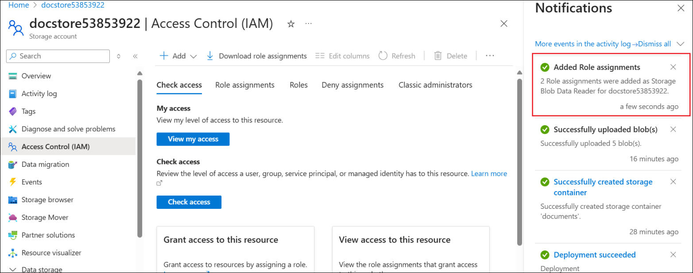

# ラボ - Copilot Studio で Azure AI Search を活用した小売エージェントを作成し、プロンプト用に独自のモデルを導入する

ラボの所要時間 – 60分

## 客観的

小売店のサイトでは、顧客から製品の仕様、保証条件、トラブルシューティングガイドなどについて頻繁に質問が寄せられます。静的なFAQチャットボットでは、あらゆる質問に対応することはできません。

このシナリオを支援するために、このラボでは次のことを実装します。

- 製品マニュアル、保証書、FAQ PDF は、 **Azure AI
  Search**にインデックス付けされます。

- Copilot Studio
  エージェントは、顧客が製品に関して質問したときに適切なスニペットを取得します。

- エージェントは自然言語による回答と、関連する製品マニュアルへのリンクを提供します。

これにより、コールセンターの負荷が軽減され、24 時間 365
日の顧客サポートが提供され、顧客満足度が向上します。

また、Azure AI Foundry から独自のモデルを Copilot Studio
に取り込む方法についても学習します。

## 演習 1: Azure AI Search リソースを作成する

この演習では、まずドキュメントの検索に使用する Azure AI Search
リソースを作成します。

1.  Azure ポータルのホーム ページから、 **Azure AI Foundry**
    を選択します。

    

2.  **AI Foundry ページ**で、左側のペインから**AI Search**を選択し、 **+
    Create を選択**します。

    

3.  以下の詳細を入力し、 **\[Review + create\]**を選択します。

    - Subscription –**割り当てられたサブスクリプション**を選択します

    - Resource group –**割り当てられたリソース グループ**(
    **ResourceGroup1** )を選択します。

    - Service name – +++ **documentstore53853922@lab.labinstanceid( )** +++

    - Location –**割り当てられた地域を**選択してください

    

4.  検証に合格したら、 **\[Create\]**を選択します。

    

5.  デプロイには数分かかります。検索サービスが作成されたら、 **「Go to
    resource」**を選択してください**。**

    

6.  **「Overview」ページ**から、
    Url値をコピーし、今後の演習で使用するためにメモ帳に保存します。

    

7.  左ペインの**「Settings」**から**「Keys」**を選択します。**Primary
    admin
    key**をコピーし、メモ帳に保存して、今後の演習で使用してください。

    

8.  左側のペインの**\[Settings\]
    の**下にある**\[Identity\]**を選択します。

    

9.  **「System assigned」**のステータスを**On**に切り替えて、
    **「Save」**をクリックします。

    

10. **「Enable system assigned managed
    identity」**確認ダイアログで**「Yes」**を選択します。この設定により、検索サービスがマネージドIDリソースのリストに表示されるようになり、必要に応じてロールを割り当てることができます。

    

## 演習 2: ストレージ アカウントを作成する

この演習では、Blob ストレージを使用してストレージ
アカウントを作成し、小売顧客のサポートに必要なドキュメントをアップロードします。

1.  Azure ポータルのホーム ページ(+++https://portal.azure.com/+++)
    から、 **\[Storage accounts\]**を選択します。

    

2.  新しいストレージ アカウントを作成するには、
    **\[+Create\]**を選択します。

    

3.  以下の詳細を入力し、他のフィールドではデフォルト値を受け入れて、
    **「Review+ create」**をクリックします。

    - Subscription –**割り当てられたサブスクリプションを選択します**

    - Resource group –**割り当てられたリソース グループ**(
    **ResourceGroup1** )を選択します。

    - Region –**割り当てられた地域を選択してください**

    - Storage account name – +++ **docstore@lab.LabInstanceId ( )** +++

    - Primary service – **Azure Blob Storage or Azure Data Lake Storage Gen
    2**を選択します。

    

4.  検証に合格したら、 **「Create」**をクリックします。

    

5.  リソースの作成が成功したら、 **「Go to
    resource」**をクリックします。

    

    

6.  **「Data storage」**の**「Containers」**を選択します。
    **「+Container」を選択し**、名前に「+++ **documents**
    +++」と入力して**「Create」**をクリックし、コンテナーを作成します。

    

7.  作成されたコンテナ**ドキュメント**を選択し、そこに休暇ポリシー
    ドキュメントをアップロードします。

    

8.  **「Upload」**をクリックし、 **「Browse for files」**を選択します。

    

9.  **C:\LabFiles\AISearch**フォルダから**ドキュメント**を選択します
    次に、 **\[Upload\]**をクリックします。

    

    

10. [**docstore@lab.LabInstanceId()**](mailto:docstore@lab.LabInstanceId())に移動します
    ストレージ アカウント ( Azure ポータルの**ホーム
    ページ**から**\[Storageaccounts\]**を選択し、
    **docstore@lab.LabInstanceId ()**を選択)
    を選択し、左側のペインから**\[Access Control
    (IAM)\]を選択します。\[Add\] -\> \[Add role
    assignment\]**を選択します。

    

11. +++ **Storage Blob Data Reader** +++
    を検索し、選択して**「Next」**をクリックします。

    

12. **「+ Select
    members」**をクリックし、**ユーザーIDを**検索して選択し、リストに表示されたユーザーIDを選択して**「Select」**をクリックします。これにより、ストレージBLOBデータリーダーロールがユーザーIDに追加されます。

    

13. **「Managed identity」**を選択し、 **「+ Select
    members」**を選択します。 **「Managed identity」**の下の**「Search
    service」**を選択し、リストに表示される**searchleaves**検索サービスを選択します。

    

14. **「Select」**をクリックして検索サービスを選択します。

    

15. Add role assignment画面に戻り、**Review + assign**をクリックします。

    

16. 次の画面でもう一度**「Review + assign」**を選択します。

    

17. ロールを追加したら次の手順に進みます。

    

この演習では、ストレージ
アカウントを作成し、ドキュメントと必要なロール権限を追加しました。

## 演習 3: Azure OpenAI サービスを作成し、モデルをデプロイする

AI検索サービスは、ドキュメント検索を実行するために、アップロードされたデータをベクトル化する必要があります。データをベクトル化するには、埋め込みモデルをデプロイする必要があります。この演習では、Azure
OpenAIサービスを作成し、そこにテキスト埋め込みモデルをデプロイします。

1.  Azure ポータルのホーム ページで、+++Azure OpenAI++
    を検索して選択します。

    

2.  **+ Create**を選択します。

    

3.  以下の詳細を入力し、 **「Next」**を選択します。

    - Subscription –**割り当てられたサブスクリプション**を選択します

    - Resource group –**割り当てられたリソース グループ**(
    **ResourceGroup1** )を選択します。

    - Region –**割り当てられた地域**を選択してください

    - Name – +++ **openaiservice52374668** +++

    - Pricing tier – **Standard**を選択

    

    

4.  次の 2 つの画面で**\[Next\]**を選択し、 **\[Review +
    submit\]**画面で**\[Create\]**を選択します。

    

5.  サービスが作成されたら、 **「Go to resource」**をクリックします。

    

6.  左側のペインから**\[Access control (IAM)\]**を選択し、 **\[Add\] -\>
    \[Add role assignment\]**を選択します。

    

7.  +++**Cognitive Services OpenAI
    User**+++を検索し、役割を選択して\[**Next**\]をクリックします。

    

8.  **+ Select members**を選択し、**ユーザー
    IDを検索**して選択し、**Select**をクリックします。

    

9.  **[Add role assignment」**画面に戻り、 **「Managed
    identity」**を選択します。次に、 **「+ Select
    members」**を選択します。 **「Select managed identities」**画面で、
    **「Managed identity」**の下にある**「Search service」**を選択し、
    **documentstore@lab.LabInstanceId ( )**サービスを選択します。

    

10. 選択したら、 **「Select」**をクリックします。

    

11. 次の 2 つの画面で \[Review + assign\] を選択します。

    

12. 次のタスクに進む前に、ロールの追加に関する**成功**メッセージを待ちます。

    

13. Azure OpenAI サービス リソースの**Overview**ページで、**Go to Azure
    AI Foundry portal**を選択し、そこで Azure OpenAI
    サービスを開いてモデルをデプロイします。

    

14. 左ペインから**「Deployment」**を選択します。 **「+ Deploy model**
    -\> **From base models」**を選択します。

    

15. +++ **text-embedding** +++ を検索し、
    **text-embedding-3-large**を選択してから、Confirmを選択します。

    

16. 「Deploy text-embedding-3-large」で**「Deploy」**を選択します。

    

17. モデルがデプロイされ、デプロイの詳細が画面に読み込まれます。

    

## 演習4: ベクトルインデックスを作成する

AI検索リソースは、ベクター検索を実行するためにベクターインデックスを必要とします。この演習では、アップロードされたデータをベクター化します。

1.  Azureポータルから、 AI
    Searchサービスリソースの**documentstore@lab.LabInstanceId (
    )**にアクセスします。 **「Import and vectorize
    data」**を選択します。

    

2.  **Azure Blob Storage**オプションを選択します。

    

3.  **「What scenarios are you
    targeting?」**画面で**RAG**オプションを選択します。

    

4.  以下の詳細を入力し、他の値はデフォルトのままにして、
    **「Next」**をクリックします。

    - Subscription –**割り当てられたサブスクリプション**を選択します

    - Storage account - **docstore@lab@ LabInstanceId ( )**を選択します。

    - BLOB-container –**documents**を選択

    

5.  「Vectorize your
    text」画面では、サブスクリプション情報が事前に入力されています。以下の情報を入力し、
    **「Next」**をクリックしてください。

    - Azure OpenAI resource – **openaiservice@lab.LabInstanceId ( )** を選択

    - Model deployment – **text-embedding-3-large**を選択

    - Authentication type – **System assigned identity**を選択

    - Azure OpenAI
    のコストアラートを確認するには、チェックボックスをオンにします。

    

6.  ここでは画像を扱わないため、「**Vectorize and enrich your
    images」**画面で「**Next**」を選択し、 **「Advanced
    settings」**画面でも**「Next」**を選択します。

    

    

7.  **\[Review + create\]** 画面で**\[Create\]**を選択します。

    

8.  成功ダイアログボックスで**「Close」**をクリックします。

    

## 演習5: 小売アシスタントエージェントを作成する

この演習では、Copilot Studio で小売アシスタント
エージェントを作成します。

1.  ログイン資格情報を使用して、+++https://copilotstudio.microsoft.com+++
    にログインします。

    

2.  左側のペインから**\[Create\]**を選択します。

    

3.  新しいエージェントを作成するには、 **「+ New agent」**を選択します。

    

4.  +++ You are a Retail assistant agent for customers HR who will
    answer questions related to the store products
    +++と入力し、\[**Send\]**を選択します。

    

    

5.  エージェントが作成されたら、\[Test\] ペインに「+++ What is the
    warranty period for Washing machine?+++」と入力し、 **\[Send\]**
    をクリックします**。**

    

6.  以下のスクリーンショットのように、一般的な返信が返されます。

    

## 演習 6: Azure AI Search をナレッジ ソースとして追加する

この演習では、Azure ポータルから作成した Azure AI Search を、Copilot
Studio の小売支援エージェントへのナレッジ ソースとして追加します。

1.  エージェントの**Overview**ページから、 **「+ Add
    knowledge」**を選択します。

    

2.  利用可能なナレッジ ソースのリストから**Azure AI Search**
    を選択します。

    

3.  次の画面で**「Not
    connected」**の横にある**ドロップダウン**をクリックし、 **「Create
    new connection」**を選択します。

    

4.  前の演習でメモ帳に保存した**エンドポイントURL**と**Admin
    key**の値を入力し、 **\[Create\]**をクリックして接続を作成します。

    

5.  接続が確立されると、利用可能なインデックスがリストされ、既に選択されています。
    **「Add to agent」**をクリックしてください。

    

6.  AI SEARCH SERVICEがエージェントにナレッジ
    ソースとして追加され、現在は**準備完了**状態になっています。

    

7.  ここで、以前試したのと同じ質問でエージェントをテストしてみましょう。

8.  Testペインに +++ What is the warranty period for Washing machine?+++
    と入力し、\[**Send**\] をクリックします**。**

    

9.  エージェントからの応答が、AI Search
    serviceにアップロードされたドキュメントからのものであることがわかります。

    

## 演習 7: Azure AI Foundry にモデルをデプロイする

この演習では、Azure AI Foundry にモデルをデプロイし、Copilot Studio
(次の演習) で使用します。

1.  先ほど作成した Azure AI Foundry Azure OpenAI リソースを開きます。

2.  左側のペインから、 **\[Deployments\]**を選択します。

    

3.  **\[+Deploy model」**の横にあるドロップダウンを選択し、 **「Deploy
    base model」**を選択します。

    

4.  **gpt-4o**を選択し、 **\[Confirm\]**を選択します。

    

5.  \[Deploy gpt-4o\] ダイアログで、**Deployment name**として +++
    **ModelforMCS** +++
    と入力し、他のデフォルトを受け入れて**\[Deploy\]** を選択します。

    

6.  Copilot Studio からの接続作成時に使用されるTarget URL
    とキー値をメモ帳にコピーします。

    

モデルがデプロイされたので、Copilot Studio のエージェント
プロンプトで使用できるようになりました。

## 演習 8: Copilot Studio でプロンプトを作成し、Azure AI Foundry で作成されたモデルを使用する

に取り込む方法を学習します。ここでは、デプロイ済みのベースモデルを使用します。ビジネス要件に合わせて微調整したモデルを作成し、Copilot
Studio で使用することもできます。

1.  Copilot Studio エージェントで、上部のメニュー
    バーから**\[Tool\]**を選択します。

    

2.  エージェントに新しいツールを追加するには、 **「+New
    tool」**を選択します

    

3.  新しいプロンプトを追加するので、「Prompt」を選択します。

    

4.  **モデル名**の横にあるドロップダウンを選択します。

    

5.  **Azure AI Foundry Models**に対して + を選択して、 Azure AI Foundry
    にデプロイされたモデルを追加し、**Connect a new
    model**を選択します。

    

    

6.  以下の詳細を入力し、「Connect」をクリックします。

    - Model deployment name - +++ModelforMCS+++

    - Base model name - +++gpt-4o+++

    - Azure model endpoint URL –
    以前保存したターゲットURLを入力してください。

    - API Key – 以前保存したモデルのAPIキーを入力してください。

    

    

7.  接続したら、 **\[Close\]**を選択します。

    

8.  モデルModelforMCSが選択されていることがわかります。

    

9.  プロンプトの名前を「+++WM Types+++」に変更します。「+++What are the
    different types of Washing Machines?+ ++」と入力し、
    **「Test」**を選択します。

    

10. プロンプトを保存するには、 **\[Save\]**を選択します。

    

11. エージェントにプロンプトを追加するには、 「**Add to
    agent」**オプションを選択します。

    

    

この機能により、Azure AI Foundry でモデルを微調整し、Copilot Studio
で簡単に使用できるようになります。Azure AI Foundry
の広大なモデルのエコシステムを Copilot Studio
に簡単に取り込むことができます。

## まとめ

このラボでは、Copilot Studio のエージェントを知識ソースとして Azure AI
Search
サービスに接続し、そのソースに基づいてエージェントをテストする方法を学習しました。また、Azure
AI Foundry にデプロイされたモデルを Copilot Studio
に取り込む方法も学習しました。
