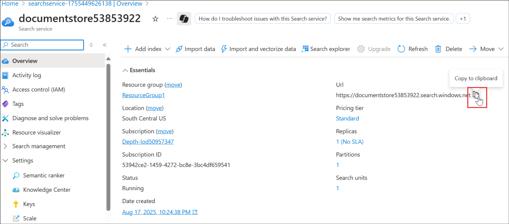
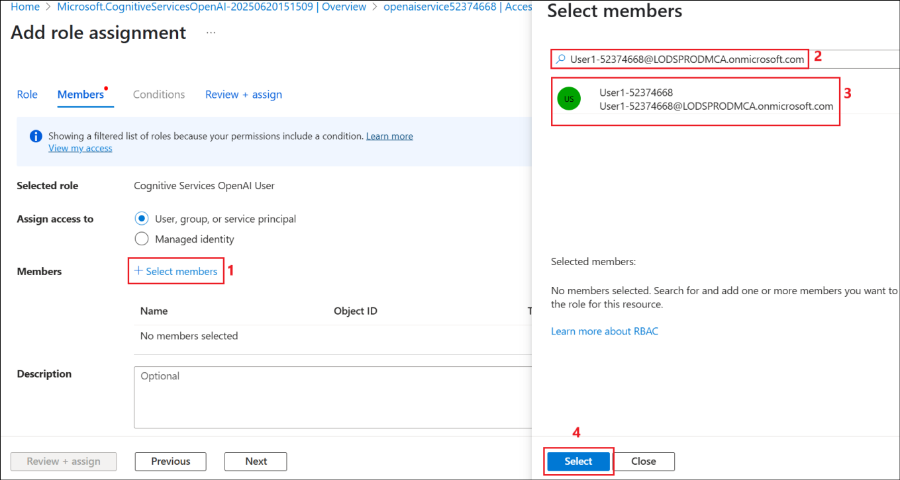

# Laboratório 5 – Crie um agente de varejo no Copilot Studio que aproveite o Azure AI Search e traga seu próprio modelo para seus prompts

Duração do laboratório – 60 minutos

## Objetivo

Em um site de loja de varejo, os clientes frequentemente perguntam sobre
especificações do produto, termos de garantia ou guias de solução de
problemas. Os chatbots estáticos de perguntas frequentes não podem
cobrir todas as variações.

Para ajudar nesse cenário, o seguinte será implementado neste
laboratório:

- Manuais de produtos, documentos de garantia e PDFs de perguntas
  frequentes serão indexados no **Azure AI Search**.

- Um agente do Copilot Studio que recupera o snippet correto quando um
  cliente faz uma pergunta sobre os produtos.

- O agente que fornece uma resposta em linguagem natural, além de um
  link para o manual do produto relevante.

Isso proporciona uma carga reduzida de central de atendimento, suporte
ao cliente 24 horas por dia, 7 dias por semana e maior satisfação do
cliente.

Também aprenderemos como trazer seu próprio modelo do Azure AI Foundry
para o Copilot Studio.

## Exercício 1: Criar um recurso do Azure AI Search

Neste exercício, primeiro criaremos um recurso do Azure AI Search, que
será usado para pesquisar os documentos.

1.  Na página inicial do portal do Azure, selecione **Azure AI
    Foundry.**

    

2.  Na página **AI Foundry**, selecione **AI Search** no painel esquerdo
    e selecione **+ Create**.

    

3.  Insira os detalhes abaixo e selecione **Review + create**.

    - Subscription – Selecione sua **assinatura atribuída**

    - Resource group – Selecione seu **grupo de recursos atribuído**
    (**ResourceGroup1**)

    - Service name – +++ **documentstore53853922@lab.labinstanceid()**+++

    - Location – Selecione sua **região atribuída**

    

4.  Depois que a validação for aprovada, selecione **Create**.

    

5.  A implementação leva alguns minutos. Selecione **Go to resource**
    quando o serviço de pesquisa for criado.

    

6.  Na página **Overview**, copie o valor da URL e salve-o em um bloco
    de notas para ser usado em um exercício futuro.

    

7.  Selecione **Keys** em **Settings** no painel esquerdo. Copie a
    **Primary admin key** e salve em um bloco de notas para usá-la nos
    próximos exercícios.

    

8.  Selecione **Identity** em **Settings** no painel esquerdo.

    

9.  Alterne o Status para **On** em **System assigned** e clique em
    **Save**.

    

10. Selecione **Yes** na caixa de diálogo de confirmação **Enable system
    assigned managed identity**. Essa configuração permitirá que o
    serviço de pesquisa seja listado nos recursos de identidade
    gerenciada, que podem receber funções conforme necessário.

    

## Exercício 2: Criar uma conta de armazenamento

Este exercício é para criar uma conta de armazenamento com o
Armazenamento de Blobs e carregar os documentos necessários para dar
suporte aos clientes de varejo nela.

1.  Na página inicial do portal do Azure,
    (+++https://portal.azure.com/+++), selecione **Storage accounts**

    

2.  Selecione **+ Create** para criar uma nova conta de armazenamento.

    

3.  Insira os detalhes abaixo, aceite os valores padrão nos outros
    campos e clique em **Review + create**.

    - Subscription – Selecione sua **assinatura atribuída**

    - Resource group – Selecione seu **grupo de recursos atribuído**
    (**ResourceGroup1**)

    - Region – Selecione sua **região atribuída**

    - Storage account name – +++ **docstore@lab.LabInstanceId()**+++

    - Primary service – Selecione **Azure Blob Storage or Azure Data Lake
    Storage Gen 2**

    

4.  Assim que a validação for aprovada, clique em **Create**.

    

5.  Assim que a criação do recurso for bem-sucedida, clique em **Go to
    resource**

    

    

6.  Selecione **Containers** em **Data storage**. Selecione **+ Add
    container**, insira o nome como +++**documents**+++ e clique em
    **Create** para criar o contêiner.

    

7.  Selecione **documents** para carregar o documento de política de
    licença nele.

    

8.  Clique em **Upload** e, em seguida, selecione **Browse for files**

    

9.  Selecione **documents** na pasta **C:\LabFiles\AISearch** e, em
    seguida, clique em **Upload**

    

    

10. Navegue até a conta de armazenamento
    **<docstore@lab.LabInstanceId()>** (selecione **Storageaccounts** na
    **página inicial** do portal do Azure e selecione
    **docstore@lab.LabInstanceId()**) e selecione **Access Control
    (IAM)** no painel esquerdo. Selecione **Add -\> Add role
    assignment**.

    

11. Busque +++**Storage Blob Data Reader**+++, selecione-o e clique em
    **Next**.

    

12. Clique em **+Select members**, pesquise e selecione seu **ID de
    usuário**, selecione seu **ID de usuário** listado e clique em
    **Select**. Isso adiciona a função Leitor de Dados do Blob de
    Armazenamento ao seu ID de usuário.

    

13. Selecione **Managed identity** e, em seguida, selecione **+ Select
    members**. Selecione **Search service** em **Managed identity** e
    selecione o serviço de pesquisa **searchleaves** que é listado.

    

14. Clique em **Select** para selecionar o serviço de pesquisa.

    

15. De volta à tela **Add role assignment**, clique em **Review +
    assign**

    

16. Selecione **Review + assign** novamente na próxima tela.

    

17. Prossiga para a próxima etapa depois que as funções forem
    adicionadas.

    

    Neste exercício, criamos uma conta de armazenamento e adicionamos os
documentos e as permissões de função necessárias a ela.

## Exercício 3: Criar um serviço OpenAI do Azure e implementar um modelo 

O serviço AI Search terá que vetorizar os dados carregados, a fim de
realizar a pesquisa sobre os documentos. Para vetorizar os dados, um
modelo de incorporação precisa ser implantado. Neste exercício, você
criará um Azure OpenAI Service e implementará o modelo de inserção de
texto nele.

1.  Na página inicial do portal do Azure, pesquise e selecione +++Azure
    OpenAI++.

    

2.  Selecione **+ Create**

    

3.  Insira os detalhes abaixo e selecione **Next**.

    - Subscription – Selecione sua **assinatura atribuída**

    - Resource group – Selecione seu **grupo de recursos atribuído**
    (**ResourceGroup1**)

    - Region – Selecione sua **região atribuída**

    - Name – +++**openaiservice52374668**+++

    - Pricing tier – Selecione **Standard**

    

    

4.  Selecionet **Next** nas próximas duas telas, selecione **Create** na
    tela **Review + submit**

    

5.  Clique em **Go to resource** depois que o serviço for criado.

    

6.  Selecione **Access control (IAM)** no painel esquerdo, selecione **+
    Add -> Add role assignment**

    

7.  Busque por +++**Cognitive Services OpenAI User**+++, selecione a
    função e clique em **Next**

    

8.  Selecione **+ Select members**, pesquise seu **ID de usuário**,
    selecione-o e clique em **Select**

    

9.  De volta à tela **Add role assignment**, selecione **Managed
    identity**. Em seguida, selecione **+ Select members**. Na tela
    **Select managed identities**, selecione **Search service** em
    **Managed identity** e selecione o serviço
    **documentstore@lab.LabInstanceId()**

    

10. Uma vez selecionado, clique em **Select**

    

11. Selecione **Review + assign** nas próximas duas telas.

    

12. Aguarde uma **mensagem** **de sucesso** nas adições de função antes
    de prosseguir com as próximas tarefas.

    

13. Da página **Overview** do recurso Azure OpenAI Service, selecione
    **Go to Azure AI Foundry portal** para abrir o Azure OpenAI Service
    e implementar um modelo.

    

14. Selecione **Deployments** no painel esquerdo. Selecione **+ Deploy
    model** -> **From base models**

    

15. Procure por +++**text-embedding**+++, selecione
    **text-embedding-3-large** e, em seguida, selecione **Confirm**.

    

16. Selecione **Deploy** em **Deploy text-embedding-3-large**

    

17. O modelo é implementado e a tela é carregada com os detalhes da
    implementação.

    

## Exercício 4: Criar um índice de vetor

O recurso AI Search precisa de um índice vetor para realizar a pesquisa
vetorial. Você vetorizará os dados carregados neste exercício.

1.  No portal do Azure, vá ao **documentstore@lab.LabInstanceId()**, AI
    Search service resource. Selecione **Import and vectorize data**

    

2.  Selecione a opção **Azure Blob Storage**

    

3.  Selecione a opção **RAG** na tela **What scenarios are you
    targeting?**

    

4.  Insira os detalhes abaixo, aceite os outros valores como padrão e
    clique em **Next**.

    - Subscription – Selecione sua **assinatura atribuída**

    - Storage account- Selecione **docstore@lab@LabInstanceId()**

    - Blob-container – Selecione **documents**

    

5.  Na tela **Vectorize your text**, a assinatura é pré-preenchida.
    Insira os detalhes abaixo e clique em **Next**.

    - Azure OpenAI resource – Selecione
    **openaiservice@lab.LabInstanceId()**

    - Model deployment – Selecione **text-embedding-3-large**

    - Authentication type – Selecione **System assigned identity**

    - Marque a caixa de seleção para confirmar o alerta de custo do Azure
    OpenAI.

    

6.  Selecione **Next** na tela **Vectorize and enrich your images** já
    que não estamos lidando com imagens aqui e selecione **Next** na
    tela **Advanced settings** também.

    

    

7.  Selecione **Create** na tela **Review + create**

    

8.  Clique em **Close** na caixa de diálogo de sucesso.

    

## Exercício 5: Criar um agente assistente de varejo

Neste exercício, você criará um agente assistente de varejo no Copilot
Studio.

1.  Faça login em +++https://copilotstudio.microsoft.com+++ usando suas
    credenciais de login.

    

2.  Selecione **Create** no painel esquerdo.

    

3.  Selecione **+ New agent** para criar um novo agente.

    

4.  Insira +++You are a Retail assistant agent for customers HR who will
    answer questions related to the store products+++ e selecione
    **Send**

    

    

5.  Depois que o agente for criado, no painel **Test**, insira +++What
    is the warranty period for Washing machine?+++ e clique em **Send.**

    

6.  Ele dá uma resposta generalizada como na captura de tela abaixo.

    

## Exercício 6: Adicionar o Azure AI Search como uma fonte de conhecimento

Neste exercício, você adicionará o Azure AI Search criado no portal do
Azure, como uma fonte de conhecimento para o agente de assistência de
varejo no Copilot Studio.

1.  Da página **Overview** do agente, selecione **+ Add knowledge**

    

2.  Selecione **Azure AI Search** da lista de fontes de conhecimento
    disponíveis.

    

3.  Clique no **menu suspenso** ao lado de **Not connected** na próxima
    tela e selecione **Create new connection**

    

4.  Insira a URL do **endpoint** e os valores da **Admin key** que
    salvamos em um bloco de notas em um exercício anterior e clique em
    **Create** para criar a conexão.

    

5.  Depois que a conexão for estabelecida, o índice disponível será
    listado e já selecionado. Clique em **Add to agent**

    

6.  O serviço AI Search é adicionado como uma fonte de conhecimento ao
    agente e está no estado **Ready** agora.

    

7.  Agora, vamos testar o agente com a mesma pergunta que tentamos
    antes.

8.  No painel **Test**, insira +++ What is the warranty period for
    Washing machine?+++ e clique em **Send.**

    

9.  Você pode ver que a resposta do agente agora é do documento
    carregado no serviço AI Search.

    

## Exercício 7: Implantar um modelo no Azure AI Foundry

Neste exercício, você implantará um modelo no Azure AI Foundry para
usá-lo no Copilot Studio (no próximo exercício).

1.  Abrir o recurso Azure AI Foundry Azure OpenAI criado anteriormente.

2.  No painel esquerdo, selecione **Deployments**

    

3.  Selecione o menu suspenso ao lado de **+ Deploy model** e selecione
    **Deploy base model**

    

4.  Selecione **gpt-4o** e clique em **Confirm**

    

5.  Na caixa de diálogo **Deploy gpt-4o**, insira o **Deployment name**
    como +++**ModelforMCS**+++, aceite os outros padrões e selecione
    **Deploy**

    

6.  Copie o **Target URI** e os valores de **Key** para um bloco de
    notas a ser usado durante a criação da conexão do Copilot Studio.

    

Agora que o modelo está implantado, você pode usá-lo no prompt do agente
do Copilot Studio.

## Exercício 8: Criar um prompt no Copilot Studio e usar o modelo criado no Azure AI Foundry

Neste exercício, você aprenderá a trazer o modelo implantado do Azure AI
Foundry no Copilot Studio. Aqui, estamos usando um modelo base que é
implantado. Também podemos criar um modelo ajustado de acordo com os
requisitos de negócios e usá-lo no Copilot Studio.

1.  No agente do Copilot Studio, selecione **Tools** na barra de menus
    superior.

    

2.  Selecione **+ New tool** Para adicionar uma nova ferramenta ao
    agente.

    

3.  Selecione **Prompt**, pois vamos adicionar um novo prompt.

    

4.  Na tela **Custom prompt**, selecione o menu suspenso ao lado do
    **nome** do modelo.

    

5.  Selecione **+** em **Azure AI Foundry Models** para adicionar o
    modelo implementado no Azure AI Foundry e selecione **Connect a new
    model**

    

    

6.  Insira os detalhes abaixo e clique em **Connect**

    - Model deployment name - +++ModelforMCS+++

    - Base model name - +++gpt-4o+++

    - Azure model endpoint URL – Insira o **Target url** salvo anteriormente

    - API Key – Insira a **API key** do modelo salva anteriormente.

    

    

7.  Uma vez conectado, selecione **Close**

    

8.  Você pode ver que o modelo ModelforMCS está selecionado agora.

    

9.  Renomeie o prompt para +++ +WM Types +++. Digite +++ What are the
    different types of Washing Machines? +++ e selecione **Test**.

    

10. Selecione **Save** para salvar o prompt.

    

11. Selecione a opção **Add to agent** Para adicionar o prompt ao
    agente.

    

    

    Com esse recurso, podemos ajustar o modelo no Azure AI Foundry e usá-lo
no Copilot Studio com facilidade. Podemos trazer o vasto ecossistema dos
modelos no Azure AI Foundry facilmente para o Copilot Studio.

## Resumo

Neste laboratório, aprendemos a conectar o agente do Copilot Studio a um
serviço do Azure AI Search como uma fonte de conhecimento e testar o
agente com base na fonte. Também aprendemos a trazer o modelo implantado
no Azure AI Foundry para o Copilot Studio.
