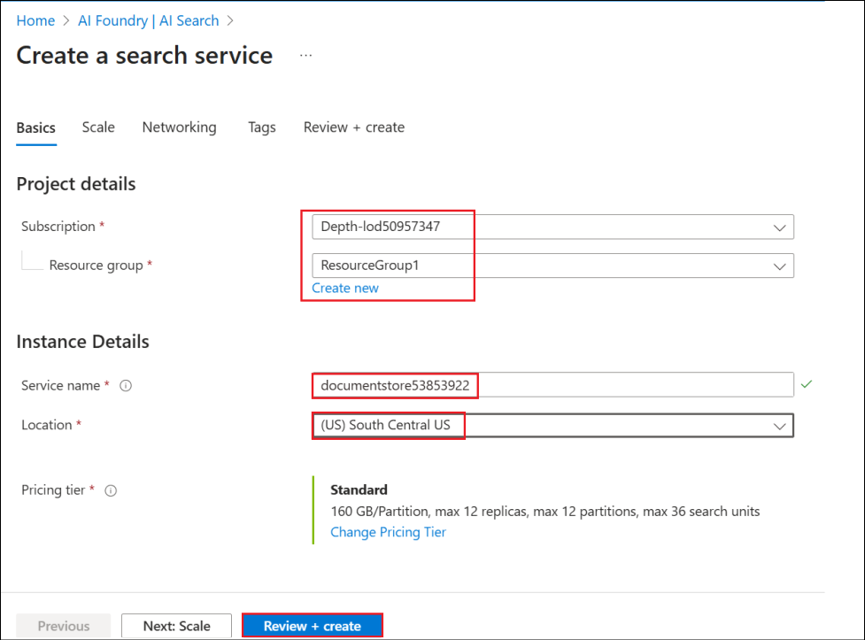

# 实验室 - 在 Copilot Studio 中创建利用 Azure AI 搜索的零售代理，并为提示自带模型

实验室持续时间 – 60分钟

## 目标

在零售店站点中，客户经常询问产品规格、保修条款或故障排除指南。静态常见问题解答聊天机器人无法涵盖所有变体。

为了帮助此方案，本实验室将实现以下内容

- 产品手册、保修文档和常见问题解答 PDF 已编入 **Azure AI 搜索索引**。

- 当客户询问有关产品的问题时，Copilot Studio 代理会检索正确的代码片段。

- 客服人员会给出自然语言答案以及相关产品手册的链接。

这减少了呼叫中心的负载、24/7 客户支持和更高的客户满意度。

我们还将了解如何将自己的模型从 Azure AI Foundry 引入 Copilot Studio。

## 练习 1: 创建 Azure AI 搜索资源

在本练习中，我们将首先创建一个 Azure AI 搜索资源，该资源将用于搜索文档。

1.  在 Azure 门户的“主页”中，选择 **Azure AI Foundry.**

    

2.  在“**AI Foundry”页**中，从 **左窗格中选择“AI 搜索”，然后选择 +
    Create**.”**。**

    

3.  输入以下详细信息，然后选择 **Review + create**.

- 订阅 – 选择**分配 的订阅**

- 资源组 – 选择您的 **assigned Resource group** (**ResourceGroup1**)

- 服务名称 – +++ **documentstore53853922@lab.labinstanceid()**+++

- 位置 – 选择您的 **分配区域**

    

4.  验证通过后，选择 **Create**.

    

5.  部署需要几分钟时间。选择 **Go to resource** 创建搜索服务后.

    

6.  在“**Overview**”页面中，复制 Url
    值并将其保存在记事本中，以便在将来的练习中使用。

    

7.  从 左窗格中选择“设置**”下的“键”**。复制**Primary admin
    key**并将其保存在记事本中，以便在接下来的练习中使用它。

    

8.  在左窗格中的“**Settings”**下选择“ **Identity**”。

    

9.  将“**System
    assigned**”**下的**“状态”切换为**“打开**”，然后单击“**保存**”。

    

10. 在“**Enable system assigned managed
    identity”**对话框中选择“**是**”。此设置将使搜索服务能够列在托管标识资源下，然后可以根据需要为托管标识资源分配角色。

    

## 练习 2: 创建存储帐户

此练习是使用 Blob 存储创建存储帐户，并上传支持其中零售客户所需的文档。

1.  从 Azure 门户的主页, (+++https://portal.azure.com/+++), 选择
    **Storage accounts**.

    

2.  选择 **+ Create** 以创建新的存储帐户。

    

3.  输入以下详细信息，接受其他字段中的默认值，然后单击 **Review +
    create**.

    - 订阅 – 选择**分配 的订阅**

    - 资源组 – 选择你的 **分配的资源组** (**ResourceGroup1**)

    - 区域 – 选择你的**分配区域**

    - 存储帐户名称 – +++ **docstore@lab.LabInstanceId()**+++

    - 主要服务 – 选择 **Azure Blob Storage or Azure Data Lake Storage Gen
    2**

    

4.  验证通过后，单击 **“创建”**。

    

5.  资源创建成功后，单击 **Go to resource**.

    

    

6.  选择**Data storage**下的**Containers**. 选择 **+ Container**,
    将名称输入为 +++**documents**+++ ，然后单击“ **创建”** 以创建容器。

    

7.  选择已创建的容器 **文档** ，将休假政策文档上传到其中。

    

8.  点击 **Upload** ，然后选择 **Browse for files**.

    

9.  从 **C：\LabFiles\AISearch** 文件夹中选择 **documents**
    ，然后单击**上传**。

    

    

10. 导航到 **<docstore@lab.LabInstanceId()>** 存储帐户（**从 Azure
    门户的**“主页**”中**选择“**Storageaccounts**”，然后选择**docstore@lab.LabInstanceId()**)
    ，从左窗格然后选择 **Access Control (IAM)**。 选择 **Add -\> Add
    role assignment**.

    

11. 寻找 +++**Storage Blob Data Reader**+++, 选择它并单击 **下一步**。

    

12. 点击 **+Select members**, 搜索并选择您的**用户 ID**，选择 列出的用户
    ID，然后单击**“选择”**。这会将存储 Blob 数据读取者角色添加到用户
    ID。

    

13. 选择 **Managed identity** ，然后选择 **+ Select members**.
    选择“**托管标识”** 下的**“搜索服务”**，然后选择列出的
    **searchleaves** 搜索服务。

    

14. 单击 **“选择”** 以选择搜索服务。

    

15. 返回“添加角色分配”屏幕，单击 **Review + assign**.

    

16. 在下一个屏幕中再次选择“**Review + assign**”。

    

17. 添加角色后，继续执行下一步。

    

在本练习中，我们创建了一个存储帐户，并向其添加了文档和所需的角色权限。

## 练习 3: 创建 Azure OpenAI 服务并部署模型 

AI
搜索服务必须对上传的数据进行矢量化，以便对文档执行搜索。要矢量化数据，需要部署嵌入模型。在本练习中，你将创建
Azure OpenAI 服务并在其中部署文本嵌入模型。

1.  在 Azure 门户主页中，搜索 select +++Azure OpenAI++.

    

2.  选择 **+ Create**.

    

3.  输入以下详细信息，然后选择 **Next**.

    - 订阅 – 选择您的 **分配的订阅**

    - 资源组 – 选择您的 **分配的资源组** (**ResourceGroup1**)

    - 地区 – 选择**分配 的区域**

    - 名字 – +++**openaiservice52374668**+++

    - 定价层 – 选择 **Standard**

    

    

4.  在 接下来的 2 个屏幕中选择下一步**，在**“**审阅 +
    提交”**屏幕中选择**“创建”。**

    

5.  创建服务后**，单击Go to resource**。

    

6.  从左窗格中**选择“Access control (IAM)**”，选择“**Add -\> Add role
    assignment. **”。

    

7.  寻找 +++**Cognitive Services OpenAI User**+++, 选择角色并单击
    **下一步**。

    

8.  选择 **+ Select members**, 搜索您的 **用户 ID**，选择它并单击
    **选择**。

    

9.  返回到“**Add role assignment”**屏幕，选择“**Managed identity”**。
    然后选择 **+ Select members**。在“**Select managed
    identities”**屏幕中, 在 **Managed identity** 下 选择**Search
    service** ，然后选择 **documentstore@lab.LabInstanceId()** 服务。

    

10. 选择后，单击 **Select**.

    

11. 在接下来的 2 个屏幕中选择“查看 + 分配”。

    

12. 等待 有关角色添加的成功消息，然后再继续执行下一个任务。

    

13. 在 Azure OpenAI 服务资源的**“**概述”页中，选择“**Go to Azure AI
    Foundry portal**”，在该处打开 Azure OpenAI 服务并部署模型。

    

14. 从左窗格中 **选择**“**Deployments**”。**从基本模型** 选择 **+ Deploy
    model** -\>

    

15. 寻找 +++**text-embedding**+++, 选择 **text-embedding-3-large**
    ，然后选择 **Confirm**.

    

16. 在部署 text-embedding-3-large 中**选择Deploy**。

    

17. 部署模型，并在屏幕上加载部署详细信息。

    

## 练习 4: 创建 Vector索引

AI
搜索资源需要向量索引来执行向量搜索。在本练习中，您将对上传的数据进行矢量化。

1.  在 Azure 门户中，转到 **documentstore@lab.LabInstanceId()**, AI
    搜索服务资源。选择 **Import and vectorize data**.

    

2.  选择 **Azure Blob Storage** .

    

3.  在“ the **What scenarios are you targeting?？** 屏幕选择**RAG**
    选项。

    

4.  输入以下详细信息，接受其他值作为默认值，然后单击 **Next**.

    - 订阅 – 选择分配 **的订阅**

    - 存储帐户- Select the **docstore@lab@LabInstanceId()**

    - Blob-container – 选择 **documents**

    

5.  在矢量化文本屏幕中，订阅已预先填充。输入以下详细信息，然后单击
    **Next**.

    - Azure OpenAI 资源 – Select **openaiservice@lab.LabInstanceId()**

    - 模型部署 – 选择 **text-embedding-3-large**

    - 身份验证类型 – 选择 **System assigned identity**

    - 选中该复选框以确认 Azure OpenAI 的成本警报。

    

6.  在**Vectorize and enrich your
    images中选择下一步**，因为我们在这里不处理图像，并在
    **高级设置**屏幕中也选择**下一步**。

    

    

7.  在**“Review + create”**屏幕中选择 **Create**。

    

8.  单击 成功对话框中的“**Close** ”。

    

## 练习 5: 创建零售助理代理

在本练习中，您将在 Copilot Studio 中创建零售助理代理。

1.  登录到 +++https://copilotstudio.microsoft.com+++ 使用您的登录凭据。

    

2.  从 左窗格中选择**创建**。

    

3.  选择 **+ New agent**以创建新代理。

    

4.  输入 +++You are a Retail assistant agent for customers HR who will
    answer questions related to the store products+++ ，然后选择
    **发送**。

    

    

5.  创建代理后，在“测试”窗格中, 输入 +++What is the warranty period for
    Washing machine?+++ ，然后单击 **发送。**

    

6.  它给出了概括的回复，如下面的屏幕截图所示。

    

## 练习 6: 将 Azure AI 搜索添加为知识源

在本练习中，您将从 Azure 门户创建的 Azure AI 搜索作为知识源添加到
Copilot Studio 中的零售协助代理。

1.  在代理的“**Overview **页中，选择 **+ Add knowledge**.”。

    

2.  从可用知识源列表中选择 **Azure AI Search**。

    

3.  在下一个屏幕中单击“ **Not
    connected**”旁边的下拉列表，然后选择**“Create new connection**”。

    

4.  输入
    我们在上一个练习中保存到记事本的**Endpoint url**和 **Admin key**值，然后单击**Create**以创建连接。

    

5.  建立连接后，将列出可用索引并已选择。点击 **Add to agent**.

    

6.  AI 搜索服务将作为知识源添加到代理，现在处于 **就绪状态** 。

    

7.  现在，让我们用我们之前尝试过的相同问题来测试代理。

8.  在“测试”窗格中, 输入 +++ What is the warranty period for Washing
    machine?+++ ，然后单击 **发送。**

    

9.  可以看到，现在代理的响应来自 AI 搜索服务中上传的文档。

    

## 练习 7: 在 Azure AI Foundry 中部署模型

在本练习中，您将在 Azure AI Foundry 中部署模型，以便在 Copilot Studio
中使用它（在下一个练习中）。

1.  打开之前创建的 Azure AI Foundry Azure OpenAI 资源。

2.  在左窗格中，选择 **Deployments**.

    

3.  选择旁边的下拉菜单 **+ Deploy model** ，然后选择 **Deploy base
    model**.

    

4.  选择 **gpt-4o** 然后选择 **Confirm**.

    

5.  在“部署 gpt-4o”对话框中，将**“Deployment name”**输入为

    +++**ModelforMCS**+++, 接受其他默认值，然后选择 **“部署”。**

    

6.  将目标 URI 和键值复制到记事本，以便在从 Copilot Studio
    创建连接期间使用。

    

现在模型已部署，您可以在 Copilot Studio 的代理提示中使用它。

## 练习 8: 在 Copilot Studio 中创建提示并使用 Azure AI Foundry 中创建的模型

在本练习中，您将学习如何在 Copilot Studio 中从 Azure AI Foundry
引入已部署的模型。在这里，我们使用的是部署的基本模型。我们还可以根据业务需求创建微调模型，然后在
Copilot Studio 中使用它。

1.  在 Copilot Studio 代理中，从 顶部菜单栏中选择**工具**。

    

2.  选择 **+ New tool** 向代理添加新工具

    

3.  选择提示，因为我们将添加新提示。

    

4.  在“自定义提示”屏幕中，选择模型名称旁边的下拉列表 。

    

5.  针对 **Azure AI Foundry Models**选择**“+”** 以添加部署在 Azure AI
    Foundry 中的模型，然后选择“ **Connect a new model**”。

    

    

6.  输入以下详细信息，然后单击连接。

    - 模型部署名称 - +++ModelforMCS+++

    - 基本型号名称 - +++gpt-4o+++

    - Azure model endpoint URL – 输入之前保存的目标 URL

    - API Key – 输入之前保存的模型 API 密钥。

    

    

7.  连接后，选择 **Close**.

    

8.  您可以看到模型 ModelforMCS 现在已选择

    

9.  将提示重命名为 +++WM Types+++. Enter +++What are the different types
    of Washing Machines?+++ ，然后选择“ **Test**”。

    

10. 选择 **“Save ”** 以保存提示。

    

11. 选择“**Add to agent**”选项，将提示添加到代理。

    

    

借助此功能，我们可以在 Azure AI Foundry 中微调模型，并在 Copilot Studio
中轻松使用它。我们可以轻松地将 Azure AI Foundry 中庞大的模型生态系统引入
Copilot Studio。

## 总结

在本实验室中，我们学习了将代理从 Copilot Studio 连接到 Azure AI
搜索服务作为知识源，并基于源测试代理。我们还学会了将部署在 Azure AI
Foundry 中的模型引入 Copilot Studio。
